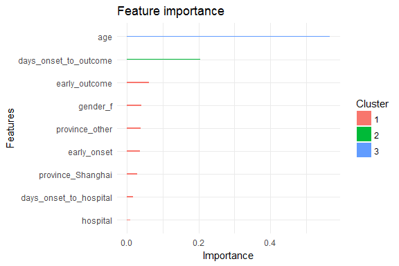
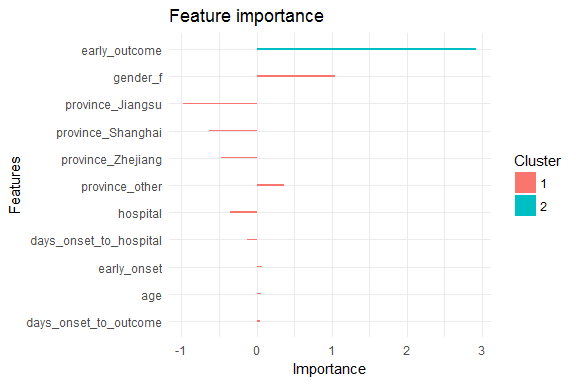
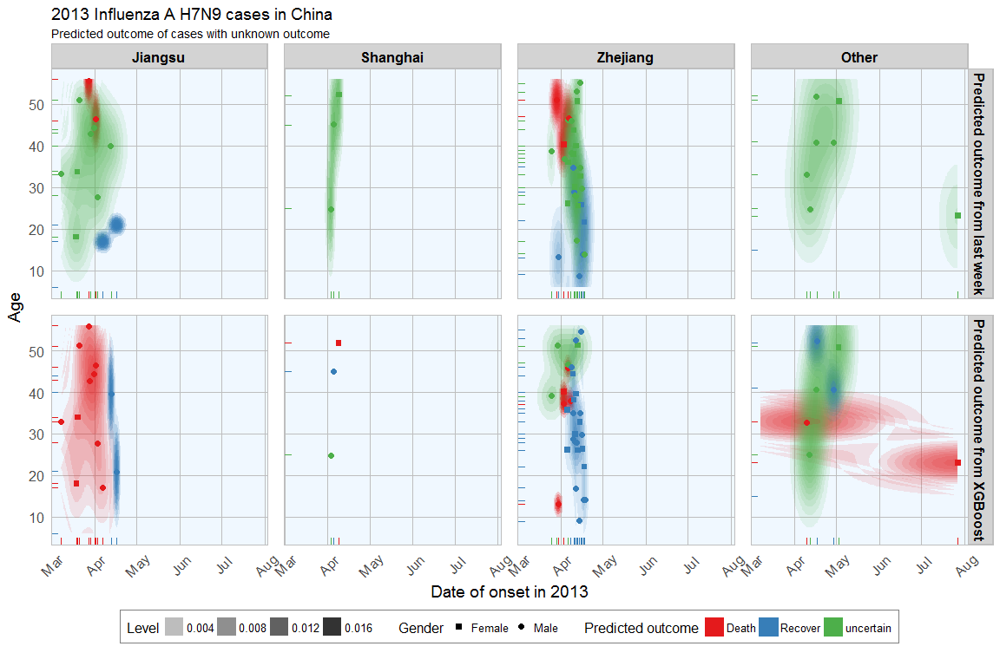

In [last week's post](https://shiring.github.io/machine_learning/2016/11/27/flu_outcome_ML_post) I explored whether machine learning models can be applied to predict flu deaths from the 2013 outbreak of influenza A H7N9 in China. There, I compared random forests, elastic-net regularized generalized linear models, k-nearest neighbors, penalized discriminant analysis, stabilized linear discriminant analysis, nearest shrunken centroids, single C5.0 tree and partial least squares.

<br>

Extreme gradient boosting
=========================

[Extreme gradient boosting (XGBoost)](http://xgboost.readthedocs.io/en/latest/model.html) is a faster and improved implementation of [gradient boosting](https://en.wikipedia.org/wiki/Gradient_boosting) for supervised learning and has recently been very successfully applied in Kaggle competitions. Because I've heard XGBoost's praise being sung everywhere lately, I wanted to get my feet wet with it too. So this week I want to compare the prediction success of gradient boosting with the same dataset. Additionally, I want to test the influence of different preprocessing methods on the outcome.

<br>

> "XGBoost uses a more regularized model formalization to control over-fitting, which gives it better performance." Tianqi Chen, developer of xgboost

XGBoost is a tree ensemble model, which means the sum of predictions from a set of classification and regression trees (CART). In that, XGBoost is similar to Random Forests but it uses a different approach to model training.

<br>

Starting with the same test and training data (partitioned into validation test and validation train subsets) from [last week's post](https://shiring.github.io/machine_learning/2016/11/27/flu_outcome_ML_post), I am training extreme gradient boosting models as implemented in the [xgboost](ftp://cran.r-project.org/pub/R/web/packages/xgboost/vignettes/xgboost.pdf) and [caret](http://topepo.github.io/caret/index.html) packages with different preprocessing settings.

Out of the different implementations and variations of gradient boosting algorithms, caret performed best on PCA-preprocessed data in the validation set. These paramteres were then used to predict the outcome in the test set and compare it to last week's predictions.

Compared to last week, there is much less uncertainty in the predictions from XGBoost. Overall, I would say that this algorithm is superior to the others I have used before.

<br>

xgboost
-------

Extreme gradient boosting is implemented in the xgboost package.

``` r
# install the stable/pre-compiled version from CRAN

install.packages('xgboost')

# or install from weekly updated drat repo

install.packages("drat", repos="https://cran.rstudio.com")
drat:::addRepo("dmlc")
install.packages("xgboost", repos="http://dmlc.ml/drat/", type="source")
```

XGBoost supports only numbers, so the outcome classes have to be converted into integers and both training and test data have to be in numeric matrix format.

``` r
library(xgboost)
matrix_train <- apply(val_train_X, 2, function(x) as.numeric(as.character(x)))
outcome_death_train <- ifelse(val_train_data$outcome == "Death", 1, 0)

matrix_test <- apply(val_test_X, 2, function(x) as.numeric(as.character(x)))
outcome_death_test <- ifelse(val_test_data$outcome == "Death", 1, 0)

xgb_train_matrix <- xgb.DMatrix(data = as.matrix(matrix_train), label = outcome_death_train)
xgb_test_matrix <- xgb.DMatrix(data = as.matrix(matrix_test), label = outcome_death_test)

watchlist <- list(train = xgb_train_matrix, test = xgb_test_matrix)
label <- getinfo(xgb_test_matrix, "label")
```

I am using cross validation to evaluate the error rate.

``` r
param <- list("objective" = "binary:logistic")

xgb.cv(param = param, 
       data = xgb_train_matrix, 
       nfold = 3,
       label = getinfo(xgb_train_matrix, "label"),
       nrounds = 5)
```

    ## [1]  train-error:0.124941+0.011991   test-error:0.268031+0.129105 
    ## [2]  train-error:0.124941+0.011991   test-error:0.268031+0.129105 
    ## [3]  train-error:0.098388+0.025999   test-error:0.340156+0.092598 
    ## [4]  train-error:0.089379+0.013272   test-error:0.357700+0.109674 
    ## [5]  train-error:0.098388+0.013747   test-error:0.341130+0.097427

<br>

### Training with gbtree

gbtree is the default booster for xgb.train.

``` r
bst_1 <- xgb.train(data = xgb_train_matrix, 
                   label = getinfo(xgb_train_matrix, "label"),
                   max.depth = 2, 
                   eta = 1, 
                   nthread = 4, 
                   nround = 50, # number of trees used for model building
                   watchlist = watchlist, 
                   objective = "binary:logistic")
```

    ## [1]  train-error:0.232143    test-error:0.304348 
    ## [2]  train-error:0.125000    test-error:0.260870 
    ## [3]  train-error:0.125000    test-error:0.260870 
    ## [4]  train-error:0.071429    test-error:0.304348 
    ## [5]  train-error:0.071429    test-error:0.391304 
    ## [6]  train-error:0.035714    test-error:0.304348 
    ## [7]  train-error:0.035714    test-error:0.304348 
    ## [8]  train-error:0.053571    test-error:0.304348 
    ## [9]  train-error:0.035714    test-error:0.347826 
    ## [10] train-error:0.035714    test-error:0.347826 
    ## [11] train-error:0.035714    test-error:0.260870 
    ## [12] train-error:0.017857    test-error:0.260870 
    ## [13] train-error:0.017857    test-error:0.260870 
    ## [14] train-error:0.017857    test-error:0.304348 
    ## [15] train-error:0.000000    test-error:0.260870 
    ## [16] train-error:0.000000    test-error:0.260870 
    ## [17] train-error:0.000000    test-error:0.304348 
    ## [18] train-error:0.000000    test-error:0.260870 
    ## [19] train-error:0.000000    test-error:0.347826 
    ## [20] train-error:0.000000    test-error:0.347826 
    ## [21] train-error:0.000000    test-error:0.304348 
    ## [22] train-error:0.000000    test-error:0.304348 
    ## [23] train-error:0.000000    test-error:0.347826 
    ## [24] train-error:0.000000    test-error:0.304348 
    ## [25] train-error:0.000000    test-error:0.347826 
    ## [26] train-error:0.000000    test-error:0.347826 
    ## [27] train-error:0.000000    test-error:0.347826 
    ## [28] train-error:0.000000    test-error:0.347826 
    ## [29] train-error:0.000000    test-error:0.347826 
    ## [30] train-error:0.000000    test-error:0.347826 
    ## [31] train-error:0.000000    test-error:0.347826 
    ## [32] train-error:0.000000    test-error:0.347826 
    ## [33] train-error:0.000000    test-error:0.304348 
    ## [34] train-error:0.000000    test-error:0.347826 
    ## [35] train-error:0.000000    test-error:0.304348 
    ## [36] train-error:0.000000    test-error:0.304348 
    ## [37] train-error:0.000000    test-error:0.304348 
    ## [38] train-error:0.000000    test-error:0.304348 
    ## [39] train-error:0.000000    test-error:0.304348 
    ## [40] train-error:0.000000    test-error:0.304348 
    ## [41] train-error:0.000000    test-error:0.304348 
    ## [42] train-error:0.000000    test-error:0.304348 
    ## [43] train-error:0.000000    test-error:0.304348 
    ## [44] train-error:0.000000    test-error:0.304348 
    ## [45] train-error:0.000000    test-error:0.304348 
    ## [46] train-error:0.000000    test-error:0.304348 
    ## [47] train-error:0.000000    test-error:0.347826 
    ## [48] train-error:0.000000    test-error:0.304348 
    ## [49] train-error:0.000000    test-error:0.304348 
    ## [50] train-error:0.000000    test-error:0.304348

Each feature is grouped by importance with k-means clustering. Gain is the improvement in accuracy that the addition of a feature brings to the branches it is on.

``` r
features = colnames(matrix_train)
importance_matrix_1 <- xgb.importance(features, model = bst_1)
print(importance_matrix_1)
```

    ##                   Feature       Gain      Cover  Frequency
    ## 1:                    age 0.56681596 0.49444626 0.44791667
    ## 2:  days_onset_to_outcome 0.20371450 0.17327928 0.17708333
    ## 3:          early_outcome 0.06148973 0.08256710 0.07291667
    ## 4:               gender_f 0.04043685 0.04056103 0.03125000
    ## 5:         province_other 0.03788142 0.04884498 0.06250000
    ## 6:            early_onset 0.03654052 0.04615314 0.05208333
    ## 7:      province_Shanghai 0.02756780 0.04503021 0.05208333
    ## 8: days_onset_to_hospital 0.01713995 0.03548939 0.05208333
    ## 9:               hospital 0.00841327 0.03362861 0.05208333

``` r
xgb.ggplot.importance(importance_matrix_1) +
  theme_minimal()
```



``` r
xgb.plot.multi.trees(feature_names = features, model = bst_1)
```

<!--html_preserve-->

<script type="application/json" data-for="htmlwidget-ee376c894b5f506fcc00">{"x":{"diagram":"digraph {\n\ngraph [rankdir = LR]\n\n\n  \"0\" [label = \"age (19.7863824)\nearly_outcome (3.08749)\ngender_f (1.94825)\ndays_onset_to_outcome (0.924685)\nprovince_Shanghai (0.231791)\", style = \"filled\", color = \"DimGray\", fillcolor = \"Beige\", shape = \"oval\", fontname = \"Helvetica\"] \n  \"0_0\" [label = \"province_Shanghai (1.15678513)\ndays_onset_to_outcome (3.143222)\nLeaf (-1.276642)\nearly_onset (1.39857)\nprovince_other (1.189677)\", style = \"filled\", color = \"DimGray\", fillcolor = \"Beige\", shape = \"oval\", fontname = \"Helvetica\"] \n  \"0_1\" [label = \"days_onset_to_outcome (6.1930878)\nLeaf (2.4565501)\nage (5.6765435)\nhospital (0.3559275)\ndays_onset_to_hospital (0.7592356)\", style = \"filled\", color = \"DimGray\", fillcolor = \"Beige\", shape = \"oval\", fontname = \"Helvetica\"] \n  \"0_0_0\" [label = \"Leaf (-5.2055725)\", style = \"filled\", color = \"DimGray\", fillcolor = \"Beige\", shape = \"oval\", fontname = \"Helvetica\"] \n  \"0_0_1\" [label = \"Leaf (0.28391263)\", style = \"filled\", color = \"DimGray\", fillcolor = \"Beige\", shape = \"oval\", fontname = \"Helvetica\"] \n  \"0_1_0\" [label = \"Leaf (2.8583972)\", style = \"filled\", color = \"DimGray\", fillcolor = \"Beige\", shape = \"oval\", fontname = \"Helvetica\"] \n  \"0_1_1\" [label = \"Leaf (3.08271514)\", style = \"filled\", color = \"DimGray\", fillcolor = \"Beige\", shape = \"oval\", fontname = \"Helvetica\"] \n\"0\"->\"0_0\" [color = \"DimGray\", arrowsize = \"1.5\", arrowhead = \"vee\", fontname = \"Helvetica\"] \n\"0_0\"->\"0_0_0\" [color = \"DimGray\", arrowsize = \"1.5\", arrowhead = \"vee\", fontname = \"Helvetica\"] \n\"0_1\"->\"0_1_0\" [color = \"DimGray\", arrowsize = \"1.5\", arrowhead = \"vee\", fontname = \"Helvetica\"] \n\"0\"->\"0_1\" [color = \"DimGray\", arrowsize = \"1.5\", arrowhead = \"vee\", fontname = \"Helvetica\"] \n\"0_0\"->\"0_0_1\" [color = \"DimGray\", arrowsize = \"1.5\", arrowhead = \"vee\", fontname = \"Helvetica\"] \n\"0_1\"->\"0_1_1\" [color = \"DimGray\", arrowsize = \"1.5\", arrowhead = \"vee\", fontname = \"Helvetica\"] \n}","config":{"engine":null,"options":null}},"evals":[],"jsHooks":[]}</script>
<!--/html_preserve-->
``` r
pred_1 <- predict(bst_1, xgb_test_matrix)

result_1 <- data.frame(case_ID = rownames(val_test_data),
                       outcome = val_test_data$outcome, 
                       label = label, 
                       prediction_p_death = round(pred_1, digits = 2),
                       prediction = as.integer(pred_1 > 0.5),
                       prediction_eval = ifelse(as.integer(pred_1 > 0.5) != label, "wrong", "correct"))
result_1
```

    ##     case_ID outcome label prediction_p_death prediction prediction_eval
    ## 1  case_123   Death     1               0.02          0           wrong
    ## 2  case_127 Recover     0               0.01          0         correct
    ## 3  case_128 Recover     0               0.96          1           wrong
    ## 4   case_14 Recover     0               0.48          0         correct
    ## 5   case_19   Death     1               0.80          1         correct
    ## 6    case_2   Death     1               0.56          1         correct
    ## 7   case_20 Recover     0               0.99          1           wrong
    ## 8   case_21 Recover     0               0.02          0         correct
    ## 9   case_34   Death     1               0.99          1         correct
    ## 10  case_37 Recover     0               0.00          0         correct
    ## 11   case_5 Recover     0               0.06          0         correct
    ## 12  case_51 Recover     0               0.20          0         correct
    ## 13  case_55 Recover     0               0.02          0         correct
    ## 14   case_6   Death     1               0.08          0           wrong
    ## 15  case_61   Death     1               0.99          1         correct
    ## 16  case_65 Recover     0               0.00          0         correct
    ## 17  case_74 Recover     0               0.06          0         correct
    ## 18  case_78   Death     1               0.42          0           wrong
    ## 19  case_79 Recover     0               0.01          0         correct
    ## 20   case_8   Death     1               0.04          0           wrong
    ## 21  case_87   Death     1               0.23          0           wrong
    ## 22  case_91 Recover     0               0.00          0         correct
    ## 23  case_94 Recover     0               0.01          0         correct

``` r
err <- as.numeric(sum(as.integer(pred_1 > 0.5) != label))/length(label)
print(paste("test-error =", round(err, digits = 2)))
```

    ## [1] "test-error = 0.3"

<br>

### Training with gblinear

``` r
bst_2 <- xgb.train(data = xgb_train_matrix, 
                   booster = "gblinear", 
                   label = getinfo(xgb_train_matrix, "label"),
                   max.depth = 2, 
                   eta = 1, 
                   nthread = 4, 
                   nround = 50, # number of trees used for model building
                   watchlist = watchlist, 
                   objective = "binary:logistic")
```

    ## [1]  train-error:0.303571    test-error:0.434783 
    ## [2]  train-error:0.285714    test-error:0.347826 
    ## [3]  train-error:0.285714    test-error:0.434783 
    ## [4]  train-error:0.267857    test-error:0.434783 
    ## [5]  train-error:0.267857    test-error:0.434783 
    ## [6]  train-error:0.267857    test-error:0.434783 
    ## [7]  train-error:0.285714    test-error:0.478261 
    ## [8]  train-error:0.285714    test-error:0.478261 
    ## [9]  train-error:0.267857    test-error:0.478261 
    ## [10] train-error:0.250000    test-error:0.434783 
    ## [11] train-error:0.232143    test-error:0.434783 
    ## [12] train-error:0.232143    test-error:0.434783 
    ## [13] train-error:0.232143    test-error:0.434783 
    ## [14] train-error:0.214286    test-error:0.434783 
    ## [15] train-error:0.214286    test-error:0.434783 
    ## [16] train-error:0.214286    test-error:0.434783 
    ## [17] train-error:0.214286    test-error:0.434783 
    ## [18] train-error:0.214286    test-error:0.434783 
    ## [19] train-error:0.214286    test-error:0.434783 
    ## [20] train-error:0.214286    test-error:0.434783 
    ## [21] train-error:0.196429    test-error:0.434783 
    ## [22] train-error:0.196429    test-error:0.434783 
    ## [23] train-error:0.196429    test-error:0.434783 
    ## [24] train-error:0.196429    test-error:0.434783 
    ## [25] train-error:0.196429    test-error:0.434783 
    ## [26] train-error:0.196429    test-error:0.434783 
    ## [27] train-error:0.196429    test-error:0.434783 
    ## [28] train-error:0.196429    test-error:0.434783 
    ## [29] train-error:0.196429    test-error:0.434783 
    ## [30] train-error:0.196429    test-error:0.434783 
    ## [31] train-error:0.178571    test-error:0.434783 
    ## [32] train-error:0.178571    test-error:0.434783 
    ## [33] train-error:0.178571    test-error:0.434783 
    ## [34] train-error:0.196429    test-error:0.434783 
    ## [35] train-error:0.196429    test-error:0.434783 
    ## [36] train-error:0.196429    test-error:0.434783 
    ## [37] train-error:0.196429    test-error:0.434783 
    ## [38] train-error:0.196429    test-error:0.434783 
    ## [39] train-error:0.196429    test-error:0.434783 
    ## [40] train-error:0.196429    test-error:0.434783 
    ## [41] train-error:0.196429    test-error:0.434783 
    ## [42] train-error:0.196429    test-error:0.434783 
    ## [43] train-error:0.160714    test-error:0.434783 
    ## [44] train-error:0.160714    test-error:0.434783 
    ## [45] train-error:0.160714    test-error:0.434783 
    ## [46] train-error:0.160714    test-error:0.434783 
    ## [47] train-error:0.142857    test-error:0.434783 
    ## [48] train-error:0.142857    test-error:0.434783 
    ## [49] train-error:0.142857    test-error:0.434783 
    ## [50] train-error:0.142857    test-error:0.434783

Each feature is grouped by importance with k-means clustering. Gain is the improvement in accuracy that the addition of a feature brings to the branches it is on.

``` r
features = colnames(matrix_train)
importance_matrix_2 <- xgb.importance(features, model = bst_2)
print(importance_matrix_2)
```

    ##                    Feature     Weight
    ##  1:                    age  0.0618175
    ##  2:               hospital -0.3547940
    ##  3:               gender_f  1.0499000
    ##  4:       province_Jiangsu -0.9738920
    ##  5:      province_Shanghai -0.6303700
    ##  6:      province_Zhejiang -0.4705460
    ##  7:         province_other  0.3615920
    ##  8:  days_onset_to_outcome  0.0397079
    ##  9: days_onset_to_hospital -0.1215700
    ## 10:            early_onset  0.0662544
    ## 11:          early_outcome  2.9233000

``` r
xgb.ggplot.importance(importance_matrix_2) +
  theme_minimal()
```



``` r
pred_2 <- predict(bst_2, xgb_test_matrix)

result_2 <- data.frame(case_ID = rownames(val_test_data),
                       outcome = val_test_data$outcome, 
                       label = label, 
                       prediction_p_death = round(pred_2, digits = 2),
                       prediction = as.integer(pred_2 > 0.5),
                       prediction_eval = ifelse(as.integer(pred_2 > 0.5) != label, "wrong", "correct"))
result_2
```

    ##     case_ID outcome label prediction_p_death prediction prediction_eval
    ## 1  case_123   Death     1               0.08          0           wrong
    ## 2  case_127 Recover     0               0.00          0         correct
    ## 3  case_128 Recover     0               0.12          0         correct
    ## 4   case_14 Recover     0               0.04          0         correct
    ## 5   case_19   Death     1               0.31          0           wrong
    ## 6    case_2   Death     1               0.12          0           wrong
    ## 7   case_20 Recover     0               0.77          1           wrong
    ## 8   case_21 Recover     0               0.80          1           wrong
    ## 9   case_34   Death     1               0.70          1         correct
    ## 10  case_37 Recover     0               0.04          0         correct
    ## 11   case_5 Recover     0               0.13          0         correct
    ## 12  case_51 Recover     0               0.85          1           wrong
    ## 13  case_55 Recover     0               0.28          0         correct
    ## 14   case_6   Death     1               0.42          0           wrong
    ## 15  case_61   Death     1               0.63          1         correct
    ## 16  case_65 Recover     0               0.04          0         correct
    ## 17  case_74 Recover     0               0.89          1           wrong
    ## 18  case_78   Death     1               0.29          0           wrong
    ## 19  case_79 Recover     0               0.06          0         correct
    ## 20   case_8   Death     1               0.17          0           wrong
    ## 21  case_87   Death     1               0.81          1         correct
    ## 22  case_91 Recover     0               0.03          0         correct
    ## 23  case_94 Recover     0               0.03          0         correct

``` r
err <- as.numeric(sum(as.integer(pred_2 > 0.5) != label))/length(label)
print(paste("test-error =", round(err, digits = 2)))
```

    ## [1] "test-error = 0.43"

<br>

caret
-----

Extreme gradient boosting is also implemented in the caret package. Caret also provides a few options for preprocessing, of which I will compare a few.

<br>

### No preprocessing

``` r
library(caret)

set.seed(27)
model_xgb_null <-train(outcome ~ .,
                 data=val_train_data,
                 method="xgbTree",
                 preProcess = NULL,
                 trControl = trainControl(method = "repeatedcv", number = 5, repeats = 10, verboseIter = FALSE))
```

``` r
confusionMatrix(predict(model_xgb_null, val_test_data[, -1]), val_test_data$outcome)
```

    ## Confusion Matrix and Statistics
    ## 
    ##           Reference
    ## Prediction Death Recover
    ##    Death       5       3
    ##    Recover     4      11
    ##                                           
    ##                Accuracy : 0.6957          
    ##                  95% CI : (0.4708, 0.8679)
    ##     No Information Rate : 0.6087          
    ##     P-Value [Acc > NIR] : 0.2644          
    ##                                           
    ##                   Kappa : 0.3482          
    ##  Mcnemar's Test P-Value : 1.0000          
    ##                                           
    ##             Sensitivity : 0.5556          
    ##             Specificity : 0.7857          
    ##          Pos Pred Value : 0.6250          
    ##          Neg Pred Value : 0.7333          
    ##              Prevalence : 0.3913          
    ##          Detection Rate : 0.2174          
    ##    Detection Prevalence : 0.3478          
    ##       Balanced Accuracy : 0.6706          
    ##                                           
    ##        'Positive' Class : Death           
    ## 

<br>

### Scaling and centering

With this method the column variables are centered (subtracting the column mean from each value in a column) and standardized (dividing by the column standard deviation).

``` r
set.seed(27)
model_xgb_sc_cen <-train(outcome ~ .,
                 data=val_train_data,
                 method="xgbTree",
                 preProcess = c("scale", "center"),
                 trControl = trainControl(method = "repeatedcv", number = 5, repeats = 10, verboseIter = FALSE))
```

``` r
confusionMatrix(predict(model_xgb_sc_cen, val_test_data[, -1]), val_test_data$outcome)
```

    ## Confusion Matrix and Statistics
    ## 
    ##           Reference
    ## Prediction Death Recover
    ##    Death       5       3
    ##    Recover     4      11
    ##                                           
    ##                Accuracy : 0.6957          
    ##                  95% CI : (0.4708, 0.8679)
    ##     No Information Rate : 0.6087          
    ##     P-Value [Acc > NIR] : 0.2644          
    ##                                           
    ##                   Kappa : 0.3482          
    ##  Mcnemar's Test P-Value : 1.0000          
    ##                                           
    ##             Sensitivity : 0.5556          
    ##             Specificity : 0.7857          
    ##          Pos Pred Value : 0.6250          
    ##          Neg Pred Value : 0.7333          
    ##              Prevalence : 0.3913          
    ##          Detection Rate : 0.2174          
    ##    Detection Prevalence : 0.3478          
    ##       Balanced Accuracy : 0.6706          
    ##                                           
    ##        'Positive' Class : Death           
    ## 

``` r
pred_3 <- predict(model_xgb_sc_cen, val_test_data[, -1])
pred_3b <- round(predict(model_xgb_sc_cen, val_test_data[, -1], type="prob"), digits = 2)

result_3 <- data.frame(case_ID = rownames(val_test_data),
                       outcome = val_test_data$outcome, 
                       label = label, 
                       prediction = pred_3,
                       pred_3b)
result_3$prediction_eval <- ifelse(result_3$prediction != result_3$outcome, "wrong", "correct")
result_3
```

    ##     case_ID outcome label prediction Death Recover prediction_eval
    ## 1  case_123   Death     1    Recover  0.08    0.92           wrong
    ## 2  case_127 Recover     0    Recover  0.05    0.95         correct
    ## 3  case_128 Recover     0      Death  0.92    0.08           wrong
    ## 4   case_14 Recover     0      Death  0.50    0.50           wrong
    ## 5   case_19   Death     1      Death  0.79    0.21         correct
    ## 6    case_2   Death     1      Death  0.53    0.47         correct
    ## 7   case_20 Recover     0      Death  0.92    0.08           wrong
    ## 8   case_21 Recover     0    Recover  0.01    0.99         correct
    ## 9   case_34   Death     1      Death  0.98    0.02         correct
    ## 10  case_37 Recover     0    Recover  0.00    1.00         correct
    ## 11   case_5 Recover     0    Recover  0.08    0.92         correct
    ## 12  case_51 Recover     0    Recover  0.45    0.55         correct
    ## 13  case_55 Recover     0    Recover  0.06    0.94         correct
    ## 14   case_6   Death     1    Recover  0.18    0.82           wrong
    ## 15  case_61   Death     1      Death  0.96    0.04         correct
    ## 16  case_65 Recover     0    Recover  0.01    0.99         correct
    ## 17  case_74 Recover     0    Recover  0.04    0.96         correct
    ## 18  case_78   Death     1      Death  0.57    0.43         correct
    ## 19  case_79 Recover     0    Recover  0.03    0.97         correct
    ## 20   case_8   Death     1    Recover  0.05    0.95           wrong
    ## 21  case_87   Death     1    Recover  0.31    0.69           wrong
    ## 22  case_91 Recover     0    Recover  0.03    0.97         correct
    ## 23  case_94 Recover     0    Recover  0.04    0.96         correct

<br>

### Box-Cox transformation

The Box-Cox power transformation is used to normalize data.

``` r
set.seed(27)
model_xgb_BoxCox <-train(outcome ~ .,
                 data=val_train_data,
                 method="xgbTree",
                 preProcess = "BoxCox",
                 trControl = trainControl(method = "repeatedcv", number = 5, repeats = 10, verboseIter = FALSE))
```

``` r
confusionMatrix(predict(model_xgb_BoxCox, val_test_data[, -1]), val_test_data$outcome)
```

    ## Confusion Matrix and Statistics
    ## 
    ##           Reference
    ## Prediction Death Recover
    ##    Death       5       3
    ##    Recover     4      11
    ##                                           
    ##                Accuracy : 0.6957          
    ##                  95% CI : (0.4708, 0.8679)
    ##     No Information Rate : 0.6087          
    ##     P-Value [Acc > NIR] : 0.2644          
    ##                                           
    ##                   Kappa : 0.3482          
    ##  Mcnemar's Test P-Value : 1.0000          
    ##                                           
    ##             Sensitivity : 0.5556          
    ##             Specificity : 0.7857          
    ##          Pos Pred Value : 0.6250          
    ##          Neg Pred Value : 0.7333          
    ##              Prevalence : 0.3913          
    ##          Detection Rate : 0.2174          
    ##    Detection Prevalence : 0.3478          
    ##       Balanced Accuracy : 0.6706          
    ##                                           
    ##        'Positive' Class : Death           
    ## 

``` r
pred_4 <- predict(model_xgb_BoxCox, val_test_data[, -1])
pred_4b <- round(predict(model_xgb_BoxCox, val_test_data[, -1], type="prob"), digits = 2)

result_4 <- data.frame(case_ID = rownames(val_test_data),
                       outcome = val_test_data$outcome, 
                       label = label, 
                       prediction = pred_4,
                       pred_4b)
result_4$prediction_eval <- ifelse(result_4$prediction != result_4$outcome, "wrong", "correct")
result_4
```

    ##     case_ID outcome label prediction Death Recover prediction_eval
    ## 1  case_123   Death     1    Recover  0.08    0.92           wrong
    ## 2  case_127 Recover     0    Recover  0.05    0.95         correct
    ## 3  case_128 Recover     0      Death  0.92    0.08           wrong
    ## 4   case_14 Recover     0      Death  0.50    0.50           wrong
    ## 5   case_19   Death     1      Death  0.79    0.21         correct
    ## 6    case_2   Death     1      Death  0.53    0.47         correct
    ## 7   case_20 Recover     0      Death  0.90    0.10           wrong
    ## 8   case_21 Recover     0    Recover  0.01    0.99         correct
    ## 9   case_34   Death     1      Death  0.98    0.02         correct
    ## 10  case_37 Recover     0    Recover  0.00    1.00         correct
    ## 11   case_5 Recover     0    Recover  0.08    0.92         correct
    ## 12  case_51 Recover     0    Recover  0.45    0.55         correct
    ## 13  case_55 Recover     0    Recover  0.04    0.96         correct
    ## 14   case_6   Death     1    Recover  0.18    0.82           wrong
    ## 15  case_61   Death     1      Death  0.96    0.04         correct
    ## 16  case_65 Recover     0    Recover  0.01    0.99         correct
    ## 17  case_74 Recover     0    Recover  0.04    0.96         correct
    ## 18  case_78   Death     1      Death  0.57    0.43         correct
    ## 19  case_79 Recover     0    Recover  0.03    0.97         correct
    ## 20   case_8   Death     1    Recover  0.05    0.95           wrong
    ## 21  case_87   Death     1    Recover  0.31    0.69           wrong
    ## 22  case_91 Recover     0    Recover  0.03    0.97         correct
    ## 23  case_94 Recover     0    Recover  0.04    0.96         correct

<br>

#### Principal Component Analysis (PCA)

PCA is used for dimensionality reduction. When applied as a preprocessing method the number of features are reduced by using the eigenvectors of the covariance matrix.

``` r
set.seed(27)
model_xgb_pca <-train(outcome ~ .,
                 data=val_train_data,
                 method="xgbTree",
                 preProcess = "pca",
                 trControl = trainControl(method = "repeatedcv", number = 5, repeats = 10, verboseIter = FALSE))
```

``` r
confusionMatrix(predict(model_xgb_pca, val_test_data[, -1]), val_test_data$outcome)
```

    ## Confusion Matrix and Statistics
    ## 
    ##           Reference
    ## Prediction Death Recover
    ##    Death       4       4
    ##    Recover     5      10
    ##                                           
    ##                Accuracy : 0.6087          
    ##                  95% CI : (0.3854, 0.8029)
    ##     No Information Rate : 0.6087          
    ##     P-Value [Acc > NIR] : 0.5901          
    ##                                           
    ##                   Kappa : 0.1619          
    ##  Mcnemar's Test P-Value : 1.0000          
    ##                                           
    ##             Sensitivity : 0.4444          
    ##             Specificity : 0.7143          
    ##          Pos Pred Value : 0.5000          
    ##          Neg Pred Value : 0.6667          
    ##              Prevalence : 0.3913          
    ##          Detection Rate : 0.1739          
    ##    Detection Prevalence : 0.3478          
    ##       Balanced Accuracy : 0.5794          
    ##                                           
    ##        'Positive' Class : Death           
    ## 

``` r
pred_5 <- predict(model_xgb_pca, val_test_data[, -1])
pred_5b <- round(predict(model_xgb_pca, val_test_data[, -1], type="prob"), digits = 2)

result_5 <- data.frame(case_ID = rownames(val_test_data),
                       outcome = val_test_data$outcome, 
                       label = label, 
                       prediction = pred_5,
                       pred_5b)
result_5$prediction_eval <- ifelse(result_5$prediction != result_5$outcome, "wrong", "correct")
result_5
```

    ##     case_ID outcome label prediction Death Recover prediction_eval
    ## 1  case_123   Death     1    Recover  0.13    0.87           wrong
    ## 2  case_127 Recover     0    Recover  0.11    0.89         correct
    ## 3  case_128 Recover     0    Recover  0.21    0.79         correct
    ## 4   case_14 Recover     0    Recover  0.21    0.79         correct
    ## 5   case_19   Death     1    Recover  0.32    0.68           wrong
    ## 6    case_2   Death     1      Death  0.59    0.41         correct
    ## 7   case_20 Recover     0    Recover  0.19    0.81         correct
    ## 8   case_21 Recover     0      Death  0.64    0.36           wrong
    ## 9   case_34   Death     1      Death  0.69    0.31         correct
    ## 10  case_37 Recover     0    Recover  0.07    0.93         correct
    ## 11   case_5 Recover     0    Recover  0.18    0.82         correct
    ## 12  case_51 Recover     0      Death  0.55    0.45           wrong
    ## 13  case_55 Recover     0    Recover  0.14    0.86         correct
    ## 14   case_6   Death     1    Recover  0.35    0.65           wrong
    ## 15  case_61   Death     1      Death  0.76    0.24         correct
    ## 16  case_65 Recover     0      Death  0.62    0.38           wrong
    ## 17  case_74 Recover     0      Death  0.69    0.31           wrong
    ## 18  case_78   Death     1    Recover  0.39    0.61           wrong
    ## 19  case_79 Recover     0    Recover  0.19    0.81         correct
    ## 20   case_8   Death     1    Recover  0.45    0.55           wrong
    ## 21  case_87   Death     1      Death  0.58    0.42         correct
    ## 22  case_91 Recover     0    Recover  0.03    0.97         correct
    ## 23  case_94 Recover     0    Recover  0.19    0.81         correct

<br>

### Median imputation

``` r
set.seed(27)
model_xgb_medianImpute <-train(outcome ~ .,
                 data=val_train_data,
                 method="xgbTree",
                 preProcess = "medianImpute",
                 trControl = trainControl(method = "repeatedcv", number = 5, repeats = 10, verboseIter = FALSE))
```

``` r
confusionMatrix(predict(model_xgb_medianImpute, val_test_data[, -1]), val_test_data$outcome)
```

    ## Confusion Matrix and Statistics
    ## 
    ##           Reference
    ## Prediction Death Recover
    ##    Death       5       3
    ##    Recover     4      11
    ##                                           
    ##                Accuracy : 0.6957          
    ##                  95% CI : (0.4708, 0.8679)
    ##     No Information Rate : 0.6087          
    ##     P-Value [Acc > NIR] : 0.2644          
    ##                                           
    ##                   Kappa : 0.3482          
    ##  Mcnemar's Test P-Value : 1.0000          
    ##                                           
    ##             Sensitivity : 0.5556          
    ##             Specificity : 0.7857          
    ##          Pos Pred Value : 0.6250          
    ##          Neg Pred Value : 0.7333          
    ##              Prevalence : 0.3913          
    ##          Detection Rate : 0.2174          
    ##    Detection Prevalence : 0.3478          
    ##       Balanced Accuracy : 0.6706          
    ##                                           
    ##        'Positive' Class : Death           
    ## 

``` r
pred_6 <- predict(model_xgb_medianImpute, val_test_data[, -1])
pred_6b <- round(predict(model_xgb_medianImpute, val_test_data[, -1], type="prob"), digits = 2)

result_6 <- data.frame(case_ID = rownames(val_test_data),
                       outcome = val_test_data$outcome, 
                       label = label, 
                       prediction = pred_6,
                       pred_6b)
result_6$prediction_eval <- ifelse(result_6$prediction != result_6$outcome, "wrong", "correct")
result_6
```

    ##     case_ID outcome label prediction Death Recover prediction_eval
    ## 1  case_123   Death     1    Recover  0.08    0.92           wrong
    ## 2  case_127 Recover     0    Recover  0.05    0.95         correct
    ## 3  case_128 Recover     0      Death  0.92    0.08           wrong
    ## 4   case_14 Recover     0      Death  0.50    0.50           wrong
    ## 5   case_19   Death     1      Death  0.79    0.21         correct
    ## 6    case_2   Death     1      Death  0.53    0.47         correct
    ## 7   case_20 Recover     0      Death  0.92    0.08           wrong
    ## 8   case_21 Recover     0    Recover  0.01    0.99         correct
    ## 9   case_34   Death     1      Death  0.98    0.02         correct
    ## 10  case_37 Recover     0    Recover  0.00    1.00         correct
    ## 11   case_5 Recover     0    Recover  0.08    0.92         correct
    ## 12  case_51 Recover     0    Recover  0.45    0.55         correct
    ## 13  case_55 Recover     0    Recover  0.06    0.94         correct
    ## 14   case_6   Death     1    Recover  0.18    0.82           wrong
    ## 15  case_61   Death     1      Death  0.96    0.04         correct
    ## 16  case_65 Recover     0    Recover  0.01    0.99         correct
    ## 17  case_74 Recover     0    Recover  0.04    0.96         correct
    ## 18  case_78   Death     1      Death  0.57    0.43         correct
    ## 19  case_79 Recover     0    Recover  0.03    0.97         correct
    ## 20   case_8   Death     1    Recover  0.05    0.95           wrong
    ## 21  case_87   Death     1    Recover  0.31    0.69           wrong
    ## 22  case_91 Recover     0    Recover  0.03    0.97         correct
    ## 23  case_94 Recover     0    Recover  0.04    0.96         correct

<br>

Comparison of extreme gradient boosting models
==============================================

Combining results
-----------------

``` r
library(dplyr)
result <- left_join(result_1[, c(1, 2, 6)], result_2[, c(1, 6)], by = "case_ID")
result <- left_join(result, result_3[, c(1, 7)], by = "case_ID")
result <- left_join(result, result_4[, c(1, 7)], by = "case_ID")
result <- left_join(result, result_5[, c(1, 7)], by = "case_ID")
result <- left_join(result, result_6[, c(1, 7)], by = "case_ID")
colnames(result)[-c(1:2)] <- c("pred_xgboost_gbtree", "pred_xgboost_gblinear", "model_xgb_sc_cen", "model_xgb_BoxCox", "pred_xgbTree_pca", "model_xgb_medianImpute")
```

<br>

### What's the rate of correctly predicted cases in the validation data?

``` r
round(sum(result$pred_xgboost_gbtree == "correct")/nrow(result), digits = 2)
```

    ## [1] 0.7

``` r
round(sum(result$pred_xgboost_gblinear == "correct")/nrow(result), digits = 2)
```

    ## [1] 0.57

``` r
round(sum(result$model_xgb_sc_cen == "correct")/nrow(result), digits = 2)
```

    ## [1] 0.7

``` r
round(sum(result$model_xgb_BoxCox == "correct")/nrow(result), digits = 2)
```

    ## [1] 0.7

``` r
round(sum(result$pred_xgbTree_pca == "correct")/nrow(result), digits = 2)
```

    ## [1] 0.61

``` r
round(sum(result$model_xgb_medianImpute == "correct")/nrow(result), digits = 2)
```

    ## [1] 0.7

<br>

Predicting unknown output
=========================

``` r
set.seed(27)
model_xgb_pca <-train(outcome ~ .,
                 data = train_data,
                 method = "xgbTree",
                 preProcess = "pca",
                 trControl = trainControl(method = "repeatedcv", number = 5, repeats = 10, verboseIter = FALSE))
```

``` r
pred <- predict(model_xgb_pca, test_data)
predb <- round(predict(model_xgb_pca, test_data, type="prob"), digits = 2)

result <- data.frame(case_ID = rownames(test_data),
                       prediction = pred,
                       predb)
result$predicted_outcome <- ifelse(result$Death > 0.7, "Death",
                                   ifelse(result$Recover > 0.7, "Recover", "uncertain"))
result
```

    ##     case_ID prediction Death Recover predicted_outcome
    ## 1  case_100    Recover  0.06    0.94           Recover
    ## 2  case_101    Recover  0.35    0.65         uncertain
    ## 3  case_102    Recover  0.04    0.96           Recover
    ## 4  case_103    Recover  0.05    0.95           Recover
    ## 5  case_104    Recover  0.03    0.97           Recover
    ## 6  case_105    Recover  0.05    0.95           Recover
    ## 7  case_108    Recover  0.11    0.89           Recover
    ## 8  case_109    Recover  0.02    0.98           Recover
    ## 9  case_110    Recover  0.00    1.00           Recover
    ## 10 case_112    Recover  0.22    0.78           Recover
    ## 11 case_113    Recover  0.42    0.58         uncertain
    ## 12 case_114    Recover  0.01    0.99           Recover
    ## 13 case_115    Recover  0.03    0.97           Recover
    ## 14 case_118    Recover  0.08    0.92           Recover
    ## 15 case_120      Death  0.89    0.11             Death
    ## 16 case_122    Recover  0.02    0.98           Recover
    ## 17 case_126      Death  0.93    0.07             Death
    ## 18 case_130    Recover  0.00    1.00           Recover
    ## 19 case_132    Recover  0.42    0.58         uncertain
    ## 20 case_136    Recover  0.28    0.72           Recover
    ## 21  case_15      Death  0.95    0.05             Death
    ## 22  case_16      Death  0.86    0.14             Death
    ## 23  case_22      Death  0.87    0.13             Death
    ## 24  case_28      Death  0.95    0.05             Death
    ## 25  case_31      Death  0.97    0.03             Death
    ## 26  case_32      Death  0.61    0.39         uncertain
    ## 27  case_38      Death  0.93    0.07             Death
    ## 28  case_39      Death  0.66    0.34         uncertain
    ## 29   case_4      Death  0.93    0.07             Death
    ## 30  case_40      Death  0.57    0.43         uncertain
    ## 31  case_41      Death  0.89    0.11             Death
    ## 32  case_42    Recover  0.09    0.91           Recover
    ## 33  case_47      Death  0.89    0.11             Death
    ## 34  case_48      Death  0.90    0.10             Death
    ## 35  case_52    Recover  0.37    0.63         uncertain
    ## 36  case_54      Death  0.97    0.03             Death
    ## 37  case_56    Recover  0.30    0.70         uncertain
    ## 38  case_62      Death  0.97    0.03             Death
    ## 39  case_63    Recover  0.32    0.68         uncertain
    ## 40  case_66      Death  0.87    0.13             Death
    ## 41  case_67    Recover  0.06    0.94           Recover
    ## 42  case_68    Recover  0.02    0.98           Recover
    ## 43  case_69    Recover  0.08    0.92           Recover
    ## 44  case_70    Recover  0.35    0.65         uncertain
    ## 45  case_71    Recover  0.30    0.70         uncertain
    ## 46  case_80    Recover  0.29    0.71           Recover
    ## 47  case_84    Recover  0.00    1.00           Recover
    ## 48  case_85    Recover  0.24    0.76           Recover
    ## 49  case_86    Recover  0.06    0.94           Recover
    ## 50  case_88    Recover  0.02    0.98           Recover
    ## 51   case_9      Death  0.98    0.02             Death
    ## 52  case_90    Recover  0.02    0.98           Recover
    ## 53  case_92      Death  0.85    0.15             Death
    ## 54  case_93    Recover  0.04    0.96           Recover
    ## 55  case_95    Recover  0.34    0.66         uncertain
    ## 56  case_96      Death  0.98    0.02             Death
    ## 57  case_99    Recover  0.37    0.63         uncertain

<br>

Comparison with predicted outcome from last week's analyses
-----------------------------------------------------------

<br>

### Plotting predicted outcome

Combining the table with predicted outcomes from this and last week with the original data.

``` r
results_combined <- merge(result, fluH7N9.china.2013[which(fluH7N9.china.2013$case.ID %in% result$case_ID), ], 
                          by.x = "case_ID", by.y = "case.ID")
results_combined <- results_combined[, -c(6,7)]
```

For plotting with ggplot2, the dataframe needs to be gathered.

``` r
library(tidyr)
results_combined_gather <- results_combined %>%
  gather(group_dates, date, date.of.onset:date.of.hospitalisation)

results_combined_gather$group_dates <- factor(results_combined_gather$group_dates, levels = c("date.of.onset", "date.of.hospitalisation"))

results_combined_gather$group_dates <- mapvalues(results_combined_gather$group_dates, from = c("date.of.onset", "date.of.hospitalisation"), 
                                             to = c("Date of onset", "Date of hospitalisation"))

results_combined_gather$gender <- mapvalues(results_combined_gather$gender, from = c("f", "m"), 
                                             to = c("Female", "Male"))
levels(results_combined_gather$gender) <- c(levels(results_combined_gather$gender), "unknown")
results_combined_gather$gender[is.na(results_combined_gather$gender)] <- "unknown"

results_combined_gather <- results_combined_gather %>%
  gather(group_pred, prediction, predicted_outcome_xgboost:predicted_outcome_last_week)

results_combined_gather$group_pred <- mapvalues(results_combined_gather$group_pred, from = c("predicted_outcome_xgboost", "predicted_outcome_last_week"), 
                                             to = c("Predicted outcome from XGBoost", "Predicted outcome from last week"))
```

Setting a custom theme for plotting:

``` r
library(ggplot2)
my_theme <- function(base_size = 12, base_family = "sans"){
  theme_minimal(base_size = base_size, base_family = base_family) +
  theme(
    axis.text = element_text(size = 12),
    axis.text.x = element_text(angle = 45, vjust = 0.5, hjust = 0.5),
    axis.title = element_text(size = 14),
    panel.grid.major = element_line(color = "grey"),
    panel.grid.minor = element_blank(),
    panel.background = element_rect(fill = "aliceblue"),
    strip.background = element_rect(fill = "lightgrey", color = "grey", size = 1),
    strip.text = element_text(face = "bold", size = 12, color = "black"),
    legend.position = "bottom",
    legend.justification = "top", 
    legend.box = "horizontal",
    legend.box.background = element_rect(colour = "grey50"),
    legend.background = element_blank(),
    panel.border = element_rect(color = "grey", fill = NA, size = 0.5),
    panel.spacing = unit(1, "lines")
  )
}
```

``` r
results_combined_gather$province <- mapvalues(results_combined_gather$province, 
                                                from = c("Anhui", "Beijing", "Fujian", "Guangdong", "Hebei", "Henan", "Hunan", "Jiangxi", "Shandong", "Taiwan"), 
                                                to = rep("Other", 10))

levels(results_combined_gather$gender) <- c(levels(results_combined_gather$gender), "unknown")
results_combined_gather$gender[is.na(results_combined_gather$gender)] <- "unknown"

results_combined_gather$province <- factor(results_combined_gather$province, levels = c("Jiangsu",  "Shanghai", "Zhejiang", "Other"))
```

``` r
ggplot(data = subset(results_combined_gather, group_dates == "Date of onset"), aes(x = date, y = as.numeric(age), fill = prediction)) +
  stat_density2d(aes(alpha = ..level..), geom = "polygon") +
  geom_jitter(aes(color = prediction, shape = gender), size = 2) +
  geom_rug(aes(color = prediction)) +
  labs(
    fill = "Predicted outcome",
    color = "Predicted outcome",
    alpha = "Level",
    shape = "Gender",
    x = "Date of onset in 2013",
    y = "Age",
    title = "2013 Influenza A H7N9 cases in China",
    subtitle = "Predicted outcome of cases with unknown outcome",
    caption = ""
  ) +
  facet_grid(group_pred ~ province) +
  my_theme() +
  scale_shape_manual(values = c(15, 16, 17)) +
  scale_color_brewer(palette="Set1", na.value = "grey50") +
  scale_fill_brewer(palette="Set1")
```



There is much less uncertainty in the XGBoost data, even tough I used slightly different methods for classifying uncertainty: In last week's analysis I based uncertainty on the ratio of combined prediction values from all analyses, this week uncertainty is based on the prediction value from one analysis.

<br>

------------------------------------------------------------------------

``` r
sessionInfo()
```

    ## R version 3.3.2 (2016-10-31)
    ## Platform: x86_64-w64-mingw32/x64 (64-bit)
    ## Running under: Windows 7 x64 (build 7601) Service Pack 1
    ## 
    ## locale:
    ## [1] LC_COLLATE=English_United States.1252  LC_CTYPE=English_United States.1252    LC_MONETARY=English_United States.1252 LC_NUMERIC=C                           LC_TIME=English_United States.1252    
    ## 
    ## attached base packages:
    ## [1] stats     graphics  grDevices utils     datasets  methods   base     
    ## 
    ## other attached packages:
    ##  [1] tidyr_0.6.0     plyr_1.8.4      xgboost_0.6-0   caret_6.0-73    ggplot2_2.2.0   lattice_0.20-34 mice_2.25       Rcpp_0.12.8     dplyr_0.5.0     outbreaks_1.0.0
    ## 
    ## loaded via a namespace (and not attached):
    ##  [1] reshape2_1.4.2        splines_3.3.2         colorspace_1.3-0      htmltools_0.3.5       stats4_3.3.2          yaml_2.1.14           mgcv_1.8-16           chron_2.3-47          survival_2.40-1       e1071_1.6-7           ModelMetrics_1.1.0    nloptr_1.0.4          DBI_0.5-1             RColorBrewer_1.1-2    foreach_1.4.3         stringr_1.1.0         MatrixModels_0.4-1    munsell_0.4.3         gtable_0.2.0          visNetwork_1.0.2      htmlwidgets_0.8       codetools_0.2-15      evaluate_0.10         labeling_0.3          knitr_1.15            SparseM_1.74          class_7.3-14          quantreg_5.29         pbkrtest_0.4-6        DiagrammeR_0.8.4      parallel_3.3.2        scales_0.4.1          jsonlite_1.1          lme4_1.1-12           Ckmeans.1d.dp_3.4.6-4 digest_0.6.10         stringi_1.1.2         grid_3.3.2            influenceR_0.1.0      tools_3.3.2           magrittr_1.5          lazyeval_0.2.0        tibble_1.2            car_2.1-3             MASS_7.3-45           Matrix_1.2-7.1        data.table_1.9.6      assertthat_0.1        minqa_1.2.4           rmarkdown_1.1         rstudioapi_0.6        iterators_1.0.8       R6_2.2.0              rpart_4.1-10          compiler_3.3.2        nnet_7.3-12           igraph_1.0.1          nlme_3.1-128
