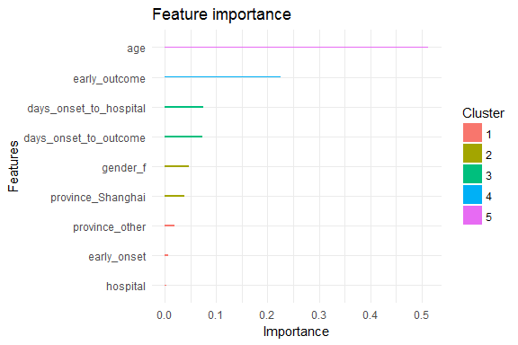
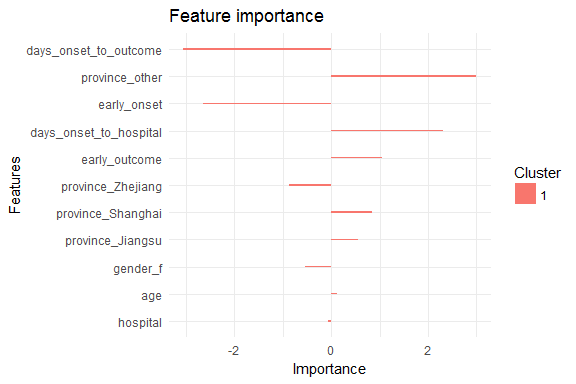
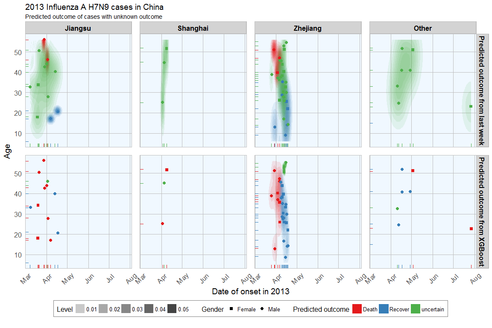

In [last week's post](https://shiring.github.io/machine_learning/2016/11/27/flu_outcome_ML_post) I explored whether machine learning models can be applied to predict flu deaths from the 2013 outbreak of influenza A H7N9 in China. There, I compared random forests, elastic-net regularized generalized linear models, k-nearest neighbors, penalized discriminant analysis, stabilized linear discriminant analysis, nearest shrunken centroids, single C5.0 tree and partial least squares.

<br>

Extreme gradient boosting
=========================

[Extreme gradient boosting (XGBoost)](http://xgboost.readthedocs.io/en/latest/model.html) is a faster and improved implementation of [gradient boosting](https://en.wikipedia.org/wiki/Gradient_boosting) for supervised learning and has recently been very successfully applied in Kaggle competitions. Because I've heard XGBoost's praise being sung all over the webs recently, I wanted to get my feet wet with it too so this week I want to compare the prediction success of gradient boosting with the same dataset. Additionally, I want to test the influence of different preprocessing methods on the outcome.

<br>

> "XGBoost uses a more regularized model formalization to control over-fitting, which gives it better performance." Tianqi Chen, developer of xgboost

XGBoost is a tree ensemble model, which means the sum of predictions from a set of classification and regression trees (CART). In that, XGBoost is similar to Random Forests but it uses a different approach to model training.

<br>

Starting with the same test and training data (partitioned into validation test and validation train subsets) from [last week's post](https://shiring.github.io/machine_learning/2016/11/27/flu_outcome_ML_post), I am training extreme gradient boosting models as implemented in the [xgboost](ftp://cran.r-project.org/pub/R/web/packages/xgboost/vignettes/xgboost.pdf) and [caret](http://topepo.github.io/caret/index.html) packages with different preprocessing settings.

Out of the different implementations and variations of gradient boosting algorithms, caret performed best on PCA-preprocessed data in the validation set. These paramteres were then used to predict the outcome in the test set and compare it to last week's predictions.

Compared to last week, there is much less uncertainty in the predictions from XGBoost. Overall, I would say that this algorithm is superior to the others I have used before.

<br>

xgboost
-------

Extreme gradient boosting is implemented in the xgboost package.

``` r
install.packages("drat", repos = "https://cran.rstudio.com")
drat:::addRepo("dmlc")
install.packages("xgboost", repos = "http://dmlc.ml/drat/", type = "source")
```

XGBoost supports only numbers, so the outcome classes have to be converted into integers and both training and test data have to be in numeric matrix format.

``` r
library(xgboost)
matrix_train <- apply(val_train_X, 2, function(x) as.numeric(as.character(x)))
outcome_death_train <- ifelse(val_train_data$outcome == "Death", 1, 0)

matrix_test <- apply(val_test_X, 2, function(x) as.numeric(as.character(x)))
outcome_death_test <- ifelse(val_test_data$outcome == "Death", 1, 0)

xgb_train_matrix <- xgb.DMatrix(data = as.matrix(matrix_train), label = outcome_death_train)
xgb_test_matrix <- xgb.DMatrix(data = as.matrix(matrix_test), label = outcome_death_test)

watchlist <- list(train = xgb_train_matrix, test = xgb_test_matrix)
label <- getinfo(xgb_test_matrix, "label")
```

I am using cross validation to evaluate the error rate.

``` r
param <- list("objective" = "multi:softprob",
              "eval_metric" = "mlogloss",
              "num_class" = max(label) + 1)

xgb.cv(param = param, 
       data = xgb_train_matrix, 
       label = label, 
       nfold = 3,
       nrounds = 5)
```

    ## [1]  train-mlogloss:0.535758+0.021084    test-mlogloss:0.661586+0.027437 
    ## [2]  train-mlogloss:0.439331+0.035176    test-mlogloss:0.630627+0.082373 
    ## [3]  train-mlogloss:0.354200+0.029472    test-mlogloss:0.617911+0.142707 
    ## [4]  train-mlogloss:0.295908+0.027783    test-mlogloss:0.629048+0.186042 
    ## [5]  train-mlogloss:0.250870+0.022289    test-mlogloss:0.633813+0.191678

<br>

### Training with gbtree

gbtree is the default booster for xgb.train.

``` r
bst_1 <- xgb.train(data = xgb_train_matrix, 
                   max.depth = 2, 
                   eta = 1, 
                   nthread = 4, 
                   nround = 50, # number of trees used for model building
                   watchlist = watchlist, 
                   objective = "multi:softprob",
                   eval_metric = "mlogloss",
                   num_class = max(label) + 1)
```

    ## [1]  train-mlogloss:0.490294 test-mlogloss:0.649457 
    ## [2]  train-mlogloss:0.391275 test-mlogloss:0.592098 
    ## [3]  train-mlogloss:0.309628 test-mlogloss:0.585372 
    ## [4]  train-mlogloss:0.240290 test-mlogloss:0.650654 
    ## [5]  train-mlogloss:0.203293 test-mlogloss:0.729111 
    ## [6]  train-mlogloss:0.172326 test-mlogloss:0.824518 
    ## [7]  train-mlogloss:0.157606 test-mlogloss:0.843775 
    ## [8]  train-mlogloss:0.140777 test-mlogloss:0.888461 
    ## [9]  train-mlogloss:0.127178 test-mlogloss:0.882017 
    ## [10] train-mlogloss:0.111399 test-mlogloss:0.840032 
    ## [11] train-mlogloss:0.099434 test-mlogloss:0.858670 
    ## [12] train-mlogloss:0.082355 test-mlogloss:0.930674 
    ## [13] train-mlogloss:0.076430 test-mlogloss:0.994619 
    ## [14] train-mlogloss:0.070627 test-mlogloss:1.016008 
    ## [15] train-mlogloss:0.067678 test-mlogloss:1.032572 
    ## [16] train-mlogloss:0.063111 test-mlogloss:1.064730 
    ## [17] train-mlogloss:0.059368 test-mlogloss:1.123941 
    ## [18] train-mlogloss:0.056032 test-mlogloss:1.144884 
    ## [19] train-mlogloss:0.053680 test-mlogloss:1.100259 
    ## [20] train-mlogloss:0.051653 test-mlogloss:1.116891 
    ## [21] train-mlogloss:0.049721 test-mlogloss:1.123875 
    ## [22] train-mlogloss:0.047645 test-mlogloss:1.153877 
    ## [23] train-mlogloss:0.045584 test-mlogloss:1.171002 
    ## [24] train-mlogloss:0.043884 test-mlogloss:1.180613 
    ## [25] train-mlogloss:0.041997 test-mlogloss:1.179499 
    ## [26] train-mlogloss:0.040394 test-mlogloss:1.203822 
    ## [27] train-mlogloss:0.039403 test-mlogloss:1.183822 
    ## [28] train-mlogloss:0.038483 test-mlogloss:1.196224 
    ## [29] train-mlogloss:0.037769 test-mlogloss:1.203163 
    ## [30] train-mlogloss:0.037451 test-mlogloss:1.211294 
    ## [31] train-mlogloss:0.036598 test-mlogloss:1.253284 
    ## [32] train-mlogloss:0.036199 test-mlogloss:1.263149 
    ## [33] train-mlogloss:0.035837 test-mlogloss:1.253878 
    ## [34] train-mlogloss:0.035423 test-mlogloss:1.253795 
    ## [35] train-mlogloss:0.035056 test-mlogloss:1.259794 
    ## [36] train-mlogloss:0.034709 test-mlogloss:1.262273 
    ## [37] train-mlogloss:0.034467 test-mlogloss:1.267382 
    ## [38] train-mlogloss:0.033093 test-mlogloss:1.299689 
    ## [39] train-mlogloss:0.032458 test-mlogloss:1.290860 
    ## [40] train-mlogloss:0.032179 test-mlogloss:1.276332 
    ## [41] train-mlogloss:0.031977 test-mlogloss:1.284037 
    ## [42] train-mlogloss:0.031726 test-mlogloss:1.291976 
    ## [43] train-mlogloss:0.031602 test-mlogloss:1.295921 
    ## [44] train-mlogloss:0.031391 test-mlogloss:1.303706 
    ## [45] train-mlogloss:0.031250 test-mlogloss:1.298208 
    ## [46] train-mlogloss:0.031006 test-mlogloss:1.286831 
    ## [47] train-mlogloss:0.030882 test-mlogloss:1.291637 
    ## [48] train-mlogloss:0.030737 test-mlogloss:1.298317 
    ## [49] train-mlogloss:0.030571 test-mlogloss:1.302848 
    ## [50] train-mlogloss:0.030447 test-mlogloss:1.293513

``` r
pred_1 <- predict(bst_1, xgb_test_matrix)
result_1 <- data.frame(case_ID = rownames(val_test_data),
                       outcome = val_test_data$outcome, 
                       label = label, 
                       prediction = as.integer(pred_1 > 0.5),
                       prediction_p_death = round(pred_1, digits = 2),
                       prediction_eval = ifelse(as.integer(pred_1 > 0.5) != label, "wrong", "correct"))
result_1
```

    ##     case_ID outcome label prediction prediction_p_death prediction_eval
    ## 1  case_123   Death     1          1               0.99         correct
    ## 2  case_127 Recover     0          0               0.01         correct
    ## 3  case_128 Recover     0          1               1.00           wrong
    ## 4   case_14 Recover     0          0               0.00         correct
    ## 5   case_19   Death     1          0               0.12           wrong
    ## 6    case_2   Death     1          1               0.88         correct
    ## 7   case_20 Recover     0          0               0.14         correct
    ## 8   case_21 Recover     0          1               0.86           wrong
    ## 9   case_34   Death     1          0               0.24           wrong
    ## 10  case_37 Recover     0          1               0.76           wrong
    ## 11   case_5 Recover     0          0               0.10         correct
    ## 12  case_51 Recover     0          1               0.90           wrong
    ## 13  case_55 Recover     0          0               0.00         correct
    ## 14   case_6   Death     1          1               1.00         correct
    ## 15  case_61   Death     1          1               0.91         correct
    ## 16  case_65 Recover     0          0               0.09         correct
    ## 17  case_74 Recover     0          0               0.02         correct
    ## 18  case_78   Death     1          1               0.98         correct
    ## 19  case_79 Recover     0          1               1.00           wrong
    ## 20   case_8   Death     1          0               0.00           wrong
    ## 21  case_87   Death     1          1               0.94         correct
    ## 22  case_91 Recover     0          0               0.06         correct
    ## 23  case_94 Recover     0          0               0.36         correct
    ## 24 case_123   Death     1          1               0.64         correct
    ## 25 case_127 Recover     0          1               0.97           wrong
    ## 26 case_128 Recover     0          0               0.03         correct
    ## 27  case_14 Recover     0          1               0.89           wrong
    ## 28  case_19   Death     1          0               0.11           wrong
    ## 29   case_2   Death     1          0               0.00           wrong
    ## 30  case_20 Recover     0          1               1.00           wrong
    ## 31  case_21 Recover     0          1               1.00           wrong
    ## 32  case_34   Death     1          0               0.00           wrong
    ## 33  case_37 Recover     0          0               0.00         correct
    ## 34   case_5 Recover     0          1               1.00           wrong
    ## 35  case_51 Recover     0          1               0.69           wrong
    ## 36  case_55 Recover     0          0               0.31         correct
    ## 37   case_6   Death     1          1               1.00         correct
    ## 38  case_61   Death     1          0               0.00           wrong
    ## 39  case_65 Recover     0          1               0.54           wrong
    ## 40  case_74 Recover     0          0               0.46         correct
    ## 41  case_78   Death     1          1               0.88         correct
    ## 42  case_79 Recover     0          0               0.12         correct
    ## 43   case_8   Death     1          1               1.00         correct
    ## 44  case_87   Death     1          0               0.00           wrong
    ## 45  case_91 Recover     0          1               0.99           wrong
    ## 46  case_94 Recover     0          0               0.01         correct

``` r
err <- as.numeric(sum(as.integer(pred_1 > 0.5) != label))/length(label)
print(paste("test-error =", round(err, digits = 2)))
```

    ## [1] "test-error = 0.91"

Each feature is grouped by importance with k-means clustering.

``` r
features = colnames(matrix_train)
importance_matrix_1 <- xgb.importance(features, model = bst_1)
print(importance_matrix_1)
```

    ##                    Feature         Gain       Cover  Frequency
    ##  1:                    age 0.5288741343 0.443675708 0.39795918
    ##  2:  days_onset_to_outcome 0.1784147196 0.225714456 0.26530612
    ##  3:            early_onset 0.1081616931 0.102420302 0.09183673
    ##  4:          early_outcome 0.0605444230 0.056097619 0.04081633
    ##  5: days_onset_to_hospital 0.0429871121 0.058280773 0.07142857
    ##  6:               gender_f 0.0345594066 0.040062780 0.04081633
    ##  7:         province_other 0.0322835583 0.031236389 0.03061224
    ##  8:      province_Zhejiang 0.0112662099 0.013176717 0.01020408
    ##  9:               hospital 0.0021173253 0.020703659 0.03061224
    ## 10:      province_Shanghai 0.0007914179 0.008631598 0.02040816

``` r
xgb.ggplot.importance(importance_matrix_1) +
  theme_minimal()
```



``` r
xgb.plot.tree(feature_names = features, model = bst_1, n_first_tree = 2) # just displaying the first trees
```

<!--html_preserve-->

<script type="application/json" data-for="htmlwidget-547edc1c9486bc5dd565">{"x":{"diagram":"digraph {\n\ngraph [rankdir = LR]\n\n\n  \"2-4\" [label = \"Leaf\nCover: 7.34349\nGain: 0.556307\", style = \"filled\", color = \"DimGray\", fillcolor = \"Khaki\", shape = \"oval\", fontname = \"Helvetica\"] \n  \"2-3\" [label = \"Leaf\nCover: 12.4031\nGain: -0.0614887\", style = \"filled\", color = \"DimGray\", fillcolor = \"Khaki\", shape = \"oval\", fontname = \"Helvetica\"] \n  \"2-2\" [label = \"Leaf\nCover: 2.61212\nGain: -0.730705\", style = \"filled\", color = \"DimGray\", fillcolor = \"Khaki\", shape = \"oval\", fontname = \"Helvetica\"] \n  \"2-1\" [label = \"age\nCover: 19.7466\nGain: 1.93038\", style = \"filled\", color = \"DimGray\", fillcolor = \"Beige\", shape = \"rectangle\", fontname = \"Helvetica\"] \n  \"2-0\" [label = \"age\nCover: 22.3587\nGain: 2.57162\", style = \"filled\", color = \"DimGray\", fillcolor = \"Beige\", shape = \"rectangle\", fontname = \"Helvetica\"] \n  \"1-6\" [label = \"Leaf\nCover: 11.5\nGain: -0.12\", style = \"filled\", color = \"DimGray\", fillcolor = \"Khaki\", shape = \"oval\", fontname = \"Helvetica\"] \n  \"1-5\" [label = \"Leaf\nCover: 5.5\nGain: 0.692308\", style = \"filled\", color = \"DimGray\", fillcolor = \"Khaki\", shape = \"oval\", fontname = \"Helvetica\"] \n  \"1-4\" [label = \"Leaf\nCover: 4.5\nGain: -0.272727\", style = \"filled\", color = \"DimGray\", fillcolor = \"Khaki\", shape = \"oval\", fontname = \"Helvetica\"] \n  \"1-3\" [label = \"Leaf\nCover: 6.5\nGain: -0.866667\", style = \"filled\", color = \"DimGray\", fillcolor = \"Khaki\", shape = \"oval\", fontname = \"Helvetica\"] \n  \"1-2\" [label = \"days_onset_to_outcome\nCover: 17\nGain: 2.79538\", style = \"filled\", color = \"DimGray\", fillcolor = \"Beige\", shape = \"rectangle\", fontname = \"Helvetica\"] \n  \"1-1\" [label = \"early_onset\nCover: 11\nGain: 0.709091\", style = \"filled\", color = \"DimGray\", fillcolor = \"Beige\", shape = \"rectangle\", fontname = \"Helvetica\"] \n  \"1-0\" [label = \"age\nCover: 28\nGain: 4.97126\", style = \"filled\", color = \"DimGray\", fillcolor = \"Beige\", shape = \"rectangle\", fontname = \"Helvetica\"] \n  \"0-6\" [label = \"Leaf\nCover: 11.5\nGain: 0.12\", style = \"filled\", color = \"DimGray\", fillcolor = \"Khaki\", shape = \"oval\", fontname = \"Helvetica\"] \n  \"0-5\" [label = \"Leaf\nCover: 5.5\nGain: -0.692308\", style = \"filled\", color = \"DimGray\", fillcolor = \"Khaki\", shape = \"oval\", fontname = \"Helvetica\"] \n  \"0-4\" [label = \"Leaf\nCover: 4.5\nGain: 0.272727\", style = \"filled\", color = \"DimGray\", fillcolor = \"Khaki\", shape = \"oval\", fontname = \"Helvetica\"] \n  \"0-3\" [label = \"Leaf\nCover: 6.5\nGain: 0.866667\", style = \"filled\", color = \"DimGray\", fillcolor = \"Khaki\", shape = \"oval\", fontname = \"Helvetica\"] \n  \"0-2\" [label = \"days_onset_to_outcome\nCover: 17\nGain: 2.79538\", style = \"filled\", color = \"DimGray\", fillcolor = \"Beige\", shape = \"rectangle\", fontname = \"Helvetica\"] \n  \"0-1\" [label = \"early_onset\nCover: 11\nGain: 0.709091\", style = \"filled\", color = \"DimGray\", fillcolor = \"Beige\", shape = \"rectangle\", fontname = \"Helvetica\"] \n  \"0-0\" [label = \"age\nCover: 28\nGain: 4.97126\", style = \"filled\", color = \"DimGray\", fillcolor = \"Beige\", shape = \"rectangle\", fontname = \"Helvetica\"] \n\"0-0\"->\"0-1\" [label = \"< 54.5\", color = \"DimGray\", arrowsize = \"1.5\", arrowhead = \"vee\", fontname = \"Helvetica\"] \n\"0-1\"->\"0-3\" [label = \"< 0.5\", color = \"DimGray\", arrowsize = \"1.5\", arrowhead = \"vee\", fontname = \"Helvetica\"] \n\"0-2\"->\"0-5\" [label = \"< 15.5\", color = \"DimGray\", arrowsize = \"1.5\", arrowhead = \"vee\", fontname = \"Helvetica\"] \n\"1-0\"->\"1-1\" [label = \"< 54.5\", color = \"DimGray\", arrowsize = \"1.5\", arrowhead = \"vee\", fontname = \"Helvetica\"] \n\"1-1\"->\"1-3\" [label = \"< 0.5\", color = \"DimGray\", arrowsize = \"1.5\", arrowhead = \"vee\", fontname = \"Helvetica\"] \n\"1-2\"->\"1-5\" [label = \"< 15.5\", color = \"DimGray\", arrowsize = \"1.5\", arrowhead = \"vee\", fontname = \"Helvetica\"] \n\"2-0\"->\"2-1\" [label = \"< 82\", color = \"DimGray\", arrowsize = \"1.5\", arrowhead = \"vee\", fontname = \"Helvetica\"] \n\"2-1\"->\"2-3\" [label = \"< 64.5\", color = \"DimGray\", arrowsize = \"1.5\", arrowhead = \"vee\", fontname = \"Helvetica\"] \n\"0-0\"->\"0-2\" [color = \"DimGray\", arrowsize = \"1.5\", arrowhead = \"vee\", fontname = \"Helvetica\"] \n\"0-1\"->\"0-4\" [color = \"DimGray\", arrowsize = \"1.5\", arrowhead = \"vee\", fontname = \"Helvetica\"] \n\"0-2\"->\"0-6\" [color = \"DimGray\", arrowsize = \"1.5\", arrowhead = \"vee\", fontname = \"Helvetica\"] \n\"1-0\"->\"1-2\" [color = \"DimGray\", arrowsize = \"1.5\", arrowhead = \"vee\", fontname = \"Helvetica\"] \n\"1-1\"->\"1-4\" [color = \"DimGray\", arrowsize = \"1.5\", arrowhead = \"vee\", fontname = \"Helvetica\"] \n\"1-2\"->\"1-6\" [color = \"DimGray\", arrowsize = \"1.5\", arrowhead = \"vee\", fontname = \"Helvetica\"] \n\"2-0\"->\"2-2\" [color = \"DimGray\", arrowsize = \"1.5\", arrowhead = \"vee\", fontname = \"Helvetica\"] \n\"2-1\"->\"2-4\" [color = \"DimGray\", arrowsize = \"1.5\", arrowhead = \"vee\", fontname = \"Helvetica\"] \n}","config":{"engine":null,"options":null}},"evals":[],"jsHooks":[]}</script>
<!--/html_preserve-->
<br>

### Training with gblinear

``` r
bst_2 <- bst_2 <- xgb.train(data = xgb_train_matrix, 
                            booster = "gblinear", 
                            max.depth = 2, 
                            eta = 1, 
                            nthread = 4, 
                            nround = 50, # number of trees used for model building
                            watchlist = watchlist, 
                            objective = "multi:softprob",
                            eval_metric = "mlogloss",
                            num_class = max(label) + 1)
```

    ## [1]  train-mlogloss:0.597309 test-mlogloss:0.693899 
    ## [2]  train-mlogloss:0.562716 test-mlogloss:0.705258 
    ## [3]  train-mlogloss:0.544544 test-mlogloss:0.730797 
    ## [4]  train-mlogloss:0.522435 test-mlogloss:0.742736 
    ## [5]  train-mlogloss:0.501873 test-mlogloss:0.751855 
    ## [6]  train-mlogloss:0.492144 test-mlogloss:0.755301 
    ## [7]  train-mlogloss:0.478745 test-mlogloss:0.757858 
    ## [8]  train-mlogloss:0.467209 test-mlogloss:0.759175 
    ## [9]  train-mlogloss:0.457140 test-mlogloss:0.761757 
    ## [10] train-mlogloss:0.451230 test-mlogloss:0.763961 
    ## [11] train-mlogloss:0.445495 test-mlogloss:0.771513 
    ## [12] train-mlogloss:0.440177 test-mlogloss:0.779732 
    ## [13] train-mlogloss:0.433641 test-mlogloss:0.786588 
    ## [14] train-mlogloss:0.428509 test-mlogloss:0.792179 
    ## [15] train-mlogloss:0.422986 test-mlogloss:0.800005 
    ## [16] train-mlogloss:0.418170 test-mlogloss:0.806738 
    ## [17] train-mlogloss:0.414058 test-mlogloss:0.811903 
    ## [18] train-mlogloss:0.411171 test-mlogloss:0.815192 
    ## [19] train-mlogloss:0.407251 test-mlogloss:0.826231 
    ## [20] train-mlogloss:0.404719 test-mlogloss:0.829868 
    ## [21] train-mlogloss:0.402311 test-mlogloss:0.839067 
    ## [22] train-mlogloss:0.399746 test-mlogloss:0.844498 
    ## [23] train-mlogloss:0.397400 test-mlogloss:0.855674 
    ## [24] train-mlogloss:0.395389 test-mlogloss:0.859400 
    ## [25] train-mlogloss:0.393528 test-mlogloss:0.869503 
    ## [26] train-mlogloss:0.392364 test-mlogloss:0.868393 
    ## [27] train-mlogloss:0.390755 test-mlogloss:0.878133 
    ## [28] train-mlogloss:0.389352 test-mlogloss:0.882742 
    ## [29] train-mlogloss:0.387888 test-mlogloss:0.891406 
    ## [30] train-mlogloss:0.386989 test-mlogloss:0.892769 
    ## [31] train-mlogloss:0.385991 test-mlogloss:0.895822 
    ## [32] train-mlogloss:0.384809 test-mlogloss:0.908575 
    ## [33] train-mlogloss:0.384171 test-mlogloss:0.909692 
    ## [34] train-mlogloss:0.383333 test-mlogloss:0.911262 
    ## [35] train-mlogloss:0.382673 test-mlogloss:0.914546 
    ## [36] train-mlogloss:0.382055 test-mlogloss:0.918211 
    ## [37] train-mlogloss:0.381343 test-mlogloss:0.923108 
    ## [38] train-mlogloss:0.380674 test-mlogloss:0.927364 
    ## [39] train-mlogloss:0.380173 test-mlogloss:0.930552 
    ## [40] train-mlogloss:0.379728 test-mlogloss:0.934076 
    ## [41] train-mlogloss:0.379124 test-mlogloss:0.941703 
    ## [42] train-mlogloss:0.378652 test-mlogloss:0.945598 
    ## [43] train-mlogloss:0.378194 test-mlogloss:0.949588 
    ## [44] train-mlogloss:0.377771 test-mlogloss:0.956906 
    ## [45] train-mlogloss:0.377467 test-mlogloss:0.959507 
    ## [46] train-mlogloss:0.377177 test-mlogloss:0.962833 
    ## [47] train-mlogloss:0.376877 test-mlogloss:0.964679 
    ## [48] train-mlogloss:0.376560 test-mlogloss:0.969608 
    ## [49] train-mlogloss:0.376350 test-mlogloss:0.971660 
    ## [50] train-mlogloss:0.376104 test-mlogloss:0.974721

``` r
pred_2 <- predict(bst_2, xgb_test_matrix)
result_2 <- data.frame(case_ID = rownames(val_test_data),
                       outcome = val_test_data$outcome, 
                       label = label, 
                       prediction = as.integer(pred_2 > 0.5),
                       prediction_p_death = round(pred_2, digits = 2),
                       prediction_eval = ifelse(as.integer(pred_2 > 0.5) != label, "wrong", "correct"))
result_2
```

    ##     case_ID outcome label prediction prediction_p_death prediction_eval
    ## 1  case_123   Death     1          1               0.98         correct
    ## 2  case_127 Recover     0          0               0.02         correct
    ## 3  case_128 Recover     0          1               1.00           wrong
    ## 4   case_14 Recover     0          0               0.00         correct
    ## 5   case_19   Death     1          1               0.96         correct
    ## 6    case_2   Death     1          0               0.04           wrong
    ## 7   case_20 Recover     0          1               0.94           wrong
    ## 8   case_21 Recover     0          0               0.06         correct
    ## 9   case_34   Death     1          1               0.76         correct
    ## 10  case_37 Recover     0          0               0.24         correct
    ## 11   case_5 Recover     0          1               0.86           wrong
    ## 12  case_51 Recover     0          0               0.14         correct
    ## 13  case_55 Recover     0          0               0.05         correct
    ## 14   case_6   Death     1          1               0.95         correct
    ## 15  case_61   Death     1          0               0.10           wrong
    ## 16  case_65 Recover     0          1               0.90           wrong
    ## 17  case_74 Recover     0          0               0.22         correct
    ## 18  case_78   Death     1          1               0.78         correct
    ## 19  case_79 Recover     0          1               0.94           wrong
    ## 20   case_8   Death     1          0               0.06           wrong
    ## 21  case_87   Death     1          1               0.90         correct
    ## 22  case_91 Recover     0          0               0.10         correct
    ## 23  case_94 Recover     0          0               0.15         correct
    ## 24 case_123   Death     1          1               0.85         correct
    ## 25 case_127 Recover     0          1               0.96           wrong
    ## 26 case_128 Recover     0          0               0.04         correct
    ## 27  case_14 Recover     0          0               0.42         correct
    ## 28  case_19   Death     1          1               0.58         correct
    ## 29   case_2   Death     1          1               0.62         correct
    ## 30  case_20 Recover     0          0               0.38         correct
    ## 31  case_21 Recover     0          1               0.99           wrong
    ## 32  case_34   Death     1          0               0.01           wrong
    ## 33  case_37 Recover     0          1               0.53           wrong
    ## 34   case_5 Recover     0          0               0.47         correct
    ## 35  case_51 Recover     0          1               0.94           wrong
    ## 36  case_55 Recover     0          0               0.06         correct
    ## 37   case_6   Death     1          1               0.98         correct
    ## 38  case_61   Death     1          0               0.02           wrong
    ## 39  case_65 Recover     0          1               0.80           wrong
    ## 40  case_74 Recover     0          0               0.20         correct
    ## 41  case_78   Death     1          1               0.59         correct
    ## 42  case_79 Recover     0          0               0.41         correct
    ## 43   case_8   Death     1          1               1.00         correct
    ## 44  case_87   Death     1          0               0.00           wrong
    ## 45  case_91 Recover     0          1               0.97           wrong
    ## 46  case_94 Recover     0          0               0.03         correct

``` r
err <- as.numeric(sum(as.integer(pred_2 > 0.5) != label))/length(label)
print(paste("test-error =", round(err, digits = 2)))
```

    ## [1] "test-error = 0.74"

``` r
importance_matrix_2 <- xgb.importance(features, model = bst_2)
print(importance_matrix_2)
```

    ##                    Feature     Weight
    ##  1:                    age -0.0350827
    ##  2:               hospital  0.0353802
    ##  3:               gender_f  0.0871125
    ##  4:       province_Jiangsu -0.1117280
    ##  5:      province_Shanghai -0.7258700
    ##  6:      province_Zhejiang  0.7504000
    ##  7:         province_other  1.1208500
    ##  8:  days_onset_to_outcome -1.1453600
    ##  9: days_onset_to_hospital  1.1089100
    ## 10:            early_onset -1.1395500
    ## 11:          early_outcome  0.6495900
    ## 12:                    age  0.0871125
    ## 13:               hospital -0.1117280
    ## 14:               gender_f -0.7258700
    ## 15:       province_Jiangsu  0.7504000
    ## 16:      province_Shanghai  1.1208500
    ## 17:      province_Zhejiang -1.1453600
    ## 18:         province_other  1.1089100
    ## 19:  days_onset_to_outcome -1.1395500
    ## 20: days_onset_to_hospital  0.6495900
    ## 21:            early_onset -0.7262900
    ## 22:          early_outcome -0.0364441
    ##                    Feature     Weight

``` r
xgb.ggplot.importance(importance_matrix_2) +
  theme_minimal()
```



<br>

caret
-----

Extreme gradient boosting is also implemented in the caret package. Caret also provides a few options for preprocessing, of which I will compare a few.

<br>

### No preprocessing

``` r
library(caret)

set.seed(27)
model_xgb_null <-train(outcome ~ .,
                 data=val_train_data,
                 method="xgbTree",
                 preProcess = NULL,
                 trControl = trainControl(method = "repeatedcv", number = 3, repeats = 10, verboseIter = FALSE))
```

``` r
confusionMatrix(predict(model_xgb_null, val_test_data[, -1]), val_test_data$outcome)
```

    ## Confusion Matrix and Statistics
    ## 
    ##           Reference
    ## Prediction Death Recover
    ##    Death       3       5
    ##    Recover     6       9
    ##                                           
    ##                Accuracy : 0.5217          
    ##                  95% CI : (0.3059, 0.7318)
    ##     No Information Rate : 0.6087          
    ##     P-Value [Acc > NIR] : 0.857           
    ##                                           
    ##                   Kappa : -0.0243         
    ##  Mcnemar's Test P-Value : 1.000           
    ##                                           
    ##             Sensitivity : 0.3333          
    ##             Specificity : 0.6429          
    ##          Pos Pred Value : 0.3750          
    ##          Neg Pred Value : 0.6000          
    ##              Prevalence : 0.3913          
    ##          Detection Rate : 0.1304          
    ##    Detection Prevalence : 0.3478          
    ##       Balanced Accuracy : 0.4881          
    ##                                           
    ##        'Positive' Class : Death           
    ## 

<br>

### Scaling and centering

With this method the column variables are centered (subtracting the column mean from each value in a column) and standardized (dividing by the column standard deviation).

``` r
set.seed(27)
model_xgb_sc_cen <-train(outcome ~ .,
                 data=val_train_data,
                 method="xgbTree",
                 preProcess = c("scale", "center"),
                 trControl = trainControl(method = "repeatedcv", number = 3, repeats = 10, verboseIter = FALSE))
```

``` r
confusionMatrix(predict(model_xgb_sc_cen, val_test_data[, -1]), val_test_data$outcome)
```

    ## Confusion Matrix and Statistics
    ## 
    ##           Reference
    ## Prediction Death Recover
    ##    Death       4       4
    ##    Recover     5      10
    ##                                           
    ##                Accuracy : 0.6087          
    ##                  95% CI : (0.3854, 0.8029)
    ##     No Information Rate : 0.6087          
    ##     P-Value [Acc > NIR] : 0.5901          
    ##                                           
    ##                   Kappa : 0.1619          
    ##  Mcnemar's Test P-Value : 1.0000          
    ##                                           
    ##             Sensitivity : 0.4444          
    ##             Specificity : 0.7143          
    ##          Pos Pred Value : 0.5000          
    ##          Neg Pred Value : 0.6667          
    ##              Prevalence : 0.3913          
    ##          Detection Rate : 0.1739          
    ##    Detection Prevalence : 0.3478          
    ##       Balanced Accuracy : 0.5794          
    ##                                           
    ##        'Positive' Class : Death           
    ## 

Scaling and centering does not improve the rate of accurate predictions.

<br>

### Box-Cox transformation

The Box-Cox power transformation is used to normalize data.

``` r
set.seed(27)
model_xgb_BoxCox <-train(outcome ~ .,
                 data=val_train_data,
                 method="xgbTree",
                 preProcess = "BoxCox",
                 trControl = trainControl(method = "repeatedcv", number = 3, repeats = 10, verboseIter = FALSE))
```

``` r
confusionMatrix(predict(model_xgb_BoxCox, val_test_data[, -1]), val_test_data$outcome)
```

    ## Confusion Matrix and Statistics
    ## 
    ##           Reference
    ## Prediction Death Recover
    ##    Death       4       4
    ##    Recover     5      10
    ##                                           
    ##                Accuracy : 0.6087          
    ##                  95% CI : (0.3854, 0.8029)
    ##     No Information Rate : 0.6087          
    ##     P-Value [Acc > NIR] : 0.5901          
    ##                                           
    ##                   Kappa : 0.1619          
    ##  Mcnemar's Test P-Value : 1.0000          
    ##                                           
    ##             Sensitivity : 0.4444          
    ##             Specificity : 0.7143          
    ##          Pos Pred Value : 0.5000          
    ##          Neg Pred Value : 0.6667          
    ##              Prevalence : 0.3913          
    ##          Detection Rate : 0.1739          
    ##    Detection Prevalence : 0.3478          
    ##       Balanced Accuracy : 0.5794          
    ##                                           
    ##        'Positive' Class : Death           
    ## 

Boxcox transformation adds one more correctly classified outcome.

<br>

#### Principal Component Analysis (PCA)

PCA is used for dimensionality reduction. When applied as a preprocessing method the number of features are reduced by using the eigenvectors of the covariance matrix.

``` r
set.seed(27)
model_xgb_pca <-train(outcome ~ .,
                 data=val_train_data,
                 method="xgbTree",
                 preProcess = "pca",
                 trControl = trainControl(method = "repeatedcv", number = 3, repeats = 10, verboseIter = FALSE))
```

``` r
confusionMatrix(predict(model_xgb_pca, val_test_data[, -1]), val_test_data$outcome)
```

    ## Confusion Matrix and Statistics
    ## 
    ##           Reference
    ## Prediction Death Recover
    ##    Death       3       2
    ##    Recover     6      12
    ##                                           
    ##                Accuracy : 0.6522          
    ##                  95% CI : (0.4273, 0.8362)
    ##     No Information Rate : 0.6087          
    ##     P-Value [Acc > NIR] : 0.4216          
    ##                                           
    ##                   Kappa : 0.2069          
    ##  Mcnemar's Test P-Value : 0.2888          
    ##                                           
    ##             Sensitivity : 0.3333          
    ##             Specificity : 0.8571          
    ##          Pos Pred Value : 0.6000          
    ##          Neg Pred Value : 0.6667          
    ##              Prevalence : 0.3913          
    ##          Detection Rate : 0.1304          
    ##    Detection Prevalence : 0.2174          
    ##       Balanced Accuracy : 0.5952          
    ##                                           
    ##        'Positive' Class : Death           
    ## 

Preprocessing by PCA does increase the rate of accurate prediction.

<br>

### Median imputation

``` r
set.seed(27)
model_xgb_medianImpute <-train(outcome ~ .,
                 data=val_train_data,
                 method="xgbTree",
                 preProcess = "medianImpute",
                 trControl = trainControl(method = "repeatedcv", number = 3, repeats = 10, verboseIter = FALSE))
```

``` r
confusionMatrix(predict(model_xgb_medianImpute, val_test_data[, -1]), val_test_data$outcome)
```

    ## Confusion Matrix and Statistics
    ## 
    ##           Reference
    ## Prediction Death Recover
    ##    Death       3       5
    ##    Recover     6       9
    ##                                           
    ##                Accuracy : 0.5217          
    ##                  95% CI : (0.3059, 0.7318)
    ##     No Information Rate : 0.6087          
    ##     P-Value [Acc > NIR] : 0.857           
    ##                                           
    ##                   Kappa : -0.0243         
    ##  Mcnemar's Test P-Value : 1.000           
    ##                                           
    ##             Sensitivity : 0.3333          
    ##             Specificity : 0.6429          
    ##          Pos Pred Value : 0.3750          
    ##          Neg Pred Value : 0.6000          
    ##              Prevalence : 0.3913          
    ##          Detection Rate : 0.1304          
    ##    Detection Prevalence : 0.3478          
    ##       Balanced Accuracy : 0.4881          
    ##                                           
    ##        'Positive' Class : Death           
    ## 

Median imputation doesn't improve the prediction rate either.

<br>

Comparison of extreme gradient boosting models
==============================================

Caret
-----

``` r
pred_3 <- predict(model_xgb_pca, val_test_data[, -1])
pred_3b <- round(predict(model_xgb_pca, val_test_data[, -1], type="prob"), digits = 2)

result_3 <- data.frame(case_ID = rownames(val_test_data),
                       outcome = val_test_data$outcome, 
                       label = label, 
                       prediction = pred_3,
                       pred_3b)
result_3$prediction_eval <- ifelse(result_3$prediction != result_3$outcome, "wrong", "correct")
result_3
```

    ##     case_ID outcome label prediction Death Recover prediction_eval
    ## 1  case_123   Death     1    Recover  0.02    0.98           wrong
    ## 2  case_127 Recover     0    Recover  0.07    0.93         correct
    ## 3  case_128 Recover     0    Recover  0.02    0.98         correct
    ## 4   case_14 Recover     0    Recover  0.19    0.81         correct
    ## 5   case_19   Death     1    Recover  0.42    0.58           wrong
    ## 6    case_2   Death     1    Recover  0.08    0.92           wrong
    ## 7   case_20 Recover     0    Recover  0.20    0.80         correct
    ## 8   case_21 Recover     0      Death  0.84    0.16           wrong
    ## 9   case_34   Death     1      Death  0.56    0.44         correct
    ## 10  case_37 Recover     0    Recover  0.11    0.89         correct
    ## 11   case_5 Recover     0    Recover  0.11    0.89         correct
    ## 12  case_51 Recover     0    Recover  0.25    0.75         correct
    ## 13  case_55 Recover     0    Recover  0.29    0.71         correct
    ## 14   case_6   Death     1    Recover  0.29    0.71           wrong
    ## 15  case_61   Death     1      Death  0.80    0.20         correct
    ## 16  case_65 Recover     0    Recover  0.02    0.98         correct
    ## 17  case_74 Recover     0      Death  0.86    0.14           wrong
    ## 18  case_78   Death     1    Recover  0.06    0.94           wrong
    ## 19  case_79 Recover     0    Recover  0.18    0.82         correct
    ## 20   case_8   Death     1    Recover  0.49    0.51           wrong
    ## 21  case_87   Death     1      Death  0.70    0.30         correct
    ## 22  case_91 Recover     0    Recover  0.06    0.94         correct
    ## 23  case_94 Recover     0    Recover  0.19    0.81         correct

<br>

Combining results
-----------------

``` r
library(dplyr)
result <- left_join(result_1[, c(1, 2, 6)], result_2[, c(1, 6)], by = "case_ID")
result <- left_join(result, result_3[, c(1, 7)], by = "case_ID")
colnames(result)[3:5] <- c("pred_xgboost_gbtree", "pred_xgboost_gblinear", "pred_xgbTree_pca")

result
```

    ##     case_ID outcome pred_xgboost_gbtree pred_xgboost_gblinear pred_xgbTree_pca
    ## 1  case_123   Death             correct               correct            wrong
    ## 2  case_123   Death             correct               correct            wrong
    ## 3  case_127 Recover             correct               correct          correct
    ## 4  case_127 Recover             correct                 wrong          correct
    ## 5  case_128 Recover               wrong                 wrong          correct
    ## 6  case_128 Recover               wrong               correct          correct
    ## 7   case_14 Recover             correct               correct          correct
    ## 8   case_14 Recover             correct               correct          correct
    ## 9   case_19   Death               wrong               correct            wrong
    ## 10  case_19   Death               wrong               correct            wrong
    ## 11   case_2   Death             correct                 wrong            wrong
    ## 12   case_2   Death             correct               correct            wrong
    ## 13  case_20 Recover             correct                 wrong          correct
    ## 14  case_20 Recover             correct               correct          correct
    ## 15  case_21 Recover               wrong               correct            wrong
    ## 16  case_21 Recover               wrong                 wrong            wrong
    ## 17  case_34   Death               wrong               correct          correct
    ## 18  case_34   Death               wrong                 wrong          correct
    ## 19  case_37 Recover               wrong               correct          correct
    ## 20  case_37 Recover               wrong                 wrong          correct
    ## 21   case_5 Recover             correct                 wrong          correct
    ## 22   case_5 Recover             correct               correct          correct
    ## 23  case_51 Recover               wrong               correct          correct
    ## 24  case_51 Recover               wrong                 wrong          correct
    ## 25  case_55 Recover             correct               correct          correct
    ## 26  case_55 Recover             correct               correct          correct
    ## 27   case_6   Death             correct               correct            wrong
    ## 28   case_6   Death             correct               correct            wrong
    ## 29  case_61   Death             correct                 wrong          correct
    ## 30  case_61   Death             correct                 wrong          correct
    ## 31  case_65 Recover             correct                 wrong          correct
    ## 32  case_65 Recover             correct                 wrong          correct
    ## 33  case_74 Recover             correct               correct            wrong
    ## 34  case_74 Recover             correct               correct            wrong
    ## 35  case_78   Death             correct               correct            wrong
    ## 36  case_78   Death             correct               correct            wrong
    ## 37  case_79 Recover               wrong                 wrong          correct
    ## 38  case_79 Recover               wrong               correct          correct
    ## 39   case_8   Death               wrong                 wrong            wrong
    ## 40   case_8   Death               wrong               correct            wrong
    ## 41  case_87   Death             correct               correct          correct
    ## 42  case_87   Death             correct                 wrong          correct
    ## 43  case_91 Recover             correct               correct          correct
    ## 44  case_91 Recover             correct                 wrong          correct
    ## 45  case_94 Recover             correct               correct          correct
    ## 46  case_94 Recover             correct               correct          correct
    ## 47 case_123   Death             correct               correct            wrong
    ## 48 case_123   Death             correct               correct            wrong
    ## 49 case_127 Recover               wrong               correct          correct
    ## 50 case_127 Recover               wrong                 wrong          correct
    ## 51 case_128 Recover             correct                 wrong          correct
    ## 52 case_128 Recover             correct               correct          correct
    ## 53  case_14 Recover               wrong               correct          correct
    ## 54  case_14 Recover               wrong               correct          correct
    ## 55  case_19   Death               wrong               correct            wrong
    ## 56  case_19   Death               wrong               correct            wrong
    ## 57   case_2   Death               wrong                 wrong            wrong
    ## 58   case_2   Death               wrong               correct            wrong
    ## 59  case_20 Recover               wrong                 wrong          correct
    ## 60  case_20 Recover               wrong               correct          correct
    ## 61  case_21 Recover               wrong               correct            wrong
    ## 62  case_21 Recover               wrong                 wrong            wrong
    ## 63  case_34   Death               wrong               correct          correct
    ## 64  case_34   Death               wrong                 wrong          correct
    ## 65  case_37 Recover             correct               correct          correct
    ## 66  case_37 Recover             correct                 wrong          correct
    ## 67   case_5 Recover               wrong                 wrong          correct
    ## 68   case_5 Recover               wrong               correct          correct
    ## 69  case_51 Recover               wrong               correct          correct
    ## 70  case_51 Recover               wrong                 wrong          correct
    ## 71  case_55 Recover             correct               correct          correct
    ## 72  case_55 Recover             correct               correct          correct
    ## 73   case_6   Death             correct               correct            wrong
    ## 74   case_6   Death             correct               correct            wrong
    ## 75  case_61   Death               wrong                 wrong          correct
    ## 76  case_61   Death               wrong                 wrong          correct
    ## 77  case_65 Recover               wrong                 wrong          correct
    ## 78  case_65 Recover               wrong                 wrong          correct
    ## 79  case_74 Recover             correct               correct            wrong
    ## 80  case_74 Recover             correct               correct            wrong
    ## 81  case_78   Death             correct               correct            wrong
    ## 82  case_78   Death             correct               correct            wrong
    ## 83  case_79 Recover             correct                 wrong          correct
    ## 84  case_79 Recover             correct               correct          correct
    ## 85   case_8   Death             correct                 wrong            wrong
    ## 86   case_8   Death             correct               correct            wrong
    ## 87  case_87   Death               wrong               correct          correct
    ## 88  case_87   Death               wrong                 wrong          correct
    ## 89  case_91 Recover               wrong               correct          correct
    ## 90  case_91 Recover               wrong                 wrong          correct
    ## 91  case_94 Recover             correct               correct          correct
    ## 92  case_94 Recover             correct               correct          correct

<br>

### What's the rate of correctly predicted cases in the validation data?

``` r
round(sum(result$pred_xgboost_gbtree == "correct")/nrow(result), digits = 2)
```

    ## [1] 0.54

``` r
round(sum(result$pred_xgboost_gblinear == "correct")/nrow(result), digits = 2)
```

    ## [1] 0.63

``` r
round(sum(result$pred_xgbTree_pca == "correct")/nrow(result), digits = 2)
```

    ## [1] 0.65

<br>

### Are predictions from combined models better than from individual models?

``` r
result <- left_join(result_1[, c(1, 2, 5)], result_2[, c(1, 5)], by = "case_ID")
result <- left_join(result, result_3[, c(1, 5)], by = "case_ID")
colnames(result)[3:5] <- c("pred_death_xgboost_gbtree", "pred_death_xgboost_gblinear", "pred_death_xgbTree_pca")
result$mean_pred_death <- round(rowMeans(result[, c(3:5)]), digits = 2)
result$prediction_combined <- ifelse(result$mean_pred_death >= 0.6, "Death", 
                                     ifelse(result$mean_pred_death <= 0.4, "Recover", "uncertain"))
result$prediction <- ifelse(result$outcome == result$prediction_combined, "correct",
                            ifelse(result$prediction_combined == "uncertain", "uncertain", "wrong"))
```

``` r
round(sum(result$prediction == "correct")/nrow(result), digits = 2)
```

    ## [1] 0.46

<br>

Predicting unknown output
=========================

The highest prediction accuracy was achieved with the PCA corrected model of the "xgbTree" implementation in caret. I will apply this model to predict the outcome of the unclassified cases from the original dataset.

``` r
set.seed(27)
model_xgb_pca <-train(outcome ~ .,
                 data = train_data,
                 method = "xgbTree",
                 preProcess = "pca",
                 trControl = trainControl(method = "repeatedcv", number = 3, repeats = 10, verboseIter = FALSE))
```

``` r
pred <- predict(model_xgb_pca, test_data)
predb <- round(predict(model_xgb_pca, test_data, type="prob"), digits = 2)

result <- data.frame(case_ID = rownames(test_data),
                       prediction = pred,
                       predb)
result$predicted_outcome <- ifelse(result$Death > 0.75, "Death",
                                   ifelse(result$Recover > 0.75, "Recover", "uncertain"))
result
```

    ##     case_ID prediction Death Recover predicted_outcome
    ## 1  case_100    Recover  0.02    0.98           Recover
    ## 2  case_101      Death  0.68    0.32         uncertain
    ## 3  case_102    Recover  0.01    0.99           Recover
    ## 4  case_103    Recover  0.01    0.99           Recover
    ## 5  case_104    Recover  0.05    0.95           Recover
    ## 6  case_105    Recover  0.00    1.00           Recover
    ## 7  case_108      Death  0.88    0.12             Death
    ## 8  case_109    Recover  0.01    0.99           Recover
    ## 9  case_110    Recover  0.38    0.62         uncertain
    ## 10 case_112    Recover  0.02    0.98           Recover
    ## 11 case_113    Recover  0.04    0.96           Recover
    ## 12 case_114    Recover  0.04    0.96           Recover
    ## 13 case_115    Recover  0.01    0.99           Recover
    ## 14 case_118    Recover  0.00    1.00           Recover
    ## 15 case_120      Death  0.67    0.33         uncertain
    ## 16 case_122    Recover  0.01    0.99           Recover
    ## 17 case_126    Recover  0.06    0.94           Recover
    ## 18 case_130    Recover  0.40    0.60         uncertain
    ## 19 case_132    Recover  0.46    0.54         uncertain
    ## 20 case_136    Recover  0.21    0.79           Recover
    ## 21  case_15      Death  0.99    0.01             Death
    ## 22  case_16      Death  0.75    0.25         uncertain
    ## 23  case_22      Death  0.98    0.02             Death
    ## 24  case_28    Recover  0.30    0.70         uncertain
    ## 25  case_31      Death  0.52    0.48         uncertain
    ## 26  case_32      Death  0.86    0.14             Death
    ## 27  case_38      Death  0.62    0.38         uncertain
    ## 28  case_39    Recover  0.05    0.95           Recover
    ## 29   case_4      Death  0.83    0.17             Death
    ## 30  case_40      Death  0.79    0.21             Death
    ## 31  case_41      Death  0.96    0.04             Death
    ## 32  case_42    Recover  0.04    0.96           Recover
    ## 33  case_47      Death  0.97    0.03             Death
    ## 34  case_48    Recover  0.34    0.66         uncertain
    ## 35  case_52      Death  0.95    0.05             Death
    ## 36  case_54    Recover  0.19    0.81           Recover
    ## 37  case_56      Death  0.94    0.06             Death
    ## 38  case_62    Recover  0.31    0.69         uncertain
    ## 39  case_63      Death  0.55    0.45         uncertain
    ## 40  case_66      Death  0.92    0.08             Death
    ## 41  case_67    Recover  0.00    1.00           Recover
    ## 42  case_68    Recover  0.01    0.99           Recover
    ## 43  case_69    Recover  0.00    1.00           Recover
    ## 44  case_70    Recover  0.22    0.78           Recover
    ## 45  case_71      Death  0.86    0.14             Death
    ## 46  case_80      Death  0.91    0.09             Death
    ## 47  case_84    Recover  0.28    0.72         uncertain
    ## 48  case_85      Death  0.81    0.19             Death
    ## 49  case_86    Recover  0.04    0.96           Recover
    ## 50  case_88    Recover  0.01    0.99           Recover
    ## 51   case_9    Recover  0.10    0.90           Recover
    ## 52  case_90    Recover  0.07    0.93           Recover
    ## 53  case_92    Recover  0.01    0.99           Recover
    ## 54  case_93    Recover  0.00    1.00           Recover
    ## 55  case_95    Recover  0.50    0.50         uncertain
    ## 56  case_96    Recover  0.29    0.71         uncertain
    ## 57  case_99    Recover  0.49    0.51         uncertain

<br>

Comparison with predicted outcome from last week's analyses
-----------------------------------------------------------

<br>

### Plotting predicted outcome

Combining the table with predicted outcomes from this and last week with the original data.

``` r
results_combined <- merge(result, fluH7N9.china.2013[which(fluH7N9.china.2013$case.ID %in% result$case_ID), ], 
                          by.x = "case_ID", by.y = "case.ID")
results_combined <- results_combined[, -c(6,7)]
```

For plotting with ggplot2, the dataframe needs to be gathered.

``` r
library(tidyr)
results_combined_gather <- results_combined %>%
  gather(group_dates, date, date.of.onset:date.of.hospitalisation)

results_combined_gather$group_dates <- factor(results_combined_gather$group_dates, levels = c("date.of.onset", "date.of.hospitalisation"))

results_combined_gather$group_dates <- mapvalues(results_combined_gather$group_dates, from = c("date.of.onset", "date.of.hospitalisation"), 
                                             to = c("Date of onset", "Date of hospitalisation"))

results_combined_gather$gender <- mapvalues(results_combined_gather$gender, from = c("f", "m"), 
                                             to = c("Female", "Male"))
levels(results_combined_gather$gender) <- c(levels(results_combined_gather$gender), "unknown")
results_combined_gather$gender[is.na(results_combined_gather$gender)] <- "unknown"

results_combined_gather <- results_combined_gather %>%
  gather(group_pred, prediction, predicted_outcome_xgboost:predicted_outcome_last_week)

results_combined_gather$group_pred <- mapvalues(results_combined_gather$group_pred, from = c("predicted_outcome_xgboost", "predicted_outcome_last_week"), 
                                             to = c("Predicted outcome from XGBoost", "Predicted outcome from last week"))
```

Setting a custom theme for plotting:

``` r
library(ggplot2)
my_theme <- function(base_size = 12, base_family = "sans"){
  theme_minimal(base_size = base_size, base_family = base_family) +
  theme(
    axis.text = element_text(size = 12),
    axis.text.x = element_text(angle = 45, vjust = 0.5, hjust = 0.5),
    axis.title = element_text(size = 14),
    panel.grid.major = element_line(color = "grey"),
    panel.grid.minor = element_blank(),
    panel.background = element_rect(fill = "aliceblue"),
    strip.background = element_rect(fill = "lightgrey", color = "grey", size = 1),
    strip.text = element_text(face = "bold", size = 12, color = "black"),
    legend.position = "bottom",
    legend.justification = "top", 
    legend.box = "horizontal",
    legend.box.background = element_rect(colour = "grey50"),
    legend.background = element_blank(),
    panel.border = element_rect(color = "grey", fill = NA, size = 0.5),
    panel.spacing = unit(1, "lines")
  )
}
```

``` r
results_combined_gather$province <- mapvalues(results_combined_gather$province, 
                                                from = c("Anhui", "Beijing", "Fujian", "Guangdong", "Hebei", "Henan", "Hunan", "Jiangxi", "Shandong", "Taiwan"), 
                                                to = rep("Other", 10))

levels(results_combined_gather$gender) <- c(levels(results_combined_gather$gender), "unknown")
results_combined_gather$gender[is.na(results_combined_gather$gender)] <- "unknown"

results_combined_gather$province <- factor(results_combined_gather$province, levels = c("Jiangsu",  "Shanghai", "Zhejiang", "Other"))
```

``` r
ggplot(data = subset(results_combined_gather, group_dates == "Date of onset"), aes(x = date, y = as.numeric(age), fill = prediction)) +
  stat_density2d(aes(alpha = ..level..), geom = "polygon") +
  geom_jitter(aes(color = prediction, shape = gender), size = 2) +
  geom_rug(aes(color = prediction)) +
  labs(
    fill = "Predicted outcome",
    color = "Predicted outcome",
    alpha = "Level",
    shape = "Gender",
    x = "Date of onset in 2013",
    y = "Age",
    title = "2013 Influenza A H7N9 cases in China",
    subtitle = "Predicted outcome of cases with unknown outcome",
    caption = ""
  ) +
  facet_grid(group_pred ~ province) +
  my_theme() +
  scale_shape_manual(values = c(15, 16, 17)) +
  scale_color_brewer(palette="Set1", na.value = "grey50") +
  scale_fill_brewer(palette="Set1")
```



There is much less uncertainty in the XGBoost data, even tough I used slightly different methods for classifying uncertainty: In last week's analysis I based uncertainty on the ratio of combined prediction values from all analyses, this week uncertainty is based on the prediction value from one analysis.

<br>

------------------------------------------------------------------------

``` r
sessionInfo()
```

    ## R version 3.3.2 (2016-10-31)
    ## Platform: x86_64-w64-mingw32/x64 (64-bit)
    ## Running under: Windows 7 x64 (build 7601) Service Pack 1
    ## 
    ## locale:
    ## [1] LC_COLLATE=English_United States.1252  LC_CTYPE=English_United States.1252    LC_MONETARY=English_United States.1252 LC_NUMERIC=C                           LC_TIME=English_United States.1252    
    ## 
    ## attached base packages:
    ## [1] stats     graphics  grDevices utils     datasets  methods   base     
    ## 
    ## other attached packages:
    ##  [1] tidyr_0.6.0     plyr_1.8.4      xgboost_0.6-0   caret_6.0-73    ggplot2_2.2.0   lattice_0.20-34 mice_2.25       Rcpp_0.12.8     dplyr_0.5.0     outbreaks_1.0.0
    ## 
    ## loaded via a namespace (and not attached):
    ##  [1] reshape2_1.4.2        splines_3.3.2         colorspace_1.3-0      htmltools_0.3.5       stats4_3.3.2          yaml_2.1.14           mgcv_1.8-16           chron_2.3-47          survival_2.40-1       e1071_1.6-7           ModelMetrics_1.1.0    nloptr_1.0.4          DBI_0.5-1             RColorBrewer_1.1-2    foreach_1.4.3         stringr_1.1.0         MatrixModels_0.4-1    munsell_0.4.3         gtable_0.2.0          visNetwork_1.0.2      htmlwidgets_0.8       codetools_0.2-15      evaluate_0.10         labeling_0.3          knitr_1.15            SparseM_1.74          class_7.3-14          quantreg_5.29         pbkrtest_0.4-6        DiagrammeR_0.8.4      parallel_3.3.2        scales_0.4.1          jsonlite_1.1          lme4_1.1-12           Ckmeans.1d.dp_3.4.6-4 digest_0.6.10         stringi_1.1.2         grid_3.3.2            influenceR_0.1.0      tools_3.3.2           magrittr_1.5          lazyeval_0.2.0        tibble_1.2            car_2.1-3             MASS_7.3-45           Matrix_1.2-7.1        data.table_1.9.6      assertthat_0.1        minqa_1.2.4           rmarkdown_1.1         rstudioapi_0.6        iterators_1.0.8       R6_2.2.0              rpart_4.1-10          compiler_3.3.2        nnet_7.3-12           igraph_1.0.1          nlme_3.1-128
