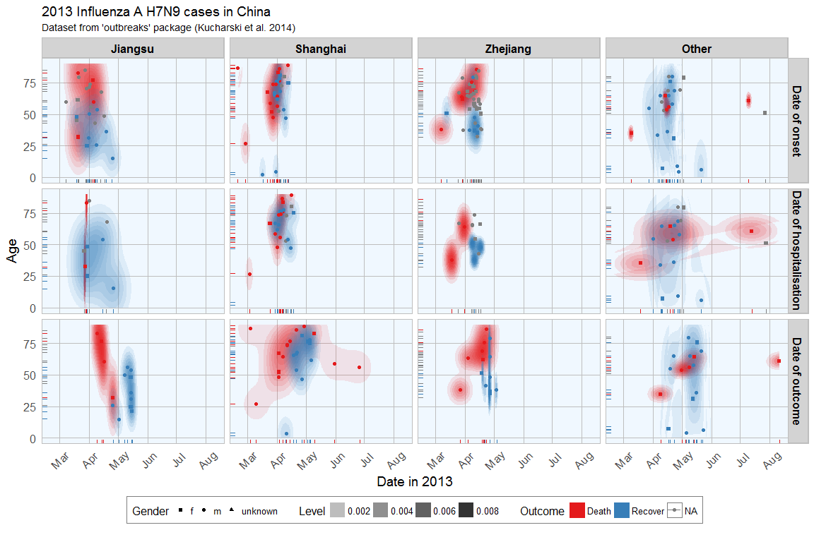
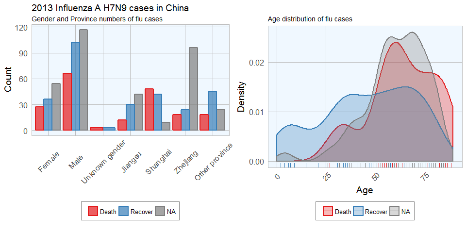
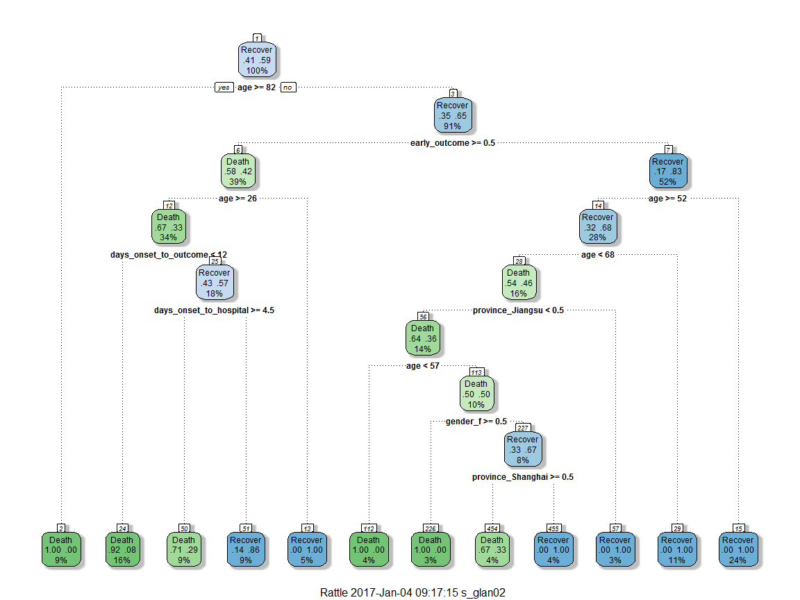
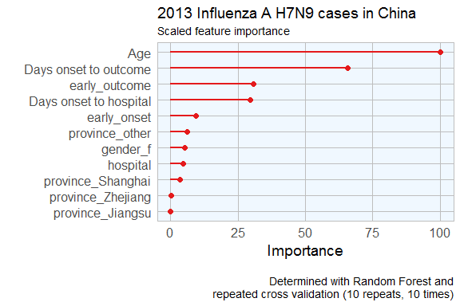
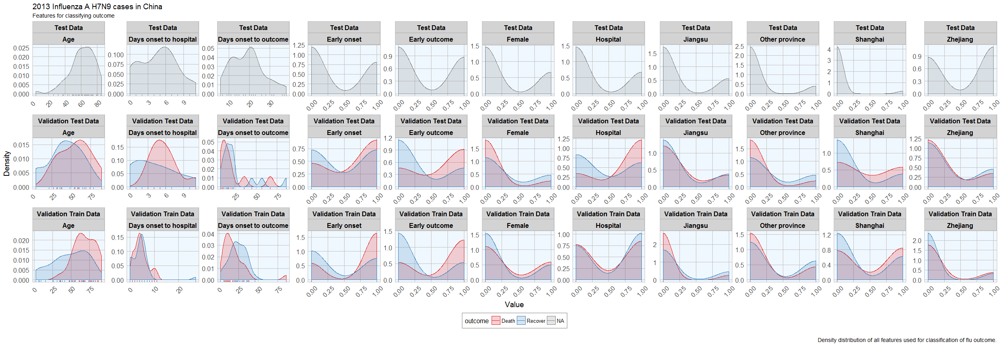
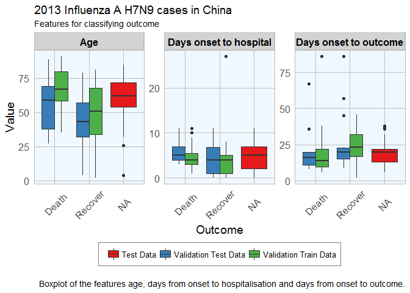
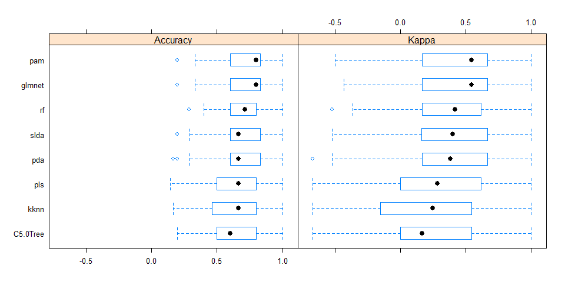
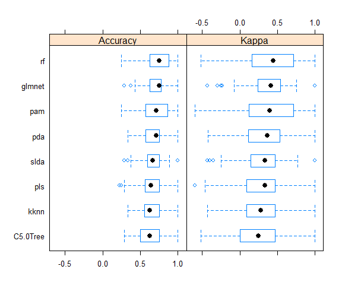
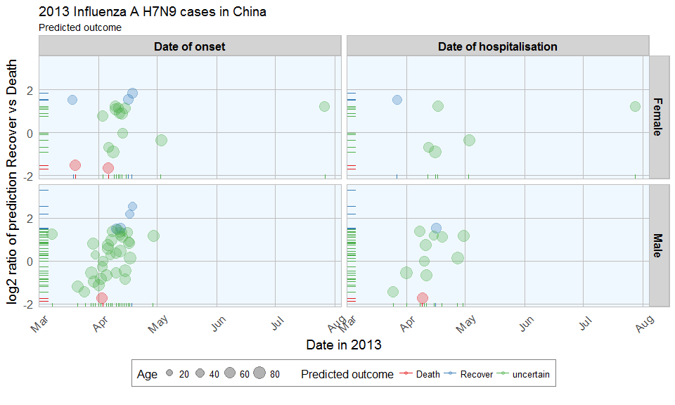

Among the many nice R packages containing data collections is the [outbreaks](https://mran.microsoft.com/web/packages/outbreaks/outbreaks.pdf) package. It contains datsets on epidemics and among them is data from the 2013 outbreak of [influenza A H7N9](http://www.who.int/influenza/human_animal_interface/faq_H7N9/en/) in [China](http://www.who.int/influenza/human_animal_interface/influenza_h7n9/ChinaH7N9JointMissionReport2013u.pdf?ua=1) as analysed by Kucharski et al. (2014):

> A. Kucharski, H. Mills, A. Pinsent, C. Fraser, M. Van Kerkhove, C. A. Donnelly, and S. Riley. 2014. Distinguishing between reservoir exposure and human-to-human transmission for emerging pathogens using case onset data. PLOS Currents Outbreaks. Mar 7, edition 1. doi: 10.1371/currents.outbreaks.e1473d9bfc99d080ca242139a06c455f.

> A. Kucharski, H. Mills, A. Pinsent, C. Fraser, M. Van Kerkhove, C. A. Donnelly, and S. Riley. 2014. Data from: Distinguishing between reservoir exposure and human-to-human transmission for emerging pathogens using case onset data. Dryad Digital Repository. <http://dx.doi.org/10.5061/dryad.2g43n>.

I will be using their data as an example to show how to use Machine Learning algorithms for predicting disease outcome.

------------------------------------------------------------------------

**Disclaimer:** I am not an expert in Machine Learning. Everything I know, I tought myself during the last months. So, if you see any mistakes or have tips and tricks for improvement, please don't hesitate to let me know! Thanks. :-)

------------------------------------------------------------------------

<br>

The data
========

The dataset contains case ID, date of onset, date of hospitalisation, date of outcome, gender, age, province and of course outcome: Death or Recovery.

``` r
options(width = 1000)

if (!require("outbreaks")) install.packages("outbreaks")
library(outbreaks)
fluH7N9.china.2013_backup <- fluH7N9.china.2013

fluH7N9.china.2013$age[which(fluH7N9.china.2013$age == "?")] <- NA
fluH7N9.china.2013$case.ID <- paste("case", fluH7N9.china.2013$case.ID, sep = "_")
head(fluH7N9.china.2013)
```

    ##   case.ID date.of.onset date.of.hospitalisation date.of.outcome outcome gender age province
    ## 1  case_1    2013-02-19                    <NA>      2013-03-04   Death      m  87 Shanghai
    ## 2  case_2    2013-02-27              2013-03-03      2013-03-10   Death      m  27 Shanghai
    ## 3  case_3    2013-03-09              2013-03-19      2013-04-09   Death      f  35    Anhui
    ## 4  case_4    2013-03-19              2013-03-27            <NA>    <NA>      f  45  Jiangsu
    ## 5  case_5    2013-03-19              2013-03-30      2013-05-15 Recover      f  48  Jiangsu
    ## 6  case_6    2013-03-21              2013-03-28      2013-04-26   Death      f  32  Jiangsu

``` r
library(tidyr)
fluH7N9.china.2013_gather <- fluH7N9.china.2013 %>%
  gather(Group, Date, date.of.onset:date.of.outcome)

fluH7N9.china.2013_gather$Group <- factor(fluH7N9.china.2013_gather$Group, levels = c("date.of.onset", "date.of.hospitalisation", "date.of.outcome"))

library(plyr)
fluH7N9.china.2013_gather$Group <- mapvalues(fluH7N9.china.2013_gather$Group, from = c("date.of.onset", "date.of.hospitalisation", "date.of.outcome"), 
          to = c("Date of onset", "Date of hospitalisation", "Date of outcome"))

fluH7N9.china.2013_gather$province <- mapvalues(fluH7N9.china.2013_gather$province, 
                                                from = c("Anhui", "Beijing", "Fujian", "Guangdong", "Hebei", "Henan", "Hunan", "Jiangxi", "Shandong", "Taiwan"), 
                                                to = rep("Other", 10))

levels(fluH7N9.china.2013_gather$gender) <- c(levels(fluH7N9.china.2013_gather$gender), "unknown")
fluH7N9.china.2013_gather$gender[is.na(fluH7N9.china.2013_gather$gender)] <- "unknown"

fluH7N9.china.2013_gather$province <- factor(fluH7N9.china.2013_gather$province, levels = c("Jiangsu",  "Shanghai", "Zhejiang", "Other"))

fluH7N9.china.2013_gather$age <- as.numeric(as.character(fluH7N9.china.2013_gather$age))
```

``` r
library(ggplot2)
my_theme <- function(base_size = 12, base_family = "sans"){
  theme_minimal(base_size = base_size, base_family = base_family) +
  theme(
    axis.text = element_text(size = 12),
    axis.text.x = element_text(angle = 45, vjust = 0.5, hjust = 0.5),
    axis.title = element_text(size = 14),
    panel.grid.major = element_line(color = "grey"),
    panel.grid.minor = element_blank(),
    panel.background = element_rect(fill = "aliceblue"),
    strip.background = element_rect(fill = "lightgrey", color = "grey", size = 1),
    strip.text = element_text(face = "bold", size = 12, color = "black"),
    legend.position = "bottom",
    legend.justification = "top", 
    legend.box = "horizontal",
    legend.box.background = element_rect(colour = "grey50"),
    legend.background = element_blank(),
    panel.border = element_rect(color = "grey", fill = NA, size = 0.5)
  )
}
```

``` r
ggplot(data = fluH7N9.china.2013_gather, aes(x = Date, y = age, fill = outcome)) +
  stat_density2d(aes(alpha = ..level..), geom = "polygon") +
  geom_jitter(aes(color = outcome, shape = gender), size = 1.5) +
  geom_rug(aes(color = outcome)) +
  scale_y_continuous(limits = c(0, 90)) +
  labs(
    fill = "Outcome",
    color = "Outcome",
    alpha = "Level",
    shape = "Gender",
    x = "Date in 2013",
    y = "Age",
    title = "2013 Influenza A H7N9 cases in China",
    subtitle = "Dataset from 'outbreaks' package (Kucharski et al. 2014)",
    caption = ""
  ) +
  facet_grid(Group ~ province) +
  my_theme() +
  scale_shape_manual(values = c(15, 16, 17)) +
  scale_color_brewer(palette="Set1", na.value = "grey50") +
  scale_fill_brewer(palette="Set1")
```



``` r
fluH7N9.china.2013_gather_2 <- fluH7N9.china.2013_gather[, -4] %>%
  gather(group_2, value, gender:province)

fluH7N9.china.2013_gather_2$value <- mapvalues(fluH7N9.china.2013_gather_2$value, from = c("m", "f", "unknown", "Other"), 
          to = c("Male", "Female", "Unknown gender", "Other province"))

fluH7N9.china.2013_gather_2$value <- factor(fluH7N9.china.2013_gather_2$value, 
                                            levels = c("Female", "Male", "Unknown gender", "Jiangsu", "Shanghai", "Zhejiang", "Other province"))

p1 <- ggplot(data = fluH7N9.china.2013_gather_2, aes(x = value, fill = outcome, color = outcome)) +
  geom_bar(position = "dodge", alpha = 0.7, size = 1) +
  my_theme() +
  scale_fill_brewer(palette="Set1", na.value = "grey50") +
  scale_color_brewer(palette="Set1", na.value = "grey50") +
  labs(
    color = "",
    fill = "",
    x = "",
    y = "Count",
    title = "2013 Influenza A H7N9 cases in China",
    subtitle = "Gender and Province numbers of flu cases",
    caption = ""
  )

p2 <- ggplot(data = fluH7N9.china.2013_gather, aes(x = age, fill = outcome, color = outcome)) +
  geom_density(alpha = 0.3, size = 1) +
  geom_rug() +
  scale_x_continuous(limits = c(0, 90)) +
  scale_color_brewer(palette="Set1", na.value = "grey50") +
  scale_fill_brewer(palette="Set1", na.value = "grey50") +
  my_theme() +
  labs(
    color = "",
    fill = "",
    x = "Age",
    y = "Density",
    title = "",
    subtitle = "Age distribution of flu cases",
    caption = ""
  )

library(gridExtra)
library(grid)

grid.arrange(p1, p2, ncol = 2)
```



``` r
ggplot(data = fluH7N9.china.2013_gather, aes(x = Date, y = age, color = outcome)) +
  geom_point(aes(color = outcome, shape = gender), size = 1.5, alpha = 0.6) +
  geom_path(aes(group = case.ID)) +
  facet_wrap( ~ province, ncol = 2) +
  my_theme() +
  scale_shape_manual(values = c(15, 16, 17)) +
  scale_color_brewer(palette="Set1", na.value = "grey50") +
  scale_fill_brewer(palette="Set1") +
  labs(
    color = "Outcome",
    shape = "Gender",
    x = "Date in 2013",
    y = "Age",
    title = "2013 Influenza A H7N9 cases in China",
    subtitle = "Dataset from 'outbreaks' package (Kucharski et al. 2014)",
    caption = "\nTime from onset of flu to outcome."
  )
```


<br>

Features
========

In Machine Learning-speak features are what we call the variables used for model training. Using the right features dramatically influences the accuracy and success of your model.

For this example, I am keeping age, but I am also generating new features from the date information and converting gender and province into numerical values.

``` r
library(dplyr)

dataset <- fluH7N9.china.2013 %>%
  mutate(hospital = as.factor(ifelse(is.na(date.of.hospitalisation), 0, 1)),
         gender_f = as.factor(ifelse(gender == "f", 1, 0)),
         province_Jiangsu = as.factor(ifelse(province == "Jiangsu", 1, 0)),
         province_Shanghai = as.factor(ifelse(province == "Shanghai", 1, 0)),
         province_Zhejiang = as.factor(ifelse(province == "Zhejiang", 1, 0)),
         province_other = as.factor(ifelse(province == "Zhejiang" | province == "Jiangsu" | province == "Shanghai", 0, 1)),
         days_onset_to_outcome = as.numeric(as.character(gsub(" days", "",
                                      as.Date(as.character(date.of.outcome), format = "%Y-%m-%d") - 
                                        as.Date(as.character(date.of.onset), format = "%Y-%m-%d")))),
         days_onset_to_hospital = as.numeric(as.character(gsub(" days", "",
                                      as.Date(as.character(date.of.hospitalisation), format = "%Y-%m-%d") - 
                                        as.Date(as.character(date.of.onset), format = "%Y-%m-%d")))),
         age = age,
         early_onset = as.factor(ifelse(date.of.onset < summary(fluH7N9.china.2013$date.of.onset)[[3]], 1, 0)),
         early_outcome = as.factor(ifelse(date.of.outcome < summary(fluH7N9.china.2013$date.of.outcome)[[3]], 1, 0))) %>%
  subset(select = -c(2:4, 6, 8))
rownames(dataset) <- dataset$case.ID
dataset <- dataset[, -1]
head(dataset)
```

    ##        outcome age hospital gender_f province_Jiangsu province_Shanghai province_Zhejiang province_other days_onset_to_outcome days_onset_to_hospital early_onset early_outcome
    ## case_1   Death  87        0        0                0                 1                 0              0                    13                     NA           1             1
    ## case_2   Death  27        1        0                0                 1                 0              0                    11                      4           1             1
    ## case_3   Death  35        1        1                0                 0                 0              1                    31                     10           1             1
    ## case_4    <NA>  45        1        1                1                 0                 0              0                    NA                      8           1          <NA>
    ## case_5 Recover  48        1        1                1                 0                 0              0                    57                     11           1             0
    ## case_6   Death  32        1        1                1                 0                 0              0                    36                      7           1             1

``` r
summary(dataset$outcome)
```

    ##   Death Recover    NA's 
    ##      32      47      57

<br>

Imputing missing values
-----------------------

<https://www.r-bloggers.com/imputing-missing-data-with-r-mice-package/>

``` r
library(mice)

dataset[, -1] <- as.numeric(as.matrix(dataset[, -1]))

dataset_impute <- mice(data = dataset[, -1],  print = FALSE)
dataset_impute
```

    ## Multiply imputed data set
    ## Call:
    ## mice(data = dataset[, -1], printFlag = FALSE)
    ## Number of multiple imputations:  5
    ## Missing cells per column:
    ##                    age               hospital               gender_f       province_Jiangsu      province_Shanghai      province_Zhejiang         province_other  days_onset_to_outcome days_onset_to_hospital            early_onset          early_outcome 
    ##                      2                      0                      2                      0                      0                      0                      0                     67                     74                     10                     65 
    ## Imputation methods:
    ##                    age               hospital               gender_f       province_Jiangsu      province_Shanghai      province_Zhejiang         province_other  days_onset_to_outcome days_onset_to_hospital            early_onset          early_outcome 
    ##                  "pmm"                     ""                  "pmm"                     ""                     ""                     ""                     ""                  "pmm"                  "pmm"                  "pmm"                  "pmm" 
    ## VisitSequence:
    ##                    age               gender_f  days_onset_to_outcome days_onset_to_hospital            early_onset          early_outcome 
    ##                      1                      3                      8                      9                     10                     11 
    ## PredictorMatrix:
    ##                        age hospital gender_f province_Jiangsu province_Shanghai province_Zhejiang province_other days_onset_to_outcome days_onset_to_hospital early_onset early_outcome
    ## age                      0        1        1                1                 1                 1              1                     1                      1           1             1
    ## hospital                 0        0        0                0                 0                 0              0                     0                      0           0             0
    ## gender_f                 1        1        0                1                 1                 1              1                     1                      1           1             1
    ## province_Jiangsu         0        0        0                0                 0                 0              0                     0                      0           0             0
    ## province_Shanghai        0        0        0                0                 0                 0              0                     0                      0           0             0
    ## province_Zhejiang        0        0        0                0                 0                 0              0                     0                      0           0             0
    ## province_other           0        0        0                0                 0                 0              0                     0                      0           0             0
    ## days_onset_to_outcome    1        1        1                1                 1                 1              1                     0                      1           1             1
    ## days_onset_to_hospital   1        1        1                1                 1                 1              1                     1                      0           1             1
    ## early_onset              1        1        1                1                 1                 1              1                     1                      1           0             1
    ## early_outcome            1        1        1                1                 1                 1              1                     1                      1           1             0
    ## Random generator seed value:  NA

``` r
dataset_complete <- merge(dataset[, 1, drop = FALSE], mice::complete(dataset_impute, 1), by = "row.names", all = TRUE)
rownames(dataset_complete) <- dataset_complete$Row.names
dataset_complete <- dataset_complete[, -1]
```

<br>

Test, train and validation data sets
====================================

``` r
train_index <- which(is.na(dataset_complete$outcome))
train_data <- dataset_complete[-train_index, ]
test_data  <- dataset_complete[train_index, -1]

library(caret)
set.seed(27)
val_index <- createDataPartition(train_data$outcome, p = 0.7, list=FALSE)
val_train_data <- train_data[val_index, ]
val_test_data  <- train_data[-val_index, ]
val_train_X <- val_train_data[,-1]
val_test_X <- val_test_data[,-1]
```

<br>

Decision trees
--------------

``` r
library(rpart)
library(rattle)
library(rpart.plot)
library(RColorBrewer)

set.seed(27)
fit <- rpart(outcome ~ .,
                    data = train_data,
                    method = "class",
                    control = rpart.control(xval = 10, minbucket = 2, cp = 0), parms = list(split = "information"))

fancyRpartPlot(fit)
```



<br>

Feature Importance
------------------

``` r
# prepare training scheme
control <- trainControl(method = "repeatedcv", number = 10, repeats = 10)

# train the model
set.seed(27)
model <- train(outcome ~ ., data = train_data, method = "rf", preProcess = NULL, trControl = control)

# estimate variable importance
importance <- varImp(model, scale=TRUE)
```

``` r
importance_df_1 <- importance$importance
importance_df_1$group <- rownames(importance_df_1)

importance_df_1$group <- mapvalues(importance_df_1$group, 
                                           from = c("age", "hospital2", "gender_f2", "province_Jiangsu2", "province_Shanghai2", "province_Zhejiang2",
                                                    "province_other2", "days_onset_to_outcome", "days_onset_to_hospital", "early_onset2", "early_outcome2" ), 
                                           to = c("Age", "Hospital", "Female", "Jiangsu", "Shanghai", "Zhejiang",
                                                    "Other province", "Days onset to outcome", "Days onset to hospital", "Early onset", "Early outcome" ))
f = importance_df_1[order(importance_df_1$Overall, decreasing = FALSE), "group"]

importance_df_2 <- importance_df_1
importance_df_2$Overall <- 0

importance_df <- rbind(importance_df_1, importance_df_2)

# setting factor levels
importance_df <- within(importance_df, group <- factor(group, levels = f))
importance_df_1 <- within(importance_df_1, group <- factor(group, levels = f))

ggplot() +
  geom_point(data = importance_df_1, aes(x = Overall, y = group, color = group), size = 2) +
  geom_path(data = importance_df, aes(x = Overall, y = group, color = group, group = group), size = 1) +
  scale_color_manual(values = rep(brewer.pal(1, "Set1")[1], 11)) +
  my_theme() +
  theme(legend.position = "none",
        axis.text.x = element_text(angle = 0, vjust = 0.5, hjust = 0.5)) +
  labs(
    x = "Importance",
    y = "",
    title = "2013 Influenza A H7N9 cases in China",
    subtitle = "Scaled feature importance",
    caption = "\nDetermined with Random Forest and
    repeated cross validation (10 repeats, 10 times)"
  )
```



<br>

Feature Plot
------------

``` r
dataset_complete_gather <- dataset_complete %>%
  mutate(set = ifelse(rownames(dataset_complete) %in% rownames(test_data), "Test Data", 
                               ifelse(rownames(dataset_complete) %in% rownames(val_train_data), "Validation Train Data",
                                      ifelse(rownames(dataset_complete) %in% rownames(val_test_data), "Validation Test Data", "NA"))),
         case_ID = rownames(.)) %>%
  gather(group, value, age:early_outcome)

dataset_complete_gather$group <- mapvalues(dataset_complete_gather$group, 
                                           from = c("age", "hospital", "gender_f", "province_Jiangsu", "province_Shanghai", "province_Zhejiang",
                                                    "province_other", "days_onset_to_outcome", "days_onset_to_hospital", "early_onset", "early_outcome" ), 
                                           to = c("Age", "Hospital", "Female", "Jiangsu", "Shanghai", "Zhejiang",
                                                    "Other province", "Days onset to outcome", "Days onset to hospital", "Early onset", "Early outcome" ))
```

``` r
ggplot(data = dataset_complete_gather, aes(x = as.numeric(value), fill = outcome, color = outcome)) +
  geom_density(alpha = 0.2) +
  geom_rug() +
  scale_color_brewer(palette="Set1", na.value = "grey50") +
  scale_fill_brewer(palette="Set1", na.value = "grey50") +
  my_theme() +
  facet_wrap(set ~ group, ncol = 11, scales = "free") +
  labs(
    x = "Value",
    y = "Density",
    title = "2013 Influenza A H7N9 cases in China",
    subtitle = "Features for classifying outcome",
    caption = "\nDensity distribution of all features used for classification of flu outcome."
  )
```



``` r
ggplot(subset(dataset_complete_gather, group == "Age" | group == "Days onset to hospital" | group == "Days onset to outcome"), 
       aes(x=outcome, y=as.numeric(value), fill=set)) + geom_boxplot() +
  my_theme() +
  scale_fill_brewer(palette="Set1", type = "div ") +
  facet_wrap( ~ group, ncol = 3, scales = "free") +
  labs(
    fill = "",
    x = "Outcome",
    y = "Value",
    title = "2013 Influenza A H7N9 cases in China",
    subtitle = "Features for classifying outcome",
    caption = "\nBoxplot of the features age, days from onset to hospitalisation and days from onset to outcome."
  )
```



<br>

Comparing Machine Learning algorithms
=====================================

On validation data set.

<br>

Random Forest
-------------

``` r
set.seed(27)
model_rf <- caret::train(outcome ~ .,
                             data = val_train_data,
                             method = "rf",
                             preProcess = NULL,
                             trControl = trainControl(method = "repeatedcv", number = 10, repeats = 10, verboseIter = FALSE))
model_rf
```

    ## Random Forest 
    ## 
    ## 56 samples
    ## 11 predictors
    ##  2 classes: 'Death', 'Recover' 
    ## 
    ## No pre-processing
    ## Resampling: Cross-Validated (10 fold, repeated 10 times) 
    ## Summary of sample sizes: 50, 50, 51, 51, 51, 50, ... 
    ## Resampling results across tuning parameters:
    ## 
    ##   mtry  Accuracy   Kappa    
    ##    2    0.7124762  0.3892183
    ##    6    0.7128095  0.3859862
    ##   11    0.7038095  0.3719085
    ## 
    ## Accuracy was used to select the optimal model using  the largest value.
    ## The final value used for the model was mtry = 6.

``` r
confusionMatrix(predict(model_rf, val_test_data[, -1]), val_test_data$outcome)
```

    ## Confusion Matrix and Statistics
    ## 
    ##           Reference
    ## Prediction Death Recover
    ##    Death       5       3
    ##    Recover     4      11
    ##                                           
    ##                Accuracy : 0.6957          
    ##                  95% CI : (0.4708, 0.8679)
    ##     No Information Rate : 0.6087          
    ##     P-Value [Acc > NIR] : 0.2644          
    ##                                           
    ##                   Kappa : 0.3482          
    ##  Mcnemar's Test P-Value : 1.0000          
    ##                                           
    ##             Sensitivity : 0.5556          
    ##             Specificity : 0.7857          
    ##          Pos Pred Value : 0.6250          
    ##          Neg Pred Value : 0.7333          
    ##              Prevalence : 0.3913          
    ##          Detection Rate : 0.2174          
    ##    Detection Prevalence : 0.3478          
    ##       Balanced Accuracy : 0.6706          
    ##                                           
    ##        'Positive' Class : Death           
    ## 

<br>

GLM net
-------

``` r
set.seed(27)
model_glmnet <- caret::train(outcome ~ .,
                             data = val_train_data,
                             method = "glmnet",
                             preProcess = NULL,
                             trControl = trainControl(method = "repeatedcv", number = 10, repeats = 10, verboseIter = FALSE))
model_glmnet
```

    ## glmnet 
    ## 
    ## 56 samples
    ## 11 predictors
    ##  2 classes: 'Death', 'Recover' 
    ## 
    ## No pre-processing
    ## Resampling: Cross-Validated (10 fold, repeated 10 times) 
    ## Summary of sample sizes: 50, 50, 51, 51, 51, 50, ... 
    ## Resampling results across tuning parameters:
    ## 
    ##   alpha  lambda        Accuracy   Kappa    
    ##   0.10   0.0004375534  0.7176190  0.4129072
    ##   0.10   0.0043755341  0.7229524  0.4232427
    ##   0.10   0.0437553409  0.7140476  0.4032239
    ##   0.55   0.0004375534  0.7176190  0.4129072
    ##   0.55   0.0043755341  0.7209524  0.4188163
    ##   0.55   0.0437553409  0.7142857  0.4103436
    ##   1.00   0.0004375534  0.7156190  0.4092709
    ##   1.00   0.0043755341  0.7192857  0.4154830
    ##   1.00   0.0437553409  0.7290000  0.4347383
    ## 
    ## Accuracy was used to select the optimal model using  the largest value.
    ## The final values used for the model were alpha = 1 and lambda = 0.04375534.

``` r
confusionMatrix(predict(model_glmnet, val_test_data[, -1]), val_test_data$outcome)
```

    ## Confusion Matrix and Statistics
    ## 
    ##           Reference
    ## Prediction Death Recover
    ##    Death       4       3
    ##    Recover     5      11
    ##                                           
    ##                Accuracy : 0.6522          
    ##                  95% CI : (0.4273, 0.8362)
    ##     No Information Rate : 0.6087          
    ##     P-Value [Acc > NIR] : 0.4216          
    ##                                           
    ##                   Kappa : 0.2397          
    ##  Mcnemar's Test P-Value : 0.7237          
    ##                                           
    ##             Sensitivity : 0.4444          
    ##             Specificity : 0.7857          
    ##          Pos Pred Value : 0.5714          
    ##          Neg Pred Value : 0.6875          
    ##              Prevalence : 0.3913          
    ##          Detection Rate : 0.1739          
    ##    Detection Prevalence : 0.3043          
    ##       Balanced Accuracy : 0.6151          
    ##                                           
    ##        'Positive' Class : Death           
    ## 

<br>

k-Nearest Neighbors
-------------------

``` r
set.seed(27)
model_kknn <- caret::train(outcome ~ .,
                             data = val_train_data,
                             method = "kknn",
                             preProcess = NULL,
                             trControl = trainControl(method = "repeatedcv", number = 10, repeats = 10, verboseIter = FALSE))
model_kknn
```

    ## k-Nearest Neighbors 
    ## 
    ## 56 samples
    ## 11 predictors
    ##  2 classes: 'Death', 'Recover' 
    ## 
    ## No pre-processing
    ## Resampling: Cross-Validated (10 fold, repeated 10 times) 
    ## Summary of sample sizes: 50, 50, 51, 51, 51, 50, ... 
    ## Resampling results across tuning parameters:
    ## 
    ##   kmax  Accuracy   Kappa    
    ##   5     0.6275714  0.2271685
    ##   7     0.6317619  0.2352165
    ##   9     0.6334286  0.2385498
    ## 
    ## Tuning parameter 'distance' was held constant at a value of 2
    ## Tuning parameter 'kernel' was held constant at a value of optimal
    ## Accuracy was used to select the optimal model using  the largest value.
    ## The final values used for the model were kmax = 9, distance = 2 and kernel = optimal.

``` r
confusionMatrix(predict(model_kknn, val_test_data[, -1]), val_test_data$outcome)
```

    ## Confusion Matrix and Statistics
    ## 
    ##           Reference
    ## Prediction Death Recover
    ##    Death       3       3
    ##    Recover     6      11
    ##                                           
    ##                Accuracy : 0.6087          
    ##                  95% CI : (0.3854, 0.8029)
    ##     No Information Rate : 0.6087          
    ##     P-Value [Acc > NIR] : 0.5901          
    ##                                           
    ##                   Kappa : 0.1266          
    ##  Mcnemar's Test P-Value : 0.5050          
    ##                                           
    ##             Sensitivity : 0.3333          
    ##             Specificity : 0.7857          
    ##          Pos Pred Value : 0.5000          
    ##          Neg Pred Value : 0.6471          
    ##              Prevalence : 0.3913          
    ##          Detection Rate : 0.1304          
    ##    Detection Prevalence : 0.2609          
    ##       Balanced Accuracy : 0.5595          
    ##                                           
    ##        'Positive' Class : Death           
    ## 

<br>

Penalized Discriminant Analysis
-------------------------------

``` r
set.seed(27)
model_pda <- caret::train(outcome ~ .,
                             data = val_train_data,
                             method = "pda",
                             preProcess = NULL,
                             trControl = trainControl(method = "repeatedcv", number = 10, repeats = 10, verboseIter = FALSE))
model_pda
```

    ## Penalized Discriminant Analysis 
    ## 
    ## 56 samples
    ## 11 predictors
    ##  2 classes: 'Death', 'Recover' 
    ## 
    ## No pre-processing
    ## Resampling: Cross-Validated (10 fold, repeated 10 times) 
    ## Summary of sample sizes: 50, 50, 51, 51, 51, 50, ... 
    ## Resampling results across tuning parameters:
    ## 
    ##   lambda  Accuracy   Kappa    
    ##   0e+00         NaN        NaN
    ##   1e-04   0.6981905  0.3788656
    ##   1e-01   0.6981905  0.3788656
    ## 
    ## Accuracy was used to select the optimal model using  the largest value.
    ## The final value used for the model was lambda = 1e-04.

``` r
confusionMatrix(predict(model_pda, val_test_data[, -1]), val_test_data$outcome)
```

    ## Confusion Matrix and Statistics
    ## 
    ##           Reference
    ## Prediction Death Recover
    ##    Death       4       3
    ##    Recover     5      11
    ##                                           
    ##                Accuracy : 0.6522          
    ##                  95% CI : (0.4273, 0.8362)
    ##     No Information Rate : 0.6087          
    ##     P-Value [Acc > NIR] : 0.4216          
    ##                                           
    ##                   Kappa : 0.2397          
    ##  Mcnemar's Test P-Value : 0.7237          
    ##                                           
    ##             Sensitivity : 0.4444          
    ##             Specificity : 0.7857          
    ##          Pos Pred Value : 0.5714          
    ##          Neg Pred Value : 0.6875          
    ##              Prevalence : 0.3913          
    ##          Detection Rate : 0.1739          
    ##    Detection Prevalence : 0.3043          
    ##       Balanced Accuracy : 0.6151          
    ##                                           
    ##        'Positive' Class : Death           
    ## 

<br>

Stabilized Linear Discriminant Analysis
---------------------------------------

``` r
set.seed(27)
model_slda <- caret::train(outcome ~ .,
                             data = val_train_data,
                             method = "slda",
                             preProcess = NULL,
                             trControl = trainControl(method = "repeatedcv", number = 10, repeats = 10, verboseIter = FALSE))
model_slda
```

    ## Stabilized Linear Discriminant Analysis 
    ## 
    ## 56 samples
    ## 11 predictors
    ##  2 classes: 'Death', 'Recover' 
    ## 
    ## No pre-processing
    ## Resampling: Cross-Validated (10 fold, repeated 10 times) 
    ## Summary of sample sizes: 50, 50, 51, 51, 51, 50, ... 
    ## Resampling results:
    ## 
    ##   Accuracy   Kappa    
    ##   0.6887143  0.3569627
    ## 
    ## 

``` r
confusionMatrix(predict(model_slda, val_test_data[, -1]), val_test_data$outcome)
```

    ## Confusion Matrix and Statistics
    ## 
    ##           Reference
    ## Prediction Death Recover
    ##    Death       4       3
    ##    Recover     5      11
    ##                                           
    ##                Accuracy : 0.6522          
    ##                  95% CI : (0.4273, 0.8362)
    ##     No Information Rate : 0.6087          
    ##     P-Value [Acc > NIR] : 0.4216          
    ##                                           
    ##                   Kappa : 0.2397          
    ##  Mcnemar's Test P-Value : 0.7237          
    ##                                           
    ##             Sensitivity : 0.4444          
    ##             Specificity : 0.7857          
    ##          Pos Pred Value : 0.5714          
    ##          Neg Pred Value : 0.6875          
    ##              Prevalence : 0.3913          
    ##          Detection Rate : 0.1739          
    ##    Detection Prevalence : 0.3043          
    ##       Balanced Accuracy : 0.6151          
    ##                                           
    ##        'Positive' Class : Death           
    ## 

<br>

Nearest Shrunken Centroids
--------------------------

``` r
set.seed(27)
model_pam <- caret::train(outcome ~ .,
                             data = val_train_data,
                             method = "pam",
                             preProcess = NULL,
                             trControl = trainControl(method = "repeatedcv", number = 10, repeats = 10, verboseIter = FALSE))
```

    ## 12345678910111213141516171819202122232425262728293011111111111111111111111111111111111111111111111111111111111111111111111111111111111111111111111111111

``` r
model_pam
```

    ## Nearest Shrunken Centroids 
    ## 
    ## 56 samples
    ## 11 predictors
    ##  2 classes: 'Death', 'Recover' 
    ## 
    ## No pre-processing
    ## Resampling: Cross-Validated (10 fold, repeated 10 times) 
    ## Summary of sample sizes: 50, 50, 51, 51, 51, 50, ... 
    ## Resampling results across tuning parameters:
    ## 
    ##   threshold  Accuracy   Kappa    
    ##   0.1229214  0.7163333  0.4212994
    ##   1.7823601  0.6314286  0.1869084
    ##   3.4417989  0.5904762  0.0000000
    ## 
    ## Accuracy was used to select the optimal model using  the largest value.
    ## The final value used for the model was threshold = 0.1229214.

``` r
confusionMatrix(predict(model_pam, val_test_data[, -1]), val_test_data$outcome)
```

    ## Confusion Matrix and Statistics
    ## 
    ##           Reference
    ## Prediction Death Recover
    ##    Death       4       2
    ##    Recover     5      12
    ##                                           
    ##                Accuracy : 0.6957          
    ##                  95% CI : (0.4708, 0.8679)
    ##     No Information Rate : 0.6087          
    ##     P-Value [Acc > NIR] : 0.2644          
    ##                                           
    ##                   Kappa : 0.3207          
    ##  Mcnemar's Test P-Value : 0.4497          
    ##                                           
    ##             Sensitivity : 0.4444          
    ##             Specificity : 0.8571          
    ##          Pos Pred Value : 0.6667          
    ##          Neg Pred Value : 0.7059          
    ##              Prevalence : 0.3913          
    ##          Detection Rate : 0.1739          
    ##    Detection Prevalence : 0.2609          
    ##       Balanced Accuracy : 0.6508          
    ##                                           
    ##        'Positive' Class : Death           
    ## 

<br>

Single C5.0 Tree
----------------

``` r
set.seed(27)
model_C5.0Tree <- caret::train(outcome ~ .,
                             data = val_train_data,
                             method = "C5.0Tree",
                             preProcess = NULL,
                             trControl = trainControl(method = "repeatedcv", number = 10, repeats = 10, verboseIter = FALSE))
model_C5.0Tree
```

    ## Single C5.0 Tree 
    ## 
    ## 56 samples
    ## 11 predictors
    ##  2 classes: 'Death', 'Recover' 
    ## 
    ## No pre-processing
    ## Resampling: Cross-Validated (10 fold, repeated 10 times) 
    ## Summary of sample sizes: 50, 50, 51, 51, 51, 50, ... 
    ## Resampling results:
    ## 
    ##   Accuracy   Kappa    
    ##   0.6328571  0.2106007
    ## 
    ## 

``` r
confusionMatrix(predict(model_C5.0Tree, val_test_data[, -1]), val_test_data$outcome)
```

    ## Confusion Matrix and Statistics
    ## 
    ##           Reference
    ## Prediction Death Recover
    ##    Death       7       4
    ##    Recover     2      10
    ##                                           
    ##                Accuracy : 0.7391          
    ##                  95% CI : (0.5159, 0.8977)
    ##     No Information Rate : 0.6087          
    ##     P-Value [Acc > NIR] : 0.1421          
    ##                                           
    ##                   Kappa : 0.4733          
    ##  Mcnemar's Test P-Value : 0.6831          
    ##                                           
    ##             Sensitivity : 0.7778          
    ##             Specificity : 0.7143          
    ##          Pos Pred Value : 0.6364          
    ##          Neg Pred Value : 0.8333          
    ##              Prevalence : 0.3913          
    ##          Detection Rate : 0.3043          
    ##    Detection Prevalence : 0.4783          
    ##       Balanced Accuracy : 0.7460          
    ##                                           
    ##        'Positive' Class : Death           
    ## 

<br>

Partial Least Squares
---------------------

``` r
set.seed(27)
model_pls <- caret::train(outcome ~ .,
                             data = val_train_data,
                             method = "pls",
                             preProcess = NULL,
                             trControl = trainControl(method = "repeatedcv", number = 10, repeats = 10, verboseIter = FALSE))
model_pls
```

    ## Partial Least Squares 
    ## 
    ## 56 samples
    ## 11 predictors
    ##  2 classes: 'Death', 'Recover' 
    ## 
    ## No pre-processing
    ## Resampling: Cross-Validated (10 fold, repeated 10 times) 
    ## Summary of sample sizes: 50, 50, 51, 51, 51, 50, ... 
    ## Resampling results across tuning parameters:
    ## 
    ##   ncomp  Accuracy   Kappa    
    ##   1      0.6338571  0.2445334
    ##   2      0.6529524  0.2808174
    ##   3      0.6517619  0.2894200
    ## 
    ## Accuracy was used to select the optimal model using  the largest value.
    ## The final value used for the model was ncomp = 2.

``` r
confusionMatrix(predict(model_pls, val_test_data[, -1]), val_test_data$outcome)
```

    ## Confusion Matrix and Statistics
    ## 
    ##           Reference
    ## Prediction Death Recover
    ##    Death       4       3
    ##    Recover     5      11
    ##                                           
    ##                Accuracy : 0.6522          
    ##                  95% CI : (0.4273, 0.8362)
    ##     No Information Rate : 0.6087          
    ##     P-Value [Acc > NIR] : 0.4216          
    ##                                           
    ##                   Kappa : 0.2397          
    ##  Mcnemar's Test P-Value : 0.7237          
    ##                                           
    ##             Sensitivity : 0.4444          
    ##             Specificity : 0.7857          
    ##          Pos Pred Value : 0.5714          
    ##          Neg Pred Value : 0.6875          
    ##              Prevalence : 0.3913          
    ##          Detection Rate : 0.1739          
    ##    Detection Prevalence : 0.3043          
    ##       Balanced Accuracy : 0.6151          
    ##                                           
    ##        'Positive' Class : Death           
    ## 

<br>

Comparing accuracy of models
----------------------------

``` r
# Create a list of models
models <- list(rf = model_rf, glmnet = model_glmnet, kknn = model_kknn, pda = model_pda, slda = model_slda,
               pam = model_pam, C5.0Tree = model_C5.0Tree, pls = model_pls)

# Resample the models
resample_results <- resamples(models)

# Generate a summary
summary(resample_results, metric = c("Kappa", "Accuracy"))
```

    ## 
    ## Call:
    ## summary.resamples(object = resample_results, metric = c("Kappa", "Accuracy"))
    ## 
    ## Models: rf, glmnet, kknn, pda, slda, pam, C5.0Tree, pls 
    ## Number of resamples: 100 
    ## 
    ## Kappa 
    ##             Min. 1st Qu. Median   Mean 3rd Qu. Max. NA's
    ## rf       -0.5217  0.1667 0.4167 0.3860  0.6154    1    0
    ## glmnet   -0.4286  0.1667 0.5455 0.4347  0.6667    1    0
    ## kknn     -0.6667 -0.1538 0.2500 0.2385  0.5455    1    0
    ## pda      -0.6667  0.1667 0.3818 0.3789  0.6667    1    0
    ## slda     -0.5217  0.1650 0.4000 0.3570  0.6667    1    0
    ## pam      -0.5000  0.1667 0.5455 0.4213  0.6667    1    0
    ## C5.0Tree -0.6667  0.0000 0.1667 0.2106  0.5455    1    0
    ## pls      -0.6667  0.0000 0.2857 0.2808  0.6154    1    0
    ## 
    ## Accuracy 
    ##            Min. 1st Qu. Median   Mean 3rd Qu. Max. NA's
    ## rf       0.2857  0.6000 0.7143 0.7128  0.8000    1    0
    ## glmnet   0.2000  0.6000 0.8000 0.7290  0.8333    1    0
    ## kknn     0.1667  0.4821 0.6667 0.6334  0.8000    1    0
    ## pda      0.1667  0.6000 0.6667 0.6982  0.8333    1    0
    ## slda     0.2000  0.6000 0.6667 0.6887  0.8333    1    0
    ## pam      0.2000  0.6000 0.8000 0.7163  0.8333    1    0
    ## C5.0Tree 0.2000  0.5000 0.6000 0.6329  0.8000    1    0
    ## pls      0.1429  0.5000 0.6667 0.6530  0.8000    1    0

``` r
bwplot(resample_results , metric = c("Kappa","Accuracy"))
```



<br>

### Results

``` r
results <- data.frame(randomForest = predict(model_rf, newdata = val_test_data[, -1], type="prob"),
                      glmnet = predict(model_glmnet, newdata = val_test_data[, -1], type="prob"),
                      kknn = predict(model_kknn, newdata = val_test_data[, -1], type="prob"),
                      pda = predict(model_pda, newdata = val_test_data[, -1], type="prob"),
                      slda = predict(model_slda, newdata = val_test_data[, -1], type="prob"),
                      pam = predict(model_pam, newdata = val_test_data[, -1], type="prob"),
                      C5.0Tree = predict(model_C5.0Tree, newdata = val_test_data[, -1], type="prob"),
                      pls = predict(model_pls, newdata = val_test_data[, -1], type="prob"))

results$sum_Death <- rowSums(results[, grep("Death", colnames(results))])
results$sum_Recover <- rowSums(results[, grep("Recover", colnames(results))])
results$log2_ratio <- log2(results$sum_Recover/results$sum_Death)
results$true_outcome <- val_test_data$outcome
results$pred_outcome <- ifelse(results$log2_ratio > 1.5, "Recover", ifelse(results$log2_ratio < -1.5, "Death", "uncertain"))
results$prediction <- ifelse(results$pred_outcome == results$true_outcome, "CORRECT", 
                             ifelse(results$pred_outcome == "uncertain", "uncertain", "wrong"))
results[, -c(1:16)]
```

    ##          sum_Death sum_Recover log2_ratio true_outcome pred_outcome prediction
    ## case_123 2.5561314    5.443869  1.0906702        Death    uncertain  uncertain
    ## case_127 0.7057641    7.294236  3.3694988      Recover      Recover    CORRECT
    ## case_128 2.9446738    5.055326  0.7796963      Recover    uncertain  uncertain
    ## case_14  1.6044893    6.395511  1.9949454      Recover      Recover    CORRECT
    ## case_19  3.2312834    4.768717  0.5614937        Death    uncertain  uncertain
    ## case_2   2.4035682    5.596432  1.2193296        Death    uncertain  uncertain
    ## case_20  4.1583249    3.841675 -0.1142669      Recover    uncertain  uncertain
    ## case_21  4.9166070    3.083393 -0.6731443      Recover    uncertain  uncertain
    ## case_34  5.9856017    2.014398 -1.5711473        Death        Death    CORRECT
    ## case_37  0.9101052    7.089895  2.9616589      Recover      Recover    CORRECT
    ## case_5   1.5124837    6.487516  2.1007466      Recover      Recover    CORRECT
    ## case_51  4.4788252    3.521175 -0.3470635      Recover    uncertain  uncertain
    ## case_55  3.4243525    4.575647  0.4181447      Recover    uncertain  uncertain
    ## case_6   2.2672686    5.732731  1.3382674        Death    uncertain  uncertain
    ## case_61  4.9899815    3.010018 -0.7292621        Death    uncertain  uncertain
    ## case_65  0.8542217    7.145778  3.0644087      Recover      Recover    CORRECT
    ## case_74  1.6762677    6.323732  1.9155238      Recover      Recover    CORRECT
    ## case_78  4.3515782    3.648422 -0.2542662        Death    uncertain  uncertain
    ## case_79  1.6728190    6.327181  1.9192815      Recover      Recover    CORRECT
    ## case_8   3.0222918    4.977708  0.7198387        Death    uncertain  uncertain
    ## case_87  5.3111491    2.688851 -0.9820343        Death    uncertain  uncertain
    ## case_91  1.5059160    6.494084  2.1084848      Recover      Recover    CORRECT
    ## case_94  1.4798132    6.520187  2.1394982      Recover      Recover    CORRECT

<br>

Predicting unknown outcomes
===========================

``` r
set.seed(27)
model_rf <- caret::train(outcome ~ .,
                             data = train_data,
                             method = "rf",
                             preProcess = NULL,
                             trControl = trainControl(method = "repeatedcv", number = 10, repeats = 10, verboseIter = FALSE))
model_glmnet <- caret::train(outcome ~ .,
                             data = train_data,
                             method = "glmnet",
                             preProcess = NULL,
                             trControl = trainControl(method = "repeatedcv", number = 10, repeats = 10, verboseIter = FALSE))
model_kknn <- caret::train(outcome ~ .,
                             data = train_data,
                             method = "kknn",
                             preProcess = NULL,
                             trControl = trainControl(method = "repeatedcv", number = 10, repeats = 10, verboseIter = FALSE))
model_pda <- caret::train(outcome ~ .,
                             data = train_data,
                             method = "pda",
                             preProcess = NULL,
                             trControl = trainControl(method = "repeatedcv", number = 10, repeats = 10, verboseIter = FALSE))
model_slda <- caret::train(outcome ~ .,
                             data = train_data,
                             method = "slda",
                             preProcess = NULL,
                             trControl = trainControl(method = "repeatedcv", number = 10, repeats = 10, verboseIter = FALSE))
model_pam <- caret::train(outcome ~ .,
                             data = train_data,
                             method = "pam",
                             preProcess = NULL,
                             trControl = trainControl(method = "repeatedcv", number = 10, repeats = 10, verboseIter = FALSE))
```

    ## 12345678910111213141516171819202122232425262728293011111111111111111111111111111111111111111111111111111111111111111111111111111111111111111111111111111

``` r
model_C5.0Tree <- caret::train(outcome ~ .,
                             data = train_data,
                             method = "C5.0Tree",
                             preProcess = NULL,
                             trControl = trainControl(method = "repeatedcv", number = 10, repeats = 10, verboseIter = FALSE))
model_pls <- caret::train(outcome ~ .,
                             data = train_data,
                             method = "pls",
                             preProcess = NULL,
                             trControl = trainControl(method = "repeatedcv", number = 10, repeats = 10, verboseIter = FALSE))

models <- list(rf = model_rf, glmnet = model_glmnet, kknn = model_kknn, pda = model_pda, slda = model_slda,
               pam = model_pam, C5.0Tree = model_C5.0Tree, pls = model_pls)

# Resample the models
resample_results <- resamples(models)

bwplot(resample_results , metric = c("Kappa","Accuracy"))
```



``` r
results <- data.frame(randomForest = predict(model_rf, newdata = test_data, type="prob"),
                      glmnet = predict(model_glmnet, newdata = test_data, type="prob"),
                      kknn = predict(model_kknn, newdata = test_data, type="prob"),
                      pda = predict(model_pda, newdata = test_data, type="prob"),
                      slda = predict(model_slda, newdata = test_data, type="prob"),
                      pam = predict(model_pam, newdata = test_data, type="prob"),
                      C5.0Tree = predict(model_C5.0Tree, newdata = test_data, type="prob"),
                      pls = predict(model_pls, newdata = test_data, type="prob"))

results$sum_Death <- rowSums(results[, grep("Death", colnames(results))])
results$sum_Recover <- rowSums(results[, grep("Recover", colnames(results))])
results$log2_ratio <- log2(results$sum_Recover/results$sum_Death)
results$predicted_outcome <- ifelse(results$log2_ratio > 1.5, "Recover", ifelse(results$log2_ratio < -1.5, "Death", "uncertain"))
results[, -c(1:16)]
```

    ##          sum_Death sum_Recover  log2_ratio predicted_outcome
    ## case_100 2.2639402    5.736060  1.34122417         uncertain
    ## case_101 2.7839646    5.216035  0.90581282         uncertain
    ## case_102 3.3610814    4.638919  0.46486302         uncertain
    ## case_103 2.5192867    5.480713  1.12134832         uncertain
    ## case_104 2.0345905    5.965409  1.55188269           Recover
    ## case_105 2.2612467    5.738753  1.34361894         uncertain
    ## case_108 4.6583877    3.341612 -0.47928639         uncertain
    ## case_109 5.1575305    2.842470 -0.85953557         uncertain
    ## case_110 2.0325035    5.967497  1.55386801           Recover
    ## case_112 2.8477363    5.152264  0.85539091         uncertain
    ## case_113 2.5323622    5.467638  1.11043393         uncertain
    ## case_114 1.7276379    6.272362  1.86020800           Recover
    ## case_115 1.4336239    6.566376  2.19543082           Recover
    ## case_118 2.8165826    5.183417  0.87995777         uncertain
    ## case_120 2.3924815    5.607518  1.22885470         uncertain
    ## case_122 1.1612193    6.838781  2.55809865           Recover
    ## case_126 3.8386115    4.161389  0.11648044         uncertain
    ## case_130 2.4400215    5.559978  1.18818542         uncertain
    ## case_132 4.4635384    3.536462 -0.33588121         uncertain
    ## case_136 2.3988789    5.601121  1.22335531         uncertain
    ## case_15  5.9507936    2.049206 -1.53801678             Death
    ## case_16  5.5597257    2.440274 -1.18797037         uncertain
    ## case_22  4.7829926    3.217007 -0.57219428         uncertain
    ## case_28  5.2671673    2.732833 -0.94663015         uncertain
    ## case_31  2.8919418    5.108058  0.82073641         uncertain
    ## case_32  5.1093626    2.890637 -0.82175564         uncertain
    ## case_38  4.3543214    3.645679 -0.25626050         uncertain
    ## case_39  2.2177378    5.782262  1.38254519         uncertain
    ## case_4   2.0492476    5.950752  1.53797782           Recover
    ## case_40  2.9747468    5.025253  0.75642945         uncertain
    ## case_41  4.9363036    3.063696 -0.68815778         uncertain
    ## case_42  4.0165992    3.983401 -0.01197389         uncertain
    ## case_47  5.4972731    2.502727 -1.13521526         uncertain
    ## case_48  6.1509565    1.849043 -1.73403162             Death
    ## case_52  6.0993179    1.900682 -1.68213067             Death
    ## case_54  3.2046690    4.795331  0.58145504         uncertain
    ## case_56  4.8872045    3.112796 -0.65079864         uncertain
    ## case_62  2.9557879    5.044212  0.77108619         uncertain
    ## case_63  3.4992949    4.500705  0.36308678         uncertain
    ## case_66  6.2983746    1.701625 -1.88806611             Death
    ## case_67  2.2520557    5.747944  1.35180353         uncertain
    ## case_68  2.0717713    5.928229  1.51673638           Recover
    ## case_69  4.7756426    3.224357 -0.56668323         uncertain
    ## case_70  2.4628970    5.537103  1.16877503         uncertain
    ## case_71  2.5453603    5.454640  1.09961405         uncertain
    ## case_80  2.6744650    5.325535  0.99367611         uncertain
    ## case_84  4.1257074    3.874293 -0.09070856         uncertain
    ## case_85  5.2356140    2.764386 -0.92139968         uncertain
    ## case_86  4.0461253    3.953875 -0.03327387         uncertain
    ## case_88  0.7253344    7.274666  3.32616271           Recover
    ## case_9   5.8645044    2.135496 -1.45743828         uncertain
    ## case_90  2.4693075    5.530693  1.16335365         uncertain
    ## case_92  2.3780602    5.621940  1.24128275         uncertain
    ## case_93  2.1113988    5.888601  1.47972588         uncertain
    ## case_95  3.6158176    4.384182  0.27798593         uncertain
    ## case_96  3.6591279    4.340872  0.24648505         uncertain
    ## case_99  2.7877327    5.212267  0.90281880         uncertain

``` r
results_combined <- merge(results[, -c(1:16)], fluH7N9.china.2013[which(fluH7N9.china.2013$case.ID %in% rownames(results)), ], 
                          by.x = "row.names", by.y = "case.ID")
results_combined <- results_combined[, -c(2, 3, 8, 9)]
```

``` r
results_combined_gather <- results_combined %>%
  gather(group_dates, date, date.of.onset:date.of.hospitalisation)

results_combined_gather$group_dates <- factor(results_combined_gather$group_dates, levels = c("date.of.onset", "date.of.hospitalisation"))

results_combined_gather$group_dates <- mapvalues(results_combined_gather$group_dates, from = c("date.of.onset", "date.of.hospitalisation"), 
                                             to = c("Date of onset", "Date of hospitalisation"))

results_combined_gather$gender <- mapvalues(results_combined_gather$gender, from = c("f", "m"), 
                                             to = c("Female", "Male"))
levels(results_combined_gather$gender) <- c(levels(results_combined_gather$gender), "unknown")
results_combined_gather$gender[is.na(results_combined_gather$gender)] <- "unknown"
```

``` r
results_combined_gather$age <- as.numeric(as.character(results_combined_gather$age))
  
ggplot(data = results_combined_gather, aes(x = date, y = log2_ratio, color = predicted_outcome)) +
  geom_jitter(aes(size = age), alpha = 0.3) +
  geom_rug() +
  facet_grid(gender ~ group_dates) +
  labs(
    color = "Predicted outcome",
    size = "Age",
    x = "Date in 2013",
    y = "log2 ratio of prediction Recover vs Death",
    title = "2013 Influenza A H7N9 cases in China",
    subtitle = "Predicted outcome",
    caption = ""
  ) +
  my_theme() +
  scale_shape_manual(values = c(15, 16, 17)) +
  scale_color_brewer(palette="Set1") +
  scale_fill_brewer(palette="Set1")
```



<br>

------------------------------------------------------------------------

``` r
sessionInfo()
```

    ## R version 3.3.2 (2016-10-31)
    ## Platform: x86_64-w64-mingw32/x64 (64-bit)
    ## Running under: Windows 7 x64 (build 7601) Service Pack 1
    ## 
    ## locale:
    ## [1] LC_COLLATE=English_United States.1252  LC_CTYPE=English_United States.1252    LC_MONETARY=English_United States.1252 LC_NUMERIC=C                           LC_TIME=English_United States.1252    
    ## 
    ## attached base packages:
    ## [1] grid      stats     graphics  grDevices utils     datasets  methods   base     
    ## 
    ## other attached packages:
    ##  [1] pls_2.6-0           C50_0.1.0-24        pamr_1.55           survival_2.40-1     cluster_2.0.5       ipred_0.9-5         mda_0.4-9           class_7.3-14        kknn_1.3.1          glmnet_2.0-5        foreach_1.4.3       Matrix_1.2-7.1      randomForest_4.6-12 RColorBrewer_1.1-2  rpart.plot_2.1.0    rattle_4.1.0        rpart_4.1-10        caret_6.0-73        lattice_0.20-34     mice_2.25           Rcpp_0.12.8         dplyr_0.5.0         gridExtra_2.2.1     ggplot2_2.2.1       plyr_1.8.4          tidyr_0.6.0         outbreaks_1.1.0    
    ## 
    ## loaded via a namespace (and not attached):
    ##  [1] RGtk2_2.20.31      assertthat_0.1     rprojroot_1.1      digest_0.6.10      R6_2.2.0           backports_1.0.4    MatrixModels_0.4-1 stats4_3.3.2       evaluate_0.10      e1071_1.6-7        lazyeval_0.2.0     minqa_1.2.4        SparseM_1.74       car_2.1-4          nloptr_1.0.4       partykit_1.1-1     rmarkdown_1.3      labeling_0.3       splines_3.3.2      lme4_1.1-12        stringr_1.1.0      igraph_1.0.1       munsell_0.4.3      compiler_3.3.2     mgcv_1.8-16        htmltools_0.3.5    nnet_7.3-12        tibble_1.2         prodlim_1.5.7      codetools_0.2-15   MASS_7.3-45        ModelMetrics_1.1.0 nlme_3.1-128       gtable_0.2.0       DBI_0.5-1          magrittr_1.5       scales_0.4.1       stringi_1.1.2      reshape2_1.4.2     Formula_1.2-1      lava_1.4.6         iterators_1.0.8    tools_3.3.2        parallel_3.3.2     pbkrtest_0.4-6     yaml_2.1.14        colorspace_1.3-2   knitr_1.15.1       quantreg_5.29
