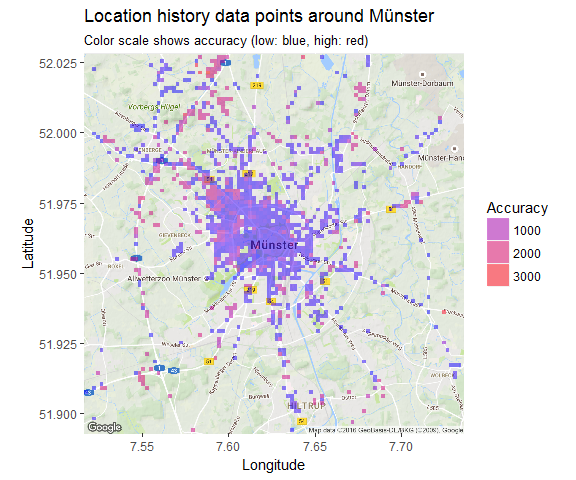
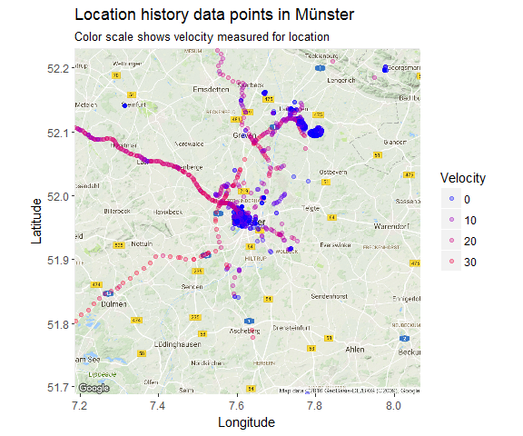

It's no secret that Google basically Big Brothers most of us. But at least they allow us to access quite a lot of the data they have collected on us. Among this is the Google location history.

If you want to see a few ways how to quickly and easily visualize your location history with R, stay tuned...

The Google location history can be downloaded from your Google account under <http://takeout.google.com/>. Make sure you only tick *"location history"* for download, otherwise it will probably take super long to get all your Google data.

The data Google provides you for download is a .json file and can be loaded with the [jsonlite](https://cran.r-project.org/web/packages/jsonlite/index.html) package. Loading this file into R might take a few minutes because it can be quite big, depending on how many location points Google had saved about you.

``` r
library(jsonlite)
system.time(x <- fromJSON("Takeout/Standortverlauf/Standortverlauf.json"))
```

    ##    user  system elapsed 
    ##  108.98    0.82  129.64

<br>

The date and time column is in the POSIX milliseconds format, so I converted it to human readable POSIX.

Similarly, longitude and latitude are saved in E7 format and were converted to GPS coordinates.

``` r
# extracting the locations dataframe
loc = x$locations

# converting time column from posix milliseconds into a readable time scale
loc$time = as.POSIXct(as.numeric(x$locations$timestampMs)/1000, origin = "1970-01-01")

# converting longitude and latitude from E7 to GPS coordinates
loc$lat = loc$latitudeE7 / 1e7
loc$lon = loc$longitudeE7 / 1e7
```

<br>

This is how the data looks like now:

``` r
head(loc)
```

    ##     timestampMs latitudeE7 longitudeE7 accuracy                 activitys
    ## 1 1478512426116  519604433    76002853       21                      NULL
    ## 2 1478512066098  519603684    76001572       20                      NULL
    ## 3 1478511705982  519604501    76001796       20 1478511697443, still, 100
    ## 4 1478511344897  519604501    76001796       21                      NULL
    ## 5 1478511177794  519604501    76001796       21                      NULL
    ## 6 1478511034069  519604501    76001796       21                      NULL
    ##   velocity heading altitude                time      lat      lon
    ## 1       NA      NA       NA 2016-11-07 10:53:46 51.96044 7.600285
    ## 2       NA      NA       NA 2016-11-07 10:47:46 51.96037 7.600157
    ## 3       NA      NA       NA 2016-11-07 10:41:45 51.96045 7.600180
    ## 4       NA      NA       NA 2016-11-07 10:35:44 51.96045 7.600180
    ## 5       NA      NA       NA 2016-11-07 10:32:57 51.96045 7.600180
    ## 6       NA      NA       NA 2016-11-07 10:30:34 51.96045 7.600180

We have the original and converted time, latitude and longitude columns, plus accuracy, activities, velocity, heading and altitude. Accuracy gives the error distance around the point in metres. Activities are saved as a list of data frames and will be explored further down. Velocity, heading and altitude were not recorded for earlier data points.

<br>

Data stats
==========

Before I get to actually plotting maps, I want to explore a few basic statistics of the data.

<br>

How many data points did Google record over what period of time?
----------------------------------------------------------------

``` r
# how many rows are in the data frame?
nrow(loc)
```

    ## [1] 587253

``` r
# 
min(loc$time)
```

    ## [1] "2013-09-06 19:33:41 CEST"

<br>

And how are they distributed over days, months and years?
---------------------------------------------------------

``` r
# calculate the number of data points per day, month and year
library(lubridate)
library(zoo)

loc$date <- as.Date(loc$time, '%Y/%m/%d')
loc$year <- year(loc$date)
loc$month_year <- as.yearmon(loc$date)

points_p_day <- data.frame(table(loc$date), group = "day")
points_p_month <- data.frame(table(loc$month_year), group = "month")
points_p_year <- data.frame(table(loc$year), group = "year")

# How many days were recorded?
nrow(points_p_day)
```

    ## [1] 1012

``` r
# How many months?
nrow(points_p_month)
```

    ## [1] 38

``` r
# And how many years?
nrow(points_p_year)
```

    ## [1] 4

``` r
# set up plotting theme
library(ggplot2)
library(ggmap)

my_theme <- function(base_size = 12, base_family = "sans"){
  theme_grey(base_size = base_size, base_family = base_family) +
  theme(
    axis.text = element_text(size = 12),
    axis.text.x = element_text(angle = 90, vjust = 0.5, hjust = 1),
    axis.title = element_text(size = 14),
    panel.grid.major = element_line(color = "grey"),
    panel.grid.minor = element_blank(),
    panel.background = element_rect(fill = "aliceblue"),
    strip.background = element_rect(fill = "lightgrey", color = "grey", size = 1),
    strip.text = element_text(face = "bold", size = 12, color = "navy"),
    legend.position = "right",
    legend.background = element_blank(),
    panel.margin = unit(.5, "lines"),
    panel.border = element_rect(color = "grey", fill = NA, size = 0.5)
  )
}
```

``` r
points <- rbind(points_p_day[, -1], points_p_month[, -1], points_p_year[, -1])

ggplot(points, aes(x = group, y = Freq)) + 
  geom_point(position = position_jitter(width = 0.2), alpha = 0.3) + 
  geom_boxplot(aes(color = group), size = 1, outlier.colour = NA) + 
  facet_grid(group ~ ., scales = "free") + my_theme() +
  theme(
    legend.position = "none",
    strip.placement = "outside",
    strip.background = element_blank(),
    strip.text = element_blank(),
    axis.text.x = element_text(angle = 0, vjust = 0.5, hjust = 0.5)
  ) +
  labs(
    x = "",
    y = "Number of data points",
    title = "How many data points did Google collect about me?",
    subtitle = "Number of data points per day, month and year",
    caption = "\nGoogle collected between 0 and 1500 data points per day (median ~500), between 0 and 40,000 per month (median ~15,000) and between 80,000 and 220,000 per year (median ~140,000)."
  )
```


<br>

How accurate is the data?
-------------------------

Accuracy is given in meters, i.e. the smaller the better.

``` r
accuracy <- data.frame(accuracy = loc$accuracy, group = ifelse(loc$accuracy < 800, "high", ifelse(loc$accuracy < 5000, "middle", "low")))

accuracy$group <- factor(accuracy$group, levels = c("high", "middle", "low"))

ggplot(accuracy, aes(x = accuracy, fill = group)) + 
  geom_histogram() + 
  facet_grid(group ~ ., scales="free") + 
  my_theme() +
  theme(
    legend.position = "none",
    strip.placement = "outside",
    strip.background = element_blank(),
    axis.text.x = element_text(angle = 0, vjust = 0.5, hjust = 0.5)
  ) +
  labs(
    x = "Accuracy in metres",
    y = "Count",
    title = "How accurate is the location data?",
    subtitle = "Histogram of accuracy of location points",
    caption = "\nMost data points are pretty accurate, but there are still many data points with a very inaccuracy.
    These were probably from areas with bad satellite reception."
  )
```


<br>

Plotting data points on maps
============================

Finally, we are actually going to plot some maps!

The first map is a simple point plot of all locations recorded around Germany.

You first specify the map area and the zoom factor (the furthest away is 1); the bigger the zoom, the closer to the center of the specified location. Location can be given as longitude/latitude pair or as city or country name.

On this map we can plot different types of plot with the regular ggplot2 syntax. For example, a point plot.

``` r
germany <- get_map(location = 'Germany', zoom = 5)

ggmap(germany) + geom_point(data = loc, aes(x = lon, y = lat), alpha = 0.5, color = "red") + 
  theme(legend.position = "right") + 
  labs(x = "Longitude", y = "Latitude", title = "Location history data points in Europe")
```


<br>

The second map shows a 2D bin plot of accuracy measured for all data points recorded in my home town Münster.

``` r
munster <- get_map(location = 'Munster', zoom = 12)

options(stringsAsFactors = T)
ggmap(munster) + 
  stat_summary_2d(geom = "tile", bins = 100, data = loc, aes(x = lon, y = lat, z = accuracy), alpha = 0.5) + 
  scale_fill_gradient(low = "blue", high = "red", guide = guide_legend(title = "Accuracy")) +
  labs(x = "Longitude", y = "Latitude", title = "Location history data points around Münster",
       subtitle = "Color scale shows accuracy (low: blue, high: red)")
```



<br>

We can also plot the velocity of each data point. This plot nicely reflects that I moved generally slower in the city center than on the autobahn.

``` r
loc_2 <- loc[which(!is.na(loc$velocity)), ]

munster <- get_map(location = 'Munster', zoom = 10)

ggmap(munster) + geom_point(data = loc_2, aes(x = lon, y = lat, color = velocity), alpha = 0.3) + 
  theme(legend.position = "right") + 
  labs(x = "Longitude", y = "Latitude", title = "Location history data points in Münster",
       subtitle = "Color scale shows velocity measured for location") +
  scale_colour_gradient(low = "blue", high = "red", guide = guide_legend(title = "Velocity"))
```



<br>

What distance did I travel?
===========================

To obtain the distance I moved, I am calculating the distance between data points. Because it takes a long time to calculate, I am only looking at data from last year.

``` r
loc3 <- with(loc, subset(loc, loc$time > as.POSIXct('2016-01-01 0:00:01')))
loc3 <- with(loc, subset(loc3, loc$time < as.POSIXct('2016-10-31 23:59:59')))

# Shifting vectors for latitude and longitude to include end position
shift.vec <- function(vec, shift){
  if (length(vec) <= abs(shift)){
    rep(NA ,length(vec))
  } else {
    if (shift >= 0) {
      c(rep(NA, shift), vec[1:(length(vec) - shift)]) }
    else {
      c(vec[(abs(shift) + 1):length(vec)], rep(NA, abs(shift)))
    }
  }
}

loc3$lat.p1 <- shift.vec(loc3$lat, -1)
loc3$lon.p1 <- shift.vec(loc3$lon, -1)

# Calculating distances between points (in metres) with the function pointDistance from the 'raster' package.
library(raster)
loc3$dist.to.prev <- apply(loc3, 1, FUN = function(row) {
  pointDistance(c(as.numeric(as.character(row["lat.p1"])),
                  as.numeric(as.character(row["lon.p1"]))),
                c(as.numeric(as.character(row["lat"])), as.numeric(as.character(row["lon"]))),
                lonlat = T) # Parameter 'lonlat' has to be TRUE!
})
```

``` r
# distance in km
round(sum(as.numeric(as.character(loc3$dist.to.prev)), na.rm = TRUE)*0.001, digits = 2)
```

    ## [1] 50899.84

``` r
distance_p_month <- aggregate(loc3$dist.to.prev, by = list(month_year = as.factor(loc3$month_year)), FUN = sum)
distance_p_month$x <- distance_p_month$x*0.001

distance_p_month[-1, ]
```

    ##    month_year         x
    ## 2    Jan 2016  2571.256
    ## 3    Mar 2016  1347.368
    ## 4    Apr 2016  3312.868
    ## 5    May 2016  4969.480
    ## 6    Jun 2016  2205.380
    ## 7    Jul 2016  3248.076
    ## 8    Aug 2016  3149.511
    ## 9    Sep 2016 27440.627
    ## 10   Oct 2016  2635.799

<br>

Activities
==========

Google also guesses my activity based on distance travelled per time.

Here again, it would take too long to look at activity from all data points.

``` r
activities <- loc3$activitys

list.condition <- sapply(activities, function(x) !is.null(x[[1]]))
activities  <- activities[list.condition]

df <- do.call("rbind", activities)
main_activity <- sapply(df$activities, function(x) x[[1]][1][[1]][1])

activities_2 <- data.frame(main_activity = main_activity, 
                           time = as.POSIXct(as.numeric(df$timestampMs)/1000, origin = "1970-01-01"))

head(activities_2)
```

    ##   main_activity                time
    ## 1         still 2016-11-01 01:05:15
    ## 2         still 2016-10-31 23:16:52
    ## 3         still 2016-10-31 21:11:59
    ## 4         still 2016-10-31 21:02:21
    ## 5         still 2016-10-31 20:06:12
    ## 6         still 2016-10-31 18:10:07

``` r
ggplot(activities_2, aes(x = main_activity, group = main_activity, fill = main_activity)) + 
  geom_bar()  + 
  my_theme() +
  labs(
    x = "",
    y = "Count",
    fill = "Main activity"
  )
```


<br>

------------------------------------------------------------------------

``` r
sessionInfo()
```

    ## R version 3.3.2 (2016-10-31)
    ## Platform: x86_64-w64-mingw32/x64 (64-bit)
    ## Running under: Windows 7 x64 (build 7601) Service Pack 1
    ## 
    ## locale:
    ## [1] LC_COLLATE=English_United States.1252 
    ## [2] LC_CTYPE=English_United States.1252   
    ## [3] LC_MONETARY=English_United States.1252
    ## [4] LC_NUMERIC=C                          
    ## [5] LC_TIME=English_United States.1252    
    ## 
    ## attached base packages:
    ## [1] stats     graphics  grDevices utils     datasets  methods   base     
    ## 
    ## other attached packages:
    ## [1] raster_2.5-8    sp_1.2-3        ggmap_2.6.2     ggplot2_2.2.0  
    ## [5] zoo_1.7-13      lubridate_1.6.0 jsonlite_1.1   
    ## 
    ## loaded via a namespace (and not attached):
    ##  [1] Rcpp_0.12.7       plyr_1.8.4        bitops_1.0-6     
    ##  [4] tools_3.3.2       digest_0.6.10     evaluate_0.10    
    ##  [7] tibble_1.2        gtable_0.2.0      lattice_0.20-34  
    ## [10] png_0.1-7         DBI_0.5-1         mapproj_1.2-4    
    ## [13] yaml_2.1.14       proto_1.0.0       stringr_1.1.0    
    ## [16] dplyr_0.5.0       knitr_1.15        RgoogleMaps_1.4.1
    ## [19] maps_3.1.1        grid_3.3.2        R6_2.2.0         
    ## [22] jpeg_0.1-8        rmarkdown_1.1     reshape2_1.4.2   
    ## [25] magrittr_1.5      codetools_0.2-15  scales_0.4.1     
    ## [28] htmltools_0.3.5   assertthat_0.1    colorspace_1.3-0 
    ## [31] geosphere_1.5-5   labeling_0.3      stringi_1.1.2    
    ## [34] lazyeval_0.2.0    munsell_0.4.3     rjson_0.2.15
