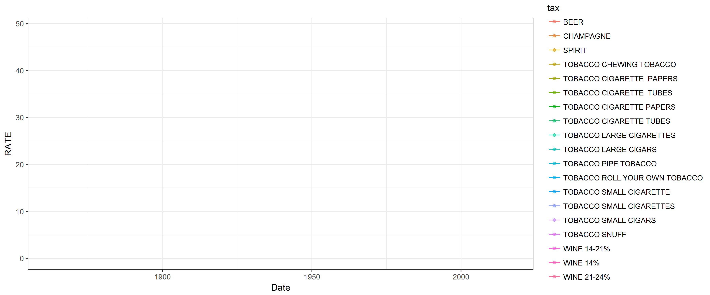
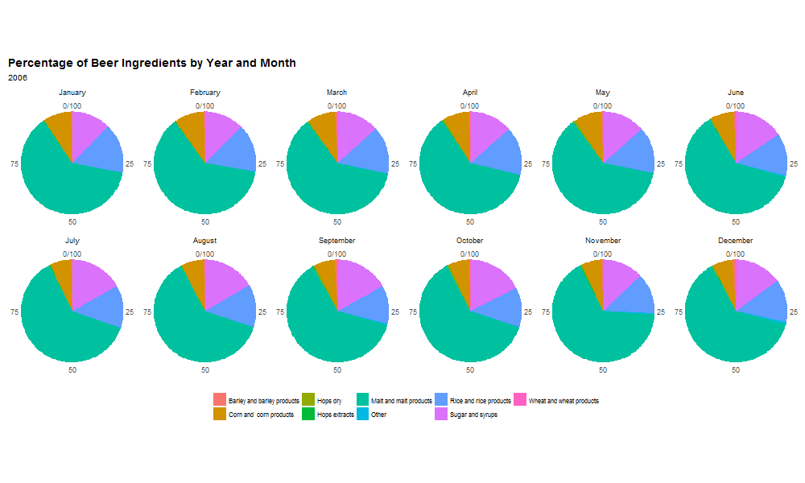

ttbbeer: A package for US Brewery data sets.

The ttbbeer package includes at current state, one data set of a collection of 10 years (2006 - 2015) worth of data on materials used at U.S. breweries in pounds reported by the Brewer's Report of Operations and the Quarterly Brewer's Report of Operations forms, ready for data analysis.

An R data package of beer statistics from U.S. Department of the Treasury, Alcohol and Tobacco Tax and Trade Bureau (TTB)

This package provides the one data set for materials used at U.S. breweries as listed in the Beer Monthly Statistical Releases, and eight data sets for historical tax rates of distilled spirits, wine, beer, champagne, and tobacco.

The motivation behind this package was to provide analysis-ready data sets as the original data for the beermaterials is in PDF format which can be difficult to read into R, given the small ecosystem of PDF parsing R packages such as: tm, and tabulizer. Other goals of this package are to provide more data sets to the R ecosystem for beer analytics from open government data portals.

Happy Holidays and Cheers!

```{r echo = TRUE, message = FALSE, warning = FALSE, cache=FALSE, fig.width = 6, fig.height = 5, fig.align = "center"}
library(ttbbeer)

beertax$tax <- "BEER"
champagnetax$tax <- "CHAMPAGNE"
spirittax$tax <- "SPIRIT"
tobaccotax$ITEM <- toupper(tobaccotax$ITEM)
tobaccotax$tax <- paste("TOBACCO", tobaccotax$ITEM, sep = " ")
tobaccotax <- tobaccotax[, -1]
tobaccotax[18, 2] <- "1977-01-31"
tobaccotax[18, 1] <- "1977-01-01"
winetax14$tax <- "WINE 14%"
winetax1421$tax <- "WINE 14-21%"
winetax2124$tax <- "WINE 21-24%"


taxes_list <- c("beertax", "champagnetax", "spirittax", "tobaccotax", "winetax14", "winetax1421", "winetax2124")

for (tax in taxes_list){
  
  tax_df <- get(tax)
  tax_df <- tax_df[match(sort(tax_df$FROM), tax_df$FROM), ]
  
  if (tax != "tobaccotax"){
    tax_df$change <- c(0, 
                       100 * round((tax_df$RATE[-1] - tax_df$RATE[1:(length(tax_df$RATE)-1)]) /
                                     tax_df$RATE[1:(length(tax_df$RATE)-1)], 2))

  } else {
    tax_df$change <- "NA"
  }
  
  if (tax == "beertax"){
    tax_df_2 <- tax_df
  } else {
    tax_df_2 <- rbind(tax_df_2, tax_df)
  }
}

tax_2 <- tax_df_2
tax_2$ID <- paste(tax_2$tax, rownames(tax_2), sep = "_")
head(tax_2)
```

```{r echo = TRUE, message = FALSE, warning = FALSE, cache=FALSE, fig.width = 10, fig.height = 6, fig.align = "center"}
library(tidyr)
tax_gather <- tax_2 %>%
  gather(dat_column, Date, FROM:TO)
tax_gather$group <- gsub(" .*", "", tax_gather$tax)
```

```{r echo = TRUE, message = FALSE, warning = FALSE, cache=FALSE, fig.width = 10, fig.height = 6, fig.align = "center"}
library(ggplot2)
my_theme <- function(base_size = 12, base_family = "sans"){
  theme_minimal(base_size = base_size, base_family = base_family) +
  theme(
    axis.text = element_text(size = 12),
    axis.text.x = element_text(angle = 90, vjust = 0.5, hjust = 0.5),
    axis.title = element_text(size = 14),
    panel.grid.major = element_line(color = "grey"),
    panel.grid.minor = element_blank(),
    panel.background = element_rect(fill = "aliceblue"),
    strip.background = element_rect(fill = "royalblue", color = "grey", size = 1),
    strip.text = element_text(face = "bold", size = 12, color = "white"),
    legend.position = "bottom",
    legend.justification = "top", 
    legend.box = "horizontal",
    legend.box.background = element_rect(colour = "grey50"),
    legend.background = element_blank(),
    panel.border = element_rect(color = "grey", fill = NA, size = 0.5)
  )
}

theme_set(my_theme())
```

```{r echo = TRUE, message = FALSE, warning = FALSE, cache=FALSE, fig.width = 12, fig.height = 9, fig.align = "center"}
ggplot(tax_gather, aes(x = Date, y = RATE, color = tax)) +
  geom_smooth(alpha = 0.3, color = "black", size = 0.5, linetype = "dashed") +
  geom_point(size = 1.5, alpha = 0.6) +
  geom_line() +
  facet_wrap(~group, ncol = 3, scales = "free_y") +
  labs(
    x = "",
    y = "Tax rate in %",
    color = "",
    title = "Alcohol and tobacco tax rates",
    subtitle = "from 1862 to 2016"
  ) +
  scale_x_date(date_breaks = "20 year", date_labels = "%Y")
```

```{r echo = TRUE, message = FALSE, warning = FALSE, cache=FALSE, fig.width = 12, fig.height = 6, fig.align = "center"}
d <- data.frame(xmin = as.Date(c("1861-04-12", "1914-07-28", "1920-01-16", "1939-11-01", "1947-03-12")), 
                ymin = -Inf, 
                xmax = as.Date(c("1865-04-09", "1918-11-11", "1933-12-05", "1945-05-08", "1991-12-26")), 
                ymax = Inf, 
                description = c("Civial War", "WW1", "Prohibition", "WW2", "Cold War"),
                pos_y = as.numeric(c(rep(c("20", "18"), 2), "20")))
d$pos_x <- as.Date(NA)

for (i in 1:nrow(d)){
  d[i, "pos_x"] <- as.Date(as.character(median(c(d$xmin[i], d$xmax[i]))))
}

tax_gather$group2 <- ifelse(tax_gather$group == "TOBACCO", "TOBACCO", "ALCOHOL")

ggplot() +
  geom_rect(data = d, aes(xmin = xmin, xmax = xmax, ymin = ymin, ymax = ymax), alpha=0.2) +
  geom_label(data = d, aes(pos_x, pos_y, label = description), check_overlap = TRUE) +
  geom_point(data = subset(tax_gather, group2 == "ALCOHOL"), aes(x = Date, y = RATE, color = tax), size = 1.5, alpha = 0.6) +
  geom_line(data = subset(tax_gather, group2 == "ALCOHOL"), aes(x = Date, y = RATE, color = tax)) +
  facet_wrap(~group2, ncol = 1, scales = "free_y") +
  labs(
    x = "",
    y = "Tax rate in %",
    color = "",
    title = "Alcohol tax rates during history",
    subtitle = "from 1862 to 2016"
  ) +
  guides(color = guide_legend(ncol = 6, byrow = FALSE)) +
  scale_x_date(date_breaks = "10 year", date_labels = "%Y")
```

```{r echo = TRUE, message = FALSE, warning = FALSE, cache=FALSE, fig.width = 12, fig.height = 6, fig.align = "center"}
ggplot() +
  geom_rect(data = d, aes(xmin = xmin, xmax = xmax, ymin = ymin, ymax = ymax), alpha=0.2) +
  geom_point(data = subset(tax_gather, group2 == "ALCOHOL" & dat_column == "TO"), aes(x = Date, y = as.numeric(change), color = tax), size = 1.5, alpha = 0.6) +
  geom_line(data = subset(tax_gather, group2 == "ALCOHOL" & dat_column == "TO"), aes(x = Date, y = as.numeric(change), color = tax, group = tax)) +
  facet_wrap(~group, ncol = 2, scales = "free_y") +
  labs(
    x = "",
    y = "Tax rate change in %",
    color = "",
    title = "Alcohol tax rate changes",
    subtitle = "Change in percent compared to previous timepoint"
  ) +
  guides(color = guide_legend(ncol = 6, byrow = FALSE)) +
  scale_x_date(date_breaks = "10 year", date_labels = "%Y")
```

```{r echo = TRUE, eval = FALSE, message = FALSE, warning = FALSE, cache=FALSE, fig.width = 12, fig.height = 5, fig.align = "center"}
library(gganimate)

p <- ggplot(tax_gather, aes(x = Date, y = RATE, color = tax, frame = tax)) +
  geom_point(size = 3, alpha = 1) +
  geom_line(size = 2, alpha = 0.8) +
    labs(
    x = "",
    y = "Tax rate in %",
    color = ""
  ) +
  scale_x_date(date_breaks = "20 year", date_labels = "%Y")

library(animation)
ani.options(ani.width=1000, ani.height=600)
gganimate(p, filename = "taxes_by_tax.mp4", cumulative = TRUE)
gganimate(p, filename = "taxes_by_tax.gif", cumulative = TRUE)
```




```{r echo = FALSE, eval = FALSE, message = FALSE, warning = FALSE, cache=FALSE, fig.width = 10, fig.height = 5, fig.align = "center"}
tax_gather$year <- gsub("-.*", "", tax_gather$Date)

ggplot(subset(tax_gather, dat_column == "FROM"), aes(x = Date, y = tax, size = RATE, color = tax, frame = year)) +
  geom_point(alpha = 0.6) +
   guides(color = FALSE) +
  labs(
    x = "",
    y = "",
    color = ""
  ) +
  scale_x_date(date_breaks = "10 year", date_labels = "%Y")
```

---

The beermaterials dataset

The monthly aggregation of materials used in US Breweries as reported by the TTB. in pounds. Other materials such as flavor, in pounds

```{r echo = TRUE, message = FALSE, warning = FALSE, cache=FALSE, fig.width = 12, fig.height = 5, fig.align = "center"}
data("beermaterials")
head(beermaterials)
```

```{r echo = TRUE, message = FALSE, warning = FALSE, cache=FALSE, fig.width = 12, fig.height = 5, fig.align = "center"}
library(dplyr)
beermaterials_change <- arrange(beermaterials, Year)
for (i in 3:ncol(beermaterials_change)){
  
  value <- beermaterials_change[[colnames(beermaterials_change)[i]]]
  beermaterials_change[, i] <- c(0, 
                       100 * round((value[-1] - value[1:(length(value)-1)]) /
                                     value[1:(length(value)-1)], 2))
  
}

head(beermaterials_change)
```

```{r echo = TRUE, message = FALSE, warning = FALSE, cache=FALSE, fig.width = 10, fig.height = 6, fig.align = "center"}
beermaterials_gather <- beermaterials %>%
  gather(Ingredient, Amount, Malt_and_malt_products:Other)
beermaterials_gather$Date <- paste("01", beermaterials_gather$Month, beermaterials_gather$Year, sep = "-") %>%
  as.Date(format = "%d-%B-%Y")
beermaterials_gather$Ingredient <- gsub("_", " ", beermaterials_gather$Ingredient)
```

```{r echo = TRUE, message = FALSE, warning = FALSE, cache=FALSE, fig.width = 12, fig.height = 9, fig.align = "center"}
ggplot(beermaterials_gather, aes(x = Date, y = Amount, color = Ingredient)) +
  geom_point(size = 1.5, alpha = 0.6) +
  geom_smooth(alpha = 0.3, color = "black", size = 0.5, linetype = "dashed") +
  geom_line() +
  facet_wrap(~Ingredient, ncol = 3, scales = "free_y") +
  guides(color = FALSE) +
  labs(
    x = "",
    y = "Amount in pounds",
    title = "Beer Ingredients by Year"
  ) +
  scale_x_date(date_breaks = "1 year", date_labels = "%Y")
```

```{r echo = TRUE, message = FALSE, warning = FALSE, cache=FALSE, fig.width = 10, fig.height = 6, fig.align = "center"}
beermaterials_change_gather <- beermaterials_change %>%
  gather(Ingredient, Amount, Malt_and_malt_products:Other)
beermaterials_change_gather$Date <- paste("01", beermaterials_change_gather$Month, beermaterials_change_gather$Year, sep = "-") %>%
  as.Date(format = "%d-%B-%Y")
beermaterials_change_gather$Ingredient <- gsub("_", " ", beermaterials_change_gather$Ingredient)
```

```{r echo = TRUE, message = FALSE, warning = FALSE, cache=FALSE, fig.width = 12, fig.height = 9, fig.align = "center"}
ggplot(beermaterials_change_gather, aes(x = Date, y = Amount, color = Ingredient)) +
  geom_smooth(alpha = 0.3, color = "black", size = 0.5, linetype = "dashed") +
  geom_point(size = 1.5, alpha = 0.6) +
  geom_line() +
  facet_wrap(~Ingredient, ncol = 3, scales = "free_y") +
  guides(color = FALSE) +
  labs(
    x = "",
    y = "Percent change",
    title = "Beer Ingredients by Year",
    subtitle = "Percent change in pounds compared to previous month"
  ) +
  scale_x_date(date_breaks = "1 year", date_labels = "%Y")
```

```{r echo = TRUE, message = FALSE, warning = FALSE, cache=FALSE, fig.width = 12, fig.height = 9, fig.align = "center"}
ggplot(beermaterials_gather, aes(x = Date, y = Amount, color = Ingredient)) +
  geom_point(size = 1.5, alpha = 0.6) +
  geom_line() +
  labs(
    x = "",
    y = "Amount in pounds",
    color = "",
    title = "Beer Ingredients by Month and Year",
    subtitle = "from January 2006 to December 2015"
  ) +
  scale_x_date(date_breaks = "6 month", date_labels = "%B %Y")
```

```{r echo = TRUE, message = FALSE, warning = FALSE, cache=FALSE, fig.width = 6, fig.height = 15, fig.align = "center"}
ggplot(subset(beermaterials_gather, Year %in% c(2014, 2015)), aes(x = Date, y = Amount, color = Ingredient)) +
  geom_smooth(alpha = 0.3, color = "black", size = 0.5, linetype = "dashed") +
  geom_point(size = 1.5, alpha = 0.6) +
  guides(color = FALSE) +
  geom_line() +
  labs(
    x = "",
    y = "Amount in pounds",
    color = "",
    title = "Beer Ingredients by Month and Year",
    subtitle = "from January 2014 to December 2015"
  ) +
  scale_x_date(date_breaks = "1 month", date_labels = "%B %Y") +
  facet_wrap(~Ingredient, ncol = 1, scales = "free_y")
```

```{r echo = TRUE, message = FALSE, warning = FALSE, cache=FALSE, fig.width = 12, fig.height = 9, fig.align = "center"}
ggplot(beermaterials_change_gather, aes(x = Date, y = Amount, color = Ingredient)) +
  geom_smooth(alpha = 0.3, color = "black", size = 0.5, linetype = "dashed") +
  geom_point(size = 1.5, alpha = 0.6) +
  geom_line() +
  labs(
    x = "",
    y = "Change in percent",
    color = "",
    title = "Change of beer Ingredients by Month and Year",
    subtitle = "Change in pounds compared to previous month"
  ) +
  scale_x_date(date_breaks = "6 month", date_labels = "%B %Y") +
  facet_wrap(~Ingredient, ncol = 3, scales = "free_y")
```

animation package

```{r echo = TRUE, eval = FALSE, message = FALSE, warning = FALSE, cache=FALSE, fig.width = 12, fig.height = 9, fig.align = "center"}
beermaterials_percent <- cbind(beermaterials[, 1:2], prop.table(as.matrix(beermaterials[, -c(1:2)]), margin = 1) * 100)

beermaterials_percent_gather <- beermaterials_percent %>%
  gather(Ingredient, Amount, Malt_and_malt_products:Other)
beermaterials_percent_gather$Ingredient <- gsub("_", " ", beermaterials_percent_gather$Ingredient)

f = unique(beermaterials_percent_gather$Month)
beermaterials_percent_gather <- within(beermaterials_percent_gather, Month <- factor(Month, levels = f))

saveGIF({
  for (year in rev(unique(beermaterials_percent_gather$Year))){
  
  pie <- ggplot(subset(beermaterials_percent_gather, Year == paste(year)), aes(x = "", y = Amount, fill = Ingredient, frame = Year)) + 
  geom_bar(width = 1, stat = "identity") + theme_minimal() +
  coord_polar("y", start = 0) +
  labs(
    title = "Percentage of Beer Ingredients by Year and Month",
    subtitle = paste(year)) +
  theme(
  axis.title.x = element_blank(),
  axis.title.y = element_blank(),
  panel.border = element_blank(),
  panel.grid = element_blank(),
  axis.ticks = element_blank(),
  plot.title = element_text(size = 14, face = "bold"),
  legend.title = element_blank(),
  legend.position = "bottom",
  legend.text = element_text(size = 8)
  ) + 
  facet_wrap( ~ Month, ncol = 6)

  print(pie)
  }
  
}, movie.name = "beer_ingredients.gif")
```



------------------

<br>

```{r echo=FALSE, message=FALSE, warning=FALSE, fig.width=6, fig.height=4, fig.align="center", cache=FALSE}
sessionInfo()
```
